# 计算机网络_概述

## 网络分层

任何复杂的软件工程都需要分层，简化逻辑处理

 

## 1_物理层
多台pc通过网线直接连接，或者使用网线通过集线器Hub进行连接

>集线器和交换机不同，没有加工处理过程，只是转发数据
>所以是在物理层工作，将自己收到的每个字节都复制到其它所有端口（广播模式）

## 2_MAC层/数据链路层
mac：Medium Access Control，即媒体访问控制

mac地址：
>mac地址是一个唯一的标识，通信范围比较小，局限在一个子网里面
>例如：
>192.168.0.2/24 访问 192.168.0.3/24 是可以用 MAC 地址的
>192.168.0.2/24 到 192.168.1.2/24，一旦跨子网，MAC 地址就不行了，需要 IP 地址起作用

>解决物理层，发送数据到所有其它端口（广播模式）
>所有pc都需要把数据包拿进来解析
>有了mac地址，对应mac地址的网卡才会解析数据包
>mac层数据包中的crc循环冗余检测，为了处理发送过程中的错误

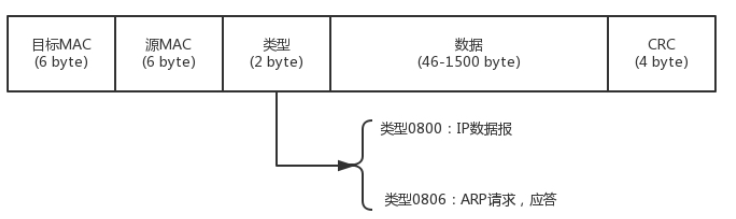

ARP协议：
>根据ip地址获取mac地址
>发送一个广播包，对应ip的主机回答自己的mac地址
>机器本地也会有ARP缓存

交换机：
>连接多个局域网LAN的二层设备
>
>多个交换机，当进行ARP请求时
>交换机和普通机器一样，也会收到请求
>交换机会对此请求进行另外端口的局域网进行广播
>直到拿到对应ip的mac地址返回
>每个交换机会学习记录各个网口的拓扑结构
>多个交换机一起形成的局域网叫VLAN（虚拟局域网）
>
>环路问题：STP，最小生成树

 

## 3_IP网络层

ip地址：
>ipv4：32位，前边是网络号，后边是主机号
>ipv6：128位

传统A、B、C、D、E网络分类：
>A类：0+网络号7位+主机号24位
>B类：10+网络号14位+主机号24位
>C类：110+网络号21位+主机号24位
>D类：1110+多播组号28位
>E类：11110+留待后用27位

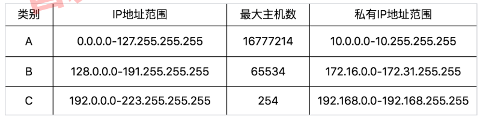

无类型域间选路（CIDR）：
>由于传统的ABC网络分类不够灵活，所以打破了原来设计的地址分类做法
>现在将32位的ip地址一分为二，前面网络号，后面主机号

CIDR表示法：
>10.100.122.2/24
>前24位网络号，后8位主机号

广播地址：
>10.100.122.255
>如果发送这个地址，10.100.122网络里的机器都可以收到

子网掩码：
>255.255.255.0
>子网掩码和ip地址进行 and 运算，得到网络号

动态主机配置协议（DHCP）：
>DHCP server 会根据mac地址对新加入的机器返回给一个ip地址，有时间期限，如果还在使用会延长期限

ip层先查看目标IP地址是否和自己在同一个局域网
>如果是，就发送ARP协议获取mac地址，不用过网关
>如果不是，则需要通过网关

路由器：
>一个路由器是多个局域网的网关连接处
>是一个三层转发的设备
>
>路由器是一台设备，5个网口相当于连着5个局域网
>每个口都是各自局域网的网关

转发网关：
>ip数据包中，传递信息通过网关时
>目标mac地址会被替换（替换成下一个网关的mac地址）
>目标ip地址不会被替换
>
>发送返回包时，再反向替换
>
>在公网中是这样传输的

NAT网关：
>ip数据包中，传递信息通过网关时
>目标mac地址会被替换（替换成下一个网关的mac地址）
>源ip地址会被替换（替换成下一个网关的ip地址）
>
>发送返回包时，再反向替换
>
>在普通的家庭办公局域网是通过这样传输的

 

## 4_传输层
端口号，用来标识进程

### （1）UDP
面向无连接的
>继承了ip包的无任何可靠性保证，一旦发出就什么都不知道了
>所以UDP不保证不丢失、不保证按序、不保证不重复等

UDP数据包格式：
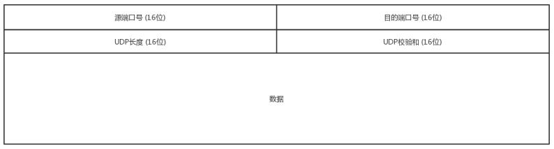

### （2）TCP
面向连接的
>建立连接
>是指为了在客户端和服务端维护连接而建立的一定数据结构来维护双方交互的状态
>用来保证数据发送的可靠交付（TCP是有状态的）：
>（1）无差错
>（2）不丢失
>（3）不重复
>（4）按序到达

TCP数据包格式：
>标志位：
>SYN 是发起一个连接
>ACK 是回复
>RST 是重新连接
>FIN 是结束连接

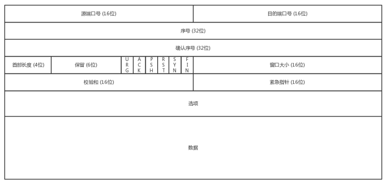

三次握手：
>请求 -> 应答 -> 应答之应答

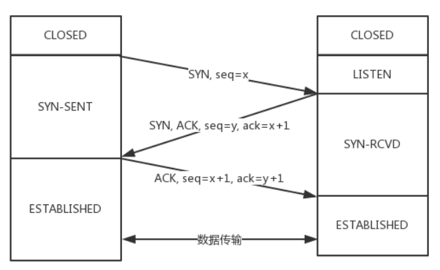

四次挥手：
>（1）A挥手FIN
>（2）B回复ACK
>（3）B挥手FIN
>（4）A回复ACK
> 
> 
>为什么四次挥手？
>因为TCP是全双工通信，每个端都必须单独关闭
>
>为什么第2步和第3步不能合并？
>因为B可能还在发送数据
>如果合并将代表立即关闭
>那么B发送中的数据可能会被下次建立的连接收到

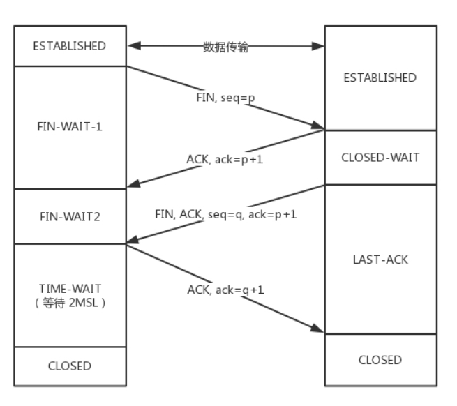

丢包问题：
>（1）超时重试：自适应重传算法_超时间隔加倍
>（2）快速重传：接收方发现其中一个包丢了，会发送丢的包之前一个序号包的ack多次，发送方便可感知丢失的包快速重发

流量控制（滑动窗口）：
>两端都维护一个发送窗口和接口窗口
>发送窗口的大小取决于对端的接收窗口
>小于或等于对端建议的接口窗口，还受拥塞控制的影响
> 
> 
>发送窗口：
>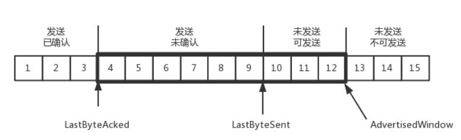
>
>接收窗口：
>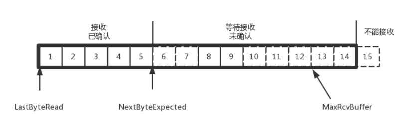

拥塞控制：
>解决多主机之间共享网络时出现的拥塞问题
>拥塞窗口：根据当前网络带宽是否空闲会动态调整
>
>发送窗口最后实际的大小
>取决于 对端的接口窗口建议的大小和拥塞窗口
>取最小值

socket套接字：
>socket是操作系统提供的ip网络层和传输层之间的一套API接口

 

## 5_应用层

### （1）http
建立在tcp协议上的应用层协议
HTTP 2.0 通过头压缩、分帧、二进制编码、多路复用等技术提升性能

>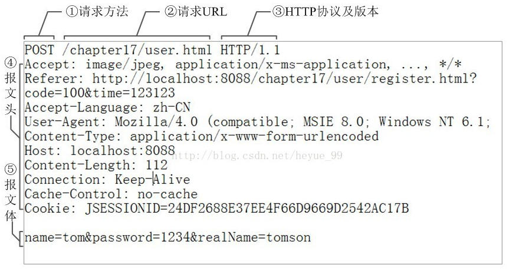
>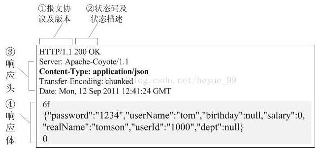

### （2）https

对称加密：
>加密解密的密钥是同一个
>
>优点：性能高
>缺点：不够安全，一旦拿到密钥即可破解

非对称加密：
>加密解密的密钥是两个
>
>优点：安全
>缺点：性能较差

数字证书：
>如何安全的获取公钥？
>
>CA机构：
>CA用自己的私钥加密网站的公钥签名，形成证书
>

https:

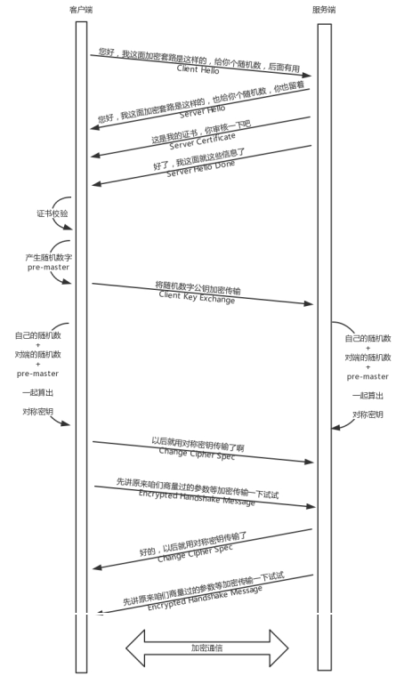

### （3）dns

DNS服务器
>根DNS服务器：返回顶级域DNS服务器的IP地址
>顶级域DNS服务器：返回权威DNS服务器的IP地址
>权威DNS服务器：返回相应主机的IP地址

DNS查询方式：
>递归：客户端只发一次请求，要求对方给出最终结果
>迭代：客户端发出一次请求，对方无法解析，返回给客户端一个可以解析的服务器，迭代直到得到最终结果
>
>客户端->本地dns服务端：这部分属于递归查询
>本地dns服务端->外网：这部分属于迭代查询