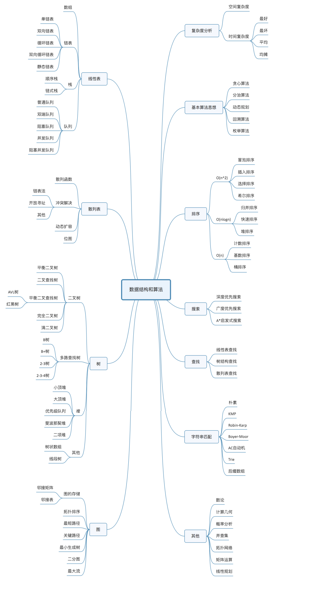

# 数据结构_概述

## 一、概念
数据结构：指一组数据的存储结构

```
逻辑结构：数据对象中的数据元素之间的相互关系
（1）线性结构：1对1
（2）树形结构：1对多
（3）图形结构：多对多

物理结构：数据的逻辑结构在计算机中的存储形式
（1）顺序存储结构：把数据元素存放在地址连续的存储单元里
（2）链式存储结构：把数据元素存放在任意的存储单元里，这些存储单元可以是连续的，也可以是不连续的
```




## 二、操作

对任何数据结构的操作只有：增、删、改、查（都是通过 遍历+访问 实现）


遍历两种方式:

```
1) 迭代遍历 
顺序存储结构（数组）
2) 递归遍历
链式存储结构
```

## 三、相关源码
https://github.com/icql/icql-java/tree/master/datastructure