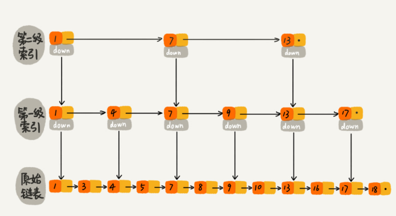

# 数据结构_线性表

## 一、定义

0个或多个数据元素的有限序列。存储分为：顺序存储（数组），链式存储（链表）


## 二、数组
用一组连续的内存空间，来存储一组具有相同类型的数据

### 1.特点
```
（1）随机访问（用索引访问）
（2）新增/删除需要移动大量元素（优化措施：将多次删除集中到1次删除，jvm的标记清除垃圾回收算法）
（3）数组/容器选择：性能要求较高优先数组

数组索引从0开始而非1的原因，cpu少了一次减法操作
若1开始，a[k] = a[1]_addr + (k-1)*type_size
若0开始，a[k] = a[0]_addr + k*type_size
```

### 2.操作

```
迭代遍历：
void traverse(int[] arr) {
    for (int i = 0; i < arr.length; i++) {
        // 迭代访问 arr[i]
    }
}

增：
需要移动元素，O(n)

删：
需要移动元素，O(n)

改：
根据索引访问，O(1)

查
根据索引访问，O(1)
```


## 三、链表
不需要连续的内存空间，使用零散的内存块存储数据，内存块之间有指针

### 1) 常见链表

``` 
(1)单链表：
头结点(data,next) -> Node(data,next) -> ... -> 尾结点(data,next(null))
[edge-policy.mobileconfig](..%2F..%2F..%2F..%2F..%2FDownloads%2Fedge-policy.mobileconfig)
(2)循环链表：
头结点(data,next) -> Node(data,next) -> ... -> 尾结点(data,next(头结点))

(3)双向链表：
头结点(data,prev(null),next) -> Node(data,prev,next) -> ... -> 尾结点(data,prev,next(null))
```


### 2) 跳表

查询数据平均时间复杂度 O(logn)，支持范围查询，所以redis zset使用跳表实现，而不是树




## 四、栈
限定仅在一端进行插入和删除的线性表，先进后出 FILO（first in last out）

```
1) 使用场景：
递归等

2) 常见术语：
stack 栈
push 入栈
pop 出栈
```


## 五、队列
只允许在一端（队尾）进行插入操作，在另一端（队头）进行删除操作的线性表，先进先出 FIFO（first in first out）

```
1) 使用场景：
各种资源池

阻塞队列：队列为空，阻塞出队直到有数据，队列满了，阻塞入队直到队列有空闲
并发队列：线程安全

2) 常见术语
queue 单向队列
deque 双向队列

offer 入队
poll 出队
peek 查看队首
```