# 数据结构_树

* [一、定义](#一定义)
* [二、基本特性](#二基本特性)
* [三、二叉树](#三二叉树)
* [四、堆](#四堆)
* [五、二分搜索树](#五二分搜索树)
* [六、平衡二叉树](#六平衡二叉树)
* [七、2-3树](#七2-3树)
* [八、红黑树](#八红黑树)
* [九、常用树结构的比较](#九常用树结构的比较)


## 一、定义
树是n个结点的有限集，每个结点只能有唯一的一个父结点

<br/>
<hr/>

## 二、基本特性

### 1）概念

```
>（1）结点的度：结点的子项个数
>（2）树的度：结点度中的最大值
>（3）叶子结点
>（4）父结点
>（5）孩子
>（6）树的深度：树的最大层次
>（7）森林：m个互不相交的树的集合
```

### 2）特点

```
根结点：无父节点，唯一
叶子结点：无孩子
中间结点：一个双亲，多个孩子
```


<br/>
<hr/>

## 三、二叉树

定义：每个结点最多有两棵子树，所以二叉树中不存在度大于2的结点；左右子树是有顺序的，即使只有一棵子树

### 1）性质

```
>（1）第i层上最多有 2^(i-1)个结点
>（2）深度为k的二叉树最多有（2^k - 1）个结点
>（3）终端结点数为n0，度数为2的结点数n2，则 n0 = n2 + 1
>（4）具有n个节点的完全二叉树深度为 log2 n +1
>（5）具有n个节点的完全二叉树深度为 log2 n +1，1 <= i <= n
>i=1，结点i是二叉树的根，无双亲
>i>1，其双亲是结点 i/2
>i>n/2，则结点i无左孩子，否则左孩子是结点 2i
>2i+1>n，则结点i无右孩子，否则其右孩子是结点 2i+1
```
    
### 2）存储结构

```
（1）顺序存储：
从根开始，按照每层从左到右依次存储，普通的二叉树若结点不是2个孩子，则以null代替，但这样比较浪费空间，所以一般只有完全二叉树使用顺序存储（数组）

（2）二叉链表：
class Node{
    E e;
    Node left;
    Node right;
}
```

### 3）遍历

```
>1）前序遍历：根结点-左结点-右节点
>2）中序遍历：左结点-根结点-右节点
>3）后序遍历：左结点-右节点-根结点
>4）层序遍历：从根节点开始，每层从左到右依次遍历
>
>前、中、后遍历：都是深度优先遍历
>层序遍历：是广度优先遍历
```

### 4）特殊二叉树

```
（1）满二叉树：
除了叶子之外所有子树都有左右孩子，且叶子均在同一层次上，是一个三角形

（2）完全二叉树：
一棵二叉树，除了最后一层之外都是完全填充的，并且最后一层的叶子结点要么都有要么只有左边
```

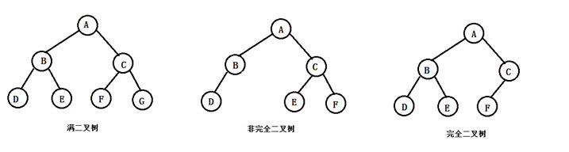

<br/>
<hr/>

## 四、堆
常用的是二叉堆，是一个完全二叉树

```
（1）最大堆：父结点的值总是大于孩子结点的值
（2）最小堆：父结点的值总是小于孩子结点的值
```

### 1）存储
一般用数组表示，完全二叉树
>性质：
>（1）父结点索引 = 当前结点索引/2
>（2）左孩子结点索引 = 当前结点索引*2
>（3）右孩子结点索引 = 当前结点索引*2+1

### 2）常用操作

``` java
package work.icql.java.datastructure.tree;

import java.util.ArrayList;
import java.util.List;

public class MaxHeap {
    private List<Integer> data;

    public MaxHeap() {
        data = new ArrayList<>();
    }

    //堆化，将数组堆化，O(n)，一个一个add，O(nlogn)
    public MaxHeap(int[] arr) {
        data = new ArrayList<>();
        for (int i = parent(arr.length - 1); i >= 0; i--) {
            siftDown(i);
        }
    }

    //向堆中添加元素
    //添加到数组尾部，上浮堆尾
    public void add(int e) {
        data.add(e);
        siftUp(data.size() - 1);
    }

    private void siftUp(int k) {
        int parent = parent(k);
        while (k > 0 && data.get(parent) < data.get(k)) {
            swap(k, parent);
            k = parent;
        }
    }

    //看堆中的最大元素
    public int findMax() {
        if (data.size() == 0) {
            throw new IllegalArgumentException();
        }
        return data.get(0);
    }

    //取出堆中最大元素
    //交换堆顶和尾部，删除堆尾，下沉堆顶
    public int removeMax() {
        int ret = findMax();
        swap(0, data.size() - 1);
        data.remove(data.size() - 1);
        siftDown(0);
        return ret;
    }

    private void siftDown(int k) {
        while (leftChild(k) < data.size()) {
            //在此轮循环中,data[k]和data[j]交换位置
            int j = leftChild(k);
            if (j + 1 < data.size() &&
                    data.get(j + 1) > data.get(j)) {
                j++;
            }
            //data[j] 是 leftChild 和 rightChild 中的最大值
            if (data.get(k) >= data.get(j)) {
                break;
            }
            swap(k, j);
            k = j;
        }
    }

    private void swap(int a, int b) {
        int aVal = data.get(a);
        int bVal = data.get(b);
        data.set(a, bVal);
        data.set(b, aVal);
    }

    private int parent(int index) {
        if (index == 0) {
            throw new IllegalArgumentException();
        }
        return (index - 1) / 2;
    }

    private int leftChild(int index) {
        return index * 2 + 1;
    }

    private int rightChild(int index) {
        return index * 2 + 2;
    }
}

```

### 3）堆的应用

#### （1）top n
构造一个最小堆，遍历一边所有数据，每次和堆顶比较
（1）若比堆顶大，则删除堆顶，当前元素入堆
（2）若比堆顶小，则不做操作

#### （2）堆排序

https://www.cnblogs.com/chengxiao/p/6129630.html

O(nlogn)，不稳定排序
所有数据在一个数组里，堆化得到最大堆，将堆顶和数组末尾交换，除了数组末尾剩下的用堆顶下沉，得到最大堆，再交换，递归得到

<br/>
<hr/>

## 五、二分搜索树

>性质：
>（1）二叉树
>（2）每个结点的值大于左子树所有结点的值
>（3）每个结点的值小于右子树所有结点的值
>
>二分搜索树可以作为2个条件的分类树
>左子树放第一个条件
>右子树放第二个条件

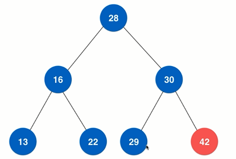

``` java
package work.icql.java.datastructure.tree;

import java.util.LinkedList;
import java.util.Queue;
import java.util.Stack;

public class BinarySearchTree {
    private static class Node {
        private int e;
        private Node left;
        private Node right;

        public Node(int e) {
            this.e = e;
        }
    }

    private Node root;
    private int size;

    //region 增

    public void add(int e) {
        root = add(root, e);
    }

    /**
     * 返回传入的结点
     */
    private Node add(Node node, int e) {
        if (node == null) {
            size++;
            return new Node(e);
        }
        int diff = e - node.e;
        if (diff == 0) {
            return node;
        }
        if (diff < 0) {
            node.left = add(node.left, e);
        } else {
            node.right = add(node.right, e);
        }
        return node;
    }

    //endregion

    //region 查

    public boolean contains(int e) {
        return contains(root, e);
    }

    private boolean contains(Node node, int e) {
        if (node == null) {
            return false;
        }
        int diff = e - node.e;
        if (diff == 0) {
            return true;
        }
        if (diff < 0) {
            return contains(node.left, e);
        }
        return contains(node.right, e);
    }

    //endregion

    //region 删

    public void remove(int e) {
        root = remove(root, e);
    }

    private Node remove(Node node, int e) {
        if (node == null) {
            return null;
        }
        int diff = e - node.e;
        if (diff < 0) {
            node.left = remove(node.left, e);
            return node;
        }
        if (diff > 0) {
            node.right = remove(node.right, e);
            return node;
        }
        //找到删除的结点进行删除

        //只有右结点
        if (node.left == null) {
            Node right = node.right;
            //node.right = null;
            size--;
            return right;
        }
        //只有左结点
        if (node.right == null) {
            Node left = node.left;
            size--;
            return left;
        }
        //左右结点都有

        //找到比当前结点大的最小结点进行替换
        //或者找到比当前结点小的最大结点进行替换
        Node successor = min(node.right);
        successor.right = removeMin(node.right);
        successor.left = node.left;
        node.left = node.right = null;

        return successor;
    }

    private Node min(Node node) {
        while (node.left != null) {
            node = node.left;
        }
        return node;
    }

    private Node removeMin(Node node) {
        if (node.left == null) {
            Node rightNode = node.right;
            node.right = null;
            size--;
            return rightNode;
        }
        node.left = removeMin(node.left);
        return node;
    }

    //endregion

    //region 高度

    public int maxHeight() {
        return maxHeight(root);
    }

    private int maxHeight(Node node) {
        if (node == null) {
            return 0;
        }
        return Math.max(maxHeight(node.left), maxHeight(node.right)) + 1;
    }

    public int minHeight() {
        return minHeight(root);
    }

    private int minHeight(Node node) {
        if (node == null) {
            return 0;
        }
        return Math.min(maxHeight(node.left), maxHeight(node.right)) + 1;
    }

    //endregion

    //region 前序遍历

    public void preOrder() {
        preOrder(root);
    }

    private void preOrder(Node node) {
        if (node == null) {
            return;
        }
        System.out.println(node.e);
        preOrder(node.left);
        preOrder(node.right);
    }

    public void preOrderNR() {
        Stack<Node> stack = new Stack<>();
        stack.push(root);
        while (!stack.isEmpty()) {
            Node cur = stack.pop();
            System.out.println(cur.e);
            if (cur.right != null) {
                stack.push(cur.right);
            }
            if (cur.left != null) {
                stack.push(cur.left);
            }
        }
    }

    //endregion

    //region 中序遍历

    public void midOrder() {
        midOrder(root);
    }

    private void midOrder(Node node) {
        if (node == null) {
            return;
        }
        midOrder(node.left);
        System.out.println(node.e);
        midOrder(node.right);
    }

    //endregion

    //region 后序遍历

    public void postOrder() {
        postOrder(root);
    }

    private void postOrder(Node node) {
        if (node == null) {
            return;
        }
        postOrder(node.left);
        postOrder(node.right);
        System.out.println(node.e);
    }

    //endregion

    //region 层序遍历

    public void levelOrder() {
        Queue<Node> queue = new LinkedList<>();
        queue.add(root);
        while (!queue.isEmpty()) {
            Node cur = queue.remove();
            System.out.println(cur.e);
            if (cur.left != null) {
                queue.add(cur.left);
            }
            if (cur.right != null) {
                queue.add(cur.right);
            }
        }
    }

    //endregion

    public static void main(String[] args) {
        //5
        //2 7
        //  6 8
        BinarySearchTree tree = new BinarySearchTree();
        tree.add(5);
        tree.add(2);
        tree.add(5);
        tree.add(7);
        tree.add(6);
        tree.add(8);
        tree.remove(7);

        System.out.println(tree.contains(98));

        //tree.preOrder();
        //tree.preOrderNR();
        //tree.midOrder();
        //tree.postOrder();

        System.out.println(tree.maxHeight());
        System.out.println(tree.minHeight());
    }
}
```

<br/>
<hr/>

## 六、平衡二叉树

二分搜索树极端情况下会退化成链表，所以才有了avl
二分搜索树的基础上，对于任意一个结点，左子树和右子树的高度差不能超过1

平衡因子：左右子树高度差
高度：logn

### 1）平衡操作
结点存储：高度、平衡因子
在插入（先插入到叶子结点）和删除时，如果结点不满足平衡性，则需要重新维护avl树的平衡性，一般有以下4种情况：

[cs_数据结构_树_avl.java](../../../resource/数据结构_树_avl.java)

#### （1）LL
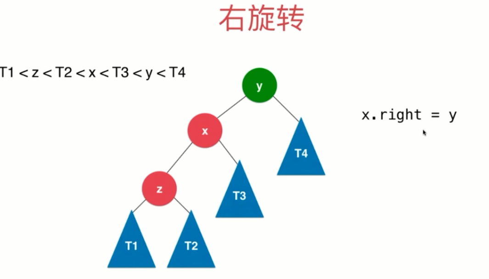
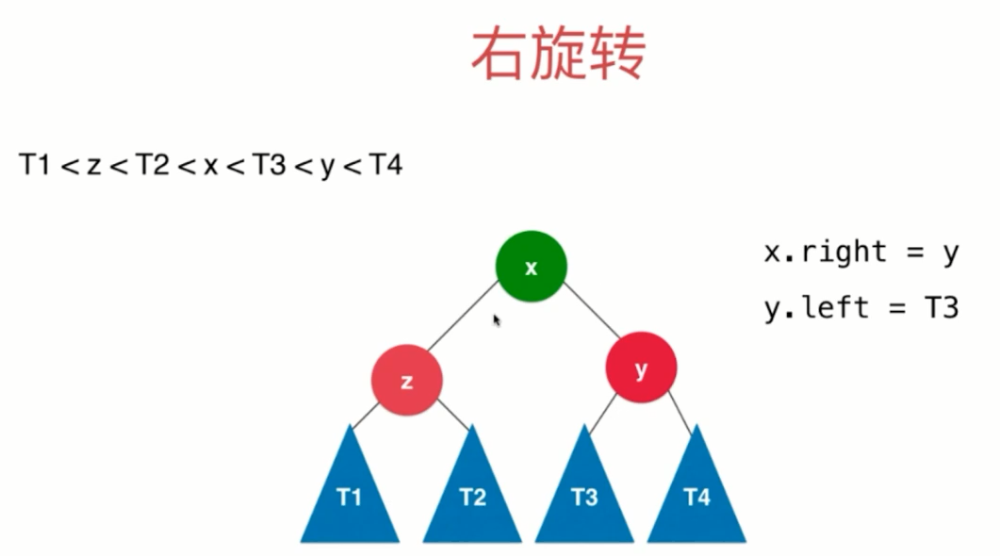

#### （2）RR
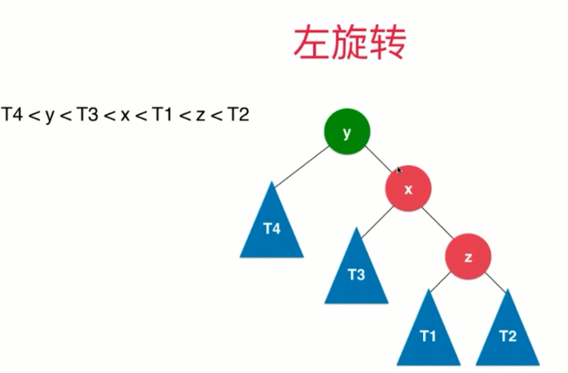
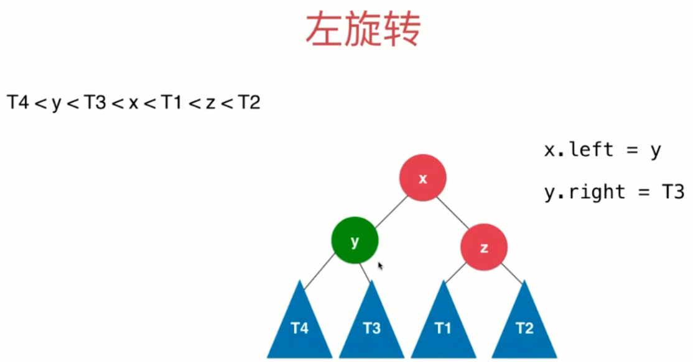

#### （3）LR
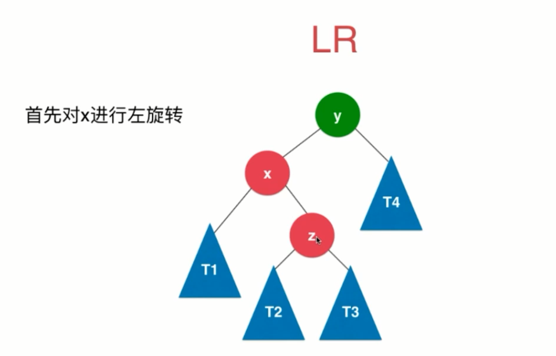
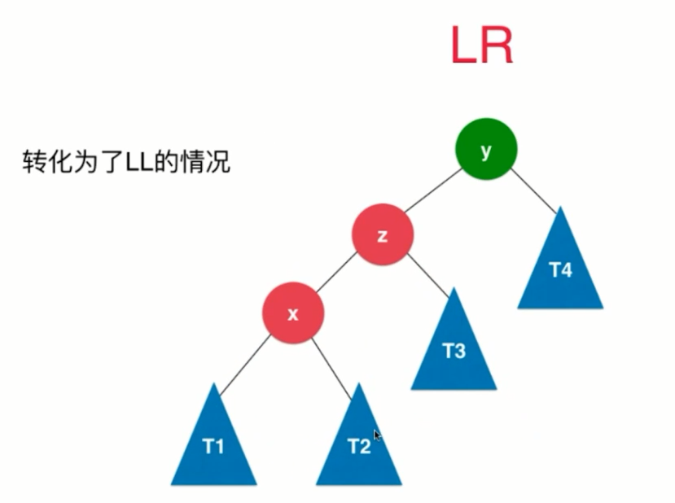

#### （4）RL
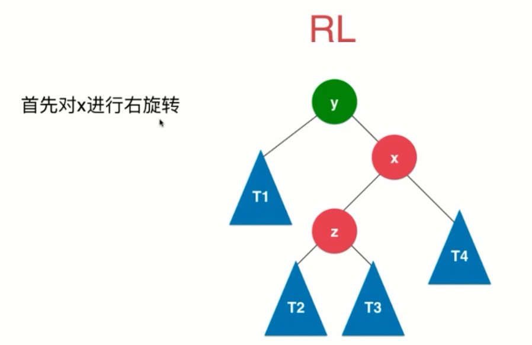
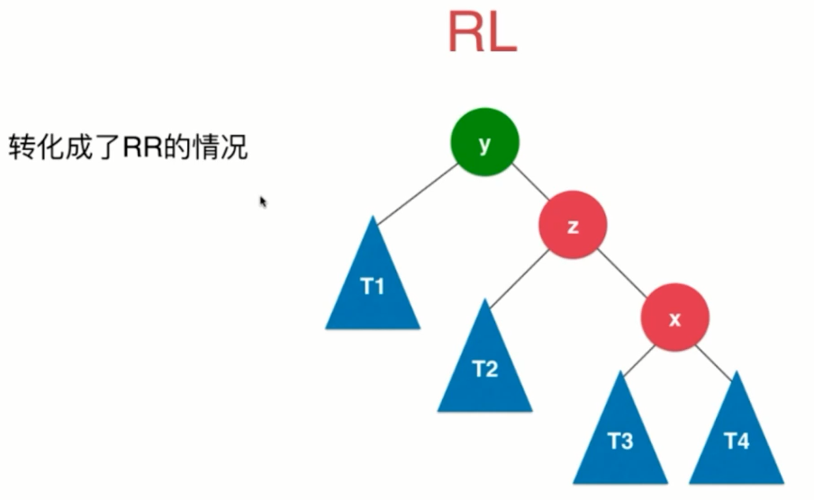


<br/>
<hr/>

## 七、2-3树
平衡多路查找树，绝对平衡（每一层所有结点的高度一致），B树和B+树的基础都是此结构
也满足二分搜索树的基本特性
一个结点要么有2个孩子要么有3个孩子，即每个结点要么存1个数据或存2个数据

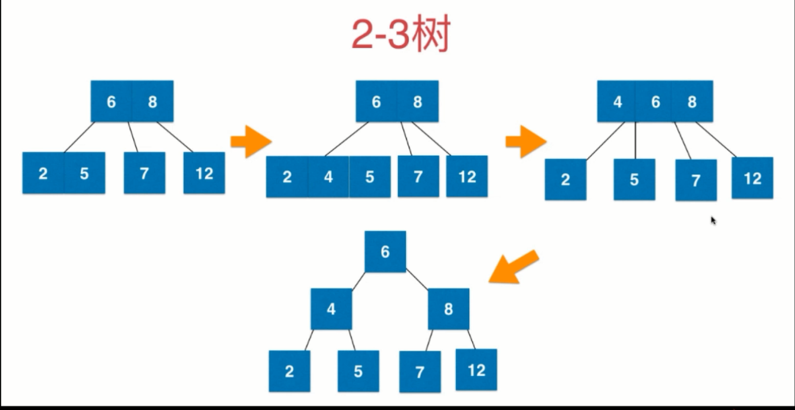

### 1）2-3树的新增

>从根节点开始，向下插入到叶子结点
>插入后的叶子结点是否超过3
>否：结束
>是：挑选插入后的叶子结点中的中间值向上融合
>判断向上融合后的父结点是否超过3
>以此类推

### 2）2-3树的删除
情况较多，比较复杂，最终在删除后需要通过左旋右旋保持最终的平衡


### 3）B树和B+树
2-3树就是一种B树

B+树和B树的区别：
B+树在向上融合的时候，会在叶子结点保留一份向上融合的结点数据
也就是说，B+树的非叶子结点都会有一份相同的数据在叶子结点

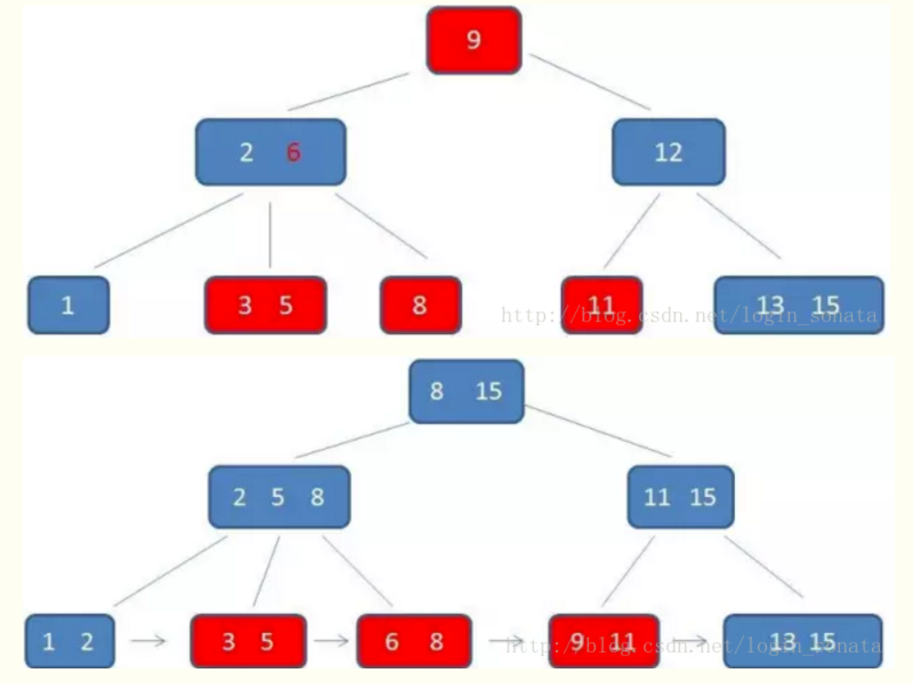

<br/>
<hr/>

## 八、红黑树

红黑树和2-3的关系：
红黑树是用二叉树实现2-3树的一种结构，等价的，红结点代表2-3树中多值结点中的小值，其他结点都是黑结点

红黑树也是一种二分搜索树

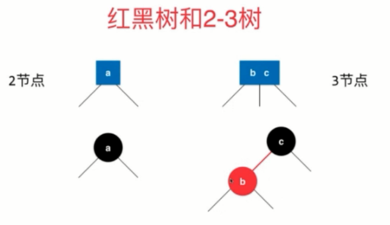
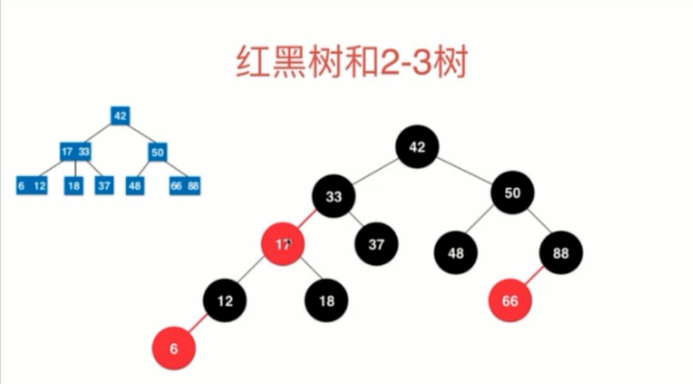
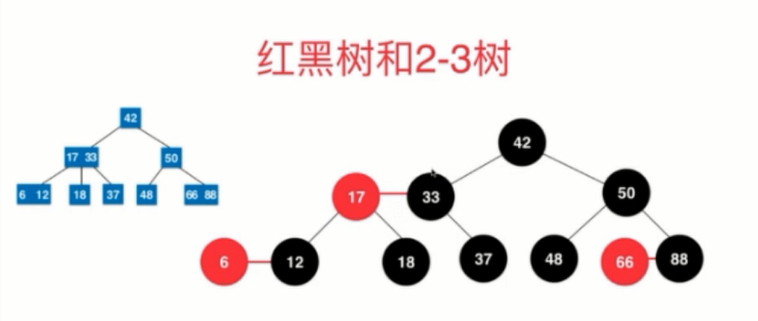

### 1）性质
1）每个结点要么时黑色要么是红色
2）根结点是黑色
3）每一个叶子结点（指的真实叶子结点的孩子结点，即null）是黑色
4）如果一个结点是红色的，那么他的孩子是黑色的
5）黑平衡，不满足avl特性，从任意一个结点到叶子结点（null），经过的黑色结点是一样的

最大高度：2logn，O(logn)

[cs_数据结构_树_红黑树.java](../../../resource/数据结构_树_红黑树.java)

<br/>
<hr/>

## 九、常用树结构的比较

二分搜索树：对于完全随机的数据，普通二分搜索树新增/查询效果很好，但是如果是顺序的数据，就退化成了链表
avl树：对于查询较多的情况，avl树性能较好，新增/删除需要进行重平衡操作，耗性能
红黑树：牺牲了一点平衡性(2logn的高度)，但是新增/删除性能较avl更优，