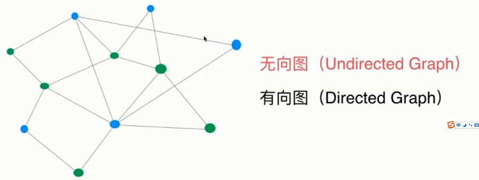
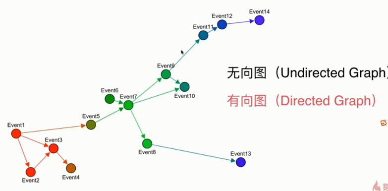
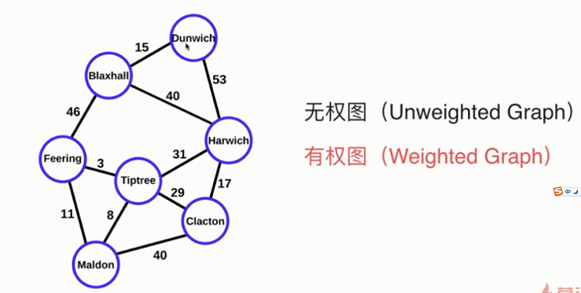
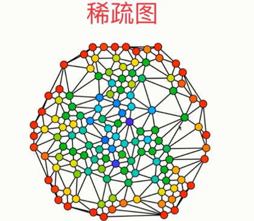
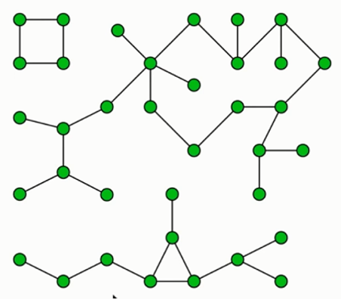

## 图
实现多对多的有限顶点之间关系的数据结构

### 1）无向图，有向图
顶点之间的边是否有方向

### 2）无权图，有权图
顶点之间的边是否有权重

### 3）稀疏图、稠密图
顶点之间的边的数量是否远大于顶点数量

### 4）顶点的度
顶点的度（degree），就是跟顶点相连接的边的条数
有向图的度分为：入度、出度

### 5）图的连通性

 

## 图的表示

### 1）邻接矩阵
常用来表示稠密图
邻接矩阵是顶点 n*n 矩阵（n<m），data[n][n]
data[a][b] 的值用来表示顶点 a->b 之间是否有边
data[b][a] 的值用来表示顶点 b->a 之间是否有边

[cs_数据结构_图_稠密图_DenseGraph](../../../resource/数据结构_图_稠密图_DenseGraph.java)

### 2）邻接表
常用来表示稀疏图
邻接表是顶点 data[n] 的数组，值为链表，存储有连接的其他顶点
data[a]=b->c，表示a指向b，a指向c

[cs_数据结构_图_稀疏图_SparseGraph](../../../resource/数据结构_图_稀疏图_SparseGraph.java)

 

## DFS深度优先遍历

 

## BFS广度优先遍历

 

## 最短路径

（1）无向图：广度优先遍历即可得到最短路径
（2）有向图：
https://www.jianshu.com/p/959e270cb850

 

## 最小生成树
在连通网的所有生成树中，所有边的代价（边的权重）和最小的生成树，称为最小生成树

https://blog.csdn.net/a2392008643/article/details/81781766