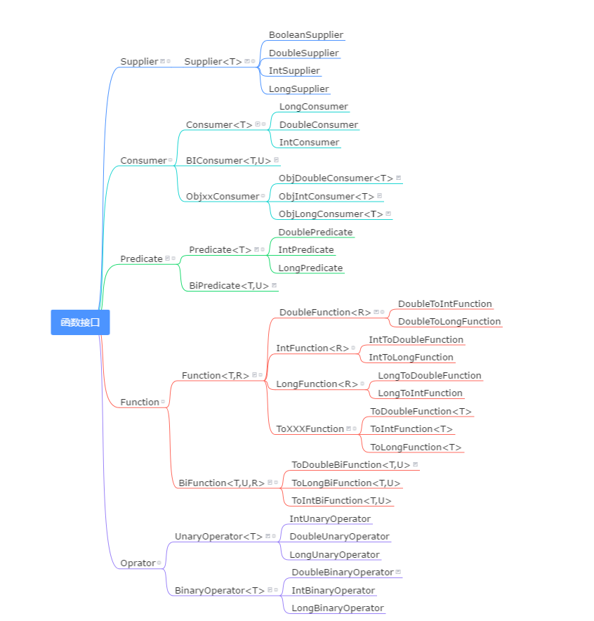

## 函数式接口

有且仅有一个抽象方法的接口/抽象类

java中的函数式编程体现就是Lambda，所以函数式接口就是可以适用于Lambda使用的接口。只有确保接口中有且仅有一个抽象方法，Java中的Lambda才能顺利地进行推导

### 1）@FunctionalInterface
一旦使用该注解来定义接口，编译器将会强制检查该接口是否确实有且仅有一个抽象方法，否则将会报错
需要注意的是，即使不使用该注解，只要满足函数式接口的定义，这仍然是一个函数式接口，使用起来都一样。(该注解是一个标记注解)

``` java
//标明为函数式接口
@FunctionalInterface 
public interface MyFunctionInterface{
    void method(); 
}
```

### 2）jdk常用函数式接口

可以使用现有的函数式接口简化简单的策略模式

