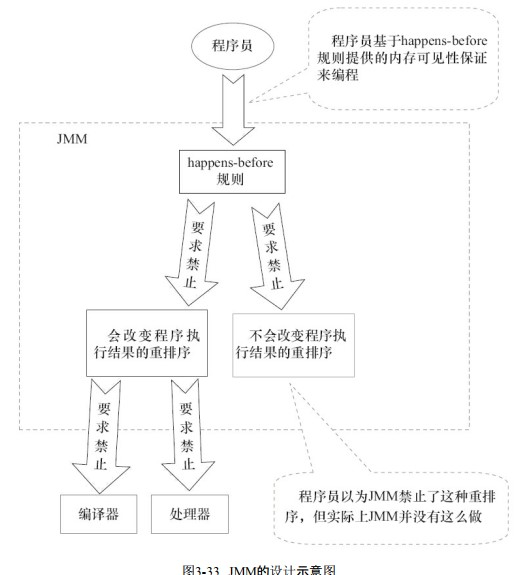

## 并发编程的通信机制（2种）

### 1）共享内存
线程之间共享公共状态（内存），通过 写-读 内存中的公共状态来进行隐式的通信

### 2）消息传递
线程之间没有公共状态，必须通过发送消息来进行显示的通信

 

## 指令重排序
as-if-serial语义，不管怎么重排序，单线程的程序执行结果不能被改变
编译器、runtime、处理器都必须遵守as-if-serial语义
如果操作之间不存在数据依赖关系，这些操作就可能被重排序

1）处理器指令重排序：
>为了使处理器内部的运算单元能尽量被充分利用
>处理器可能会对输入代码进行乱序执行（Out-Of-Order Execution） 优化，处理器会在计算之后将乱序执行的结果重组
>保证该结果与顺序执行的结果是一致的，但并不保证程序中各个语句计算的先后顺序与输入代码中的顺序一致
>因此如果存在一个计算任务依赖另外一个计算任务的中间结果，那么其顺序性并不能靠代码的先后顺序来保证

2）编译器指令重排序
类似上述的优化

3）虚拟机runtime jit即时编译器指令重排序
类似上述的优化

 

## java内存模型简介（JMM）
>java并发采用的是**共享内存机制**
>主要是 **抽象定义** **共享变量** 的并发访问规则（JSR133）
>共享变量指的是所有线程 共享的、可访问 的数据（代指实例域，静态域和数组元素等）
>其他如方法中的局部变量和参数都是线程私有的，不会被共享无并发问题不在内存模型控制范围内

**java并发内存模型如下**
>**主内存：** 共享变量构成的内存部分
>**工作内存：** 每个线程使用到共享变量时，将主内存中的共享变量内存拷贝一份到自己的工作内存中

### 1）主内存/工作内存的交互

#### （1）jsr133内存模型规定的——java虚拟机实现必须实现的8种原子操作：
>（1）lock锁定：作用于主内存的变量，把变量标识为一条线程独占的状态
>（2）unlock解锁：作用于主内存的变量，把锁定状态的变量释放出来
>（3）read读取：作用于主内存的变量，把一个变量的值从主内存传输到线程的工作内存中，以便随后的load动作使用
>（4）load载入：作用于工作内存的变量，把read操作从主内存中得到的变量值放入工作内存的变量副本中
>（5）use使用：作用于工作内存的变量，把工作内存的变量值传递给执行引擎，每当虚拟机遇到一个需要使用到变量的值的字节码指令时将会执行这个操作
>（6）assign赋值：作用于工作内存中的变量，把一个从执行引擎接收到的值赋给工作内存中的变量，每当虚拟机遇到一个给变量赋值的字节码指令时执行这个操作
>（7）store存储：作用于工作内存的变量，把工作内存中的一个变量的值传送到主内存中，一遍随后的write操作使用
>（8）write写入：作用于主内存的变量，把store操作从工作内存中得到的变量的值放入主内存的变量中

#### （2）jsr133内存模型规定的——原子操作执行规则
>（1）read/load 或 store/write 都必须顺序执行，但不要求连续，且不允许单个出现
>（2）不允许丢弃assign操作，即工作内存中改变了变量的值必须同步回主内存，不允许没有发生assign把变量同步回主内存
>（3）新变量只能在主内存中诞生，use和assign前必须分别执行load和assign操作
>（4）一个变量在同一时刻只允许一个线程对其lock，一个变量可以被同一个线程执行多次lock，后续必须执行相同次数的unlock才能解锁（可重入）
>（5）一个变量的unlock操作必须在lock之后
>（6）一个变量unlock前必须使用store和write将其同步回主内存

#### （3）jsr133内存模型规定的——long和double的非原子性协定
>允许虚拟机将没有被volatile修饰的64位数据的读写操作划分为两次32位的操作来进行
>即允许虚拟机实现自行选择是否要保证64位数据类型的load、 store、 read和write这四个操作的原子性
>
>主流jvm64位不会出现问题，32位可能出现，一般可不用考虑

### 2）内存模型的特征

#### （1）原子性
（1）read、load、use、assign、store、write这6个操作可以直接保证基本类型的原子性操作（long、double 64位类型特殊，无需考虑）
（2）lock、unlock是用于保证更大范围的原子性，例如字节码指令 monitorenter 和 monitorexit （synchronized）就是这两个抽象操作的具体实现

#### （2）可见性
（1）通过 **在变量修改后将新值同步回主内存，在变量读取前从主内存刷新变量值** 这种方式来实现可见性的
例如volatile就是具体的实现，普通变量与volatile变量的区别是，volatile的特殊规则保证了新值能立即同步到主内存，以及每次使用前立即从主内存刷新
（2）lock和unlock对一个变量进行线程独占，间接的保证了其他线程对变量的可见性
例如synchronized就是具体的实现。还有final关键字，也保证了可见性，final修饰的变量必须在类初始化或构造方法中赋值，后续不允许改变

#### （3）有序性
如果在单个线程中观察，所有的操作天然有序，即使有指令重排序，但是在单个线程中观察是察觉不到的
如果在一个线程中观察另外一个线程，就有可能看到乱序现象

### 3）先行发生原则（Happens-Before）
java内存模型下的一些天然的先行发生关系，无须任何同步器协助就已经存在，若不在此列，就可能发生重排序
这里指的是前一个操作的执行结果对后一个操作可见，但不意味着前一个操作必须在后一个操作之前执行
是对java内存模型的一种近似性的描述，它并不够严谨，但便于日常程序开发参考使用

>（1）**程序顺序规则：** 一个线程中的每个操作，happens-before于该线程中的任意后续操作
>（2）**监视器锁规则：** 对一个锁的解锁，happens-before于随后对这个锁的加锁
>（3）**volatile变量规则：** 对一个volatile域的写，happens-before于任意后续对这个volatile域的读
>（4）**传递性：** 如果A happens-before B，且B happens-before C，那么A happens-before C
>（5）**start规则：** 如果线程A执行操作ThreadB.start()（启动线程B），那么A线程的ThreadB.start()操作happens-before于线程B中的任意操作
>（6）**join规则：** 如果线程A执行操作ThreadB.join()并成功返回，那么线程B中的任意操作happens-before于线程A从ThreadB.join()操作成功返回

