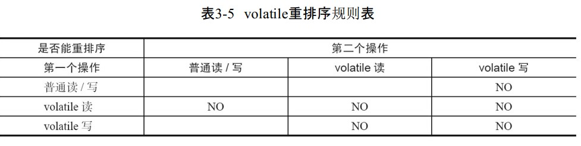

## volatile

### 1）作用
如果一个字段被声明为 volatile 
```
1）可见性：java内存模型会确保一个线程修改 **这个变量的值** 会对其他线程立即可见
2）有序性：禁止指令重排序
3）原子性：jmm内存模型规定，变量的load和store操作本身就是原子的
```

**注意：**
```
>（1）基本类型：指的是值，修改值以后其他线程会立即可见
>（2）引用类型：指的是地址，修改地址后其他线程会立即可见，修改这个变量的字段不会对其他线程立即可见
```

```java
//验证volatile引用类型
//打印jit编译的汇编代码
//vm参数，-Xcomp -XX:+UnlockDiagnosticVMOptions -XX:+PrintAssembly -XX:CompileCommand=compileonly,*Application.main
public class TestObject {
    public int test;
}
public class Application {
    private static volatile TestObject testObject = new TestObject();
    public static void main(String[] args) throws Exception {
        //testObject = null;//第1次运行
        //testObject.test = 10;//第2次运行
    }
}

//根据汇编结果可以看到：
//第1次运行，关键汇编代码，有lock xxx代码，说明修改变量的地址 volatile 有效
//0x0000000003832d8c: lock add dword ptr [rsp],0h  ;*putstatic testObject
//                                                 ; - work.icql.jvm.Application::main@1 (line 10)
//
//第2次运行，关键汇编代码，没有lock xxx代码，说明修改变量的字段，该 volatile 变量 无效
```

### 2）实现原理

#### （1）jvm层面-jmm内存模型语义



具体的，jvm用 **内存屏障** 来实现jmm内存模型规定的上述volatile语义（可见性、有序性）
>**内存屏障类型：**
>（1）LoadLoad屏障：在执行Load2前必须执行完Load1
>（2）LoadStore屏障：在执行Store前必须执行完Load
>（3）StoreStore屏障：在执行Store2前必须执行完Store1
>（4）StoreLoad屏障：在执行Load前必须执行完Store

**理论上**，对于volatile变量，jvm插入的内存屏障顺序如下：
>**volatile读操作**
>LoadLoadBarrier，保证 volatile读 不能与 普通读/volatile读 重排序
>LoadStoreBarrier，保证 volatile读 不能与 普通写/volatile写 重排序
>
>StoreStoreBarrier，保证 普通读或写/volatile写 不能与 volatile写 重排序
>**volatile写操作**
>StoreLoadBarrier，保证 volatile写 不能与 （普通读或写）/volatile读或写 重排序
>
>
>上面有几点要注意的是：
>store前必须要load，这是jmm规定的
>所以StoreStoreBarrier和StoreLoadBarrier会额外的保证了相关load操作
>StoreLoadBarrier中多余的保证了 volatile写 不能与 普通读或写 重排序
>但是不影响正确性，所以没关系

**实际上**，jvm插入的内存屏障和cpu有关
（1）X86架构处理器，只会对 **写-读** 做重排序，不会对 读-读、读-写 和 写-写 这3种操作做重排序
所以，jvm对X86处理器，只会插入 StoreLoad屏障
（2）**单核处理器没有必要插入内存屏障**，针对单核处理器，jvm没有使用内存屏障

//例如orderAccess_linux_x86.inline.hpp，图片来源于https://zhuanlan.zhihu.com/p/133851347


#### （2）硬件层面
X86架构处理器使用lock前缀的cpu指令实现内存屏障（volatile）

上图的源码中有体现，1）作用 中验证volatile引用类型也有体现


### 3）volatile缓存行填充
伪共享问题：
>缓存系统中是以缓存行（cache line）为单位存储的
>一般的cpu缓存行为64b
>当多线程修改互相独立的变量时，如果这些变量共享同一个缓存行
>就会无意中影响彼此的性能

解决办法：
>使用一些无意义的变量填充整个对象
>使 有意义数据+无意义数据 的内存占用大于64b
>即保证一个缓存行中只能有有意义数据

```java
//jdk7，Disruptor框架中的应用
//使用继承避免jdk7优化掉无用的字段
//
//左边7个字节+有效值value+右边7个字节
//这样可以使得不管如何，一个缓存行中都只有 有效值value
//没有其他有意义的数据

class LhsPadding{
    protected long p1, p2, p3, p4, p5, p6, p7;
}
class Value extends LhsPadding{
    protected volatile long value;
}
class RhsPadding extends Value{
    protected long p9, p10, p11, p12, p13, p14, p15;
}
```

```java
//jdk8
//可以直接使用注解@sun.misc.Contended，使各个变量在Cache line中分隔开
//同时jvm需要添加参数-XX:-RestrictContended 来关闭对此注解的限制
@Contended
public final static class FillLong { 
    public volatile long value = 0L;
}
```

<br/>
<hr/>


## synchronized

### 1）作用

synchronized用来实现同步，java中的每一个对象都可以作为锁

2种使用形式：
>1）同步方法
>   （1）对于普通同步方法，锁是当前实例对象
>   （2）对于静态同步方法，锁是当前类的Class对象
>2）同步代码块
>   （2）锁是synchonized括号里配置的对象


### 2）实现原理

#### （1）jvm层面

>（1）对于同步方法，jvm采用ACC_SYNCHRONIZED标记符来实现同步
>（2）对于同步代码块，jvm采用monitorenter、monitorexit两个字节码指令来实现同步
>
>上述两者都是通过 **Monitor（管程或监视器）** 实现的，每个对象都有自己的Monitor
>同步方法是隐式的，当调用同步方法时，会先检查是否有ACC_SYNCHRONIZED，如果有则需要先获得监视器锁，方法执行完后要释放监视器锁
>同步代码块则显示的直接使用的两个字节码指令

``` java
public static void main(String[] args) throws Exception {
    synchronized (""){
        System.out.println("wowo");
    }
}

public synchronized void test(){
    System.out.println("wowo");
}

public synchronized static void test2(){
    System.out.println("wowo");
}

//编译后，javap -v XXX.class查看字节码，查看关键部分如下，可以得知上述结论
 public static void main(java.lang.String[]) throws java.lang.Exception;
    descriptor: ([Ljava/lang/String;)V
    flags: ACC_PUBLIC, ACC_STATIC
    Code:
      stack=2, locals=3, args_size=1
         0: ldc           #2                  // String
         2: dup
         3: astore_1
         4: monitorenter
         5: getstatic     #3                  // Field java/lang/System.out:Ljava/io/PrintStream;
         8: ldc           #4                  // String wowo
        10: invokevirtual #5                  // Method java/io/PrintStream.println:(Ljava/lang/String;)V
        13: aload_1
        14: monitorexit
        15: goto          23
        18: astore_2
        19: aload_1
        20: monitorexit
        21: aload_2
        22: athrow
        23: return
      Exception table:
         from    to  target type
             5    15    18   any
            18    21    18   any
      LineNumberTable:
        line 10: 0
        line 11: 5
        line 12: 13
        line 13: 23
      LocalVariableTable:
        Start  Length  Slot  Name   Signature
            0      24     0  args   [Ljava/lang/String;
      StackMapTable: number_of_entries = 2
        frame_type = 255 /* full_frame */
          offset_delta = 18
          locals = [ class "[Ljava/lang/String;", class java/lang/Object ]
          stack = [ class java/lang/Throwable ]
        frame_type = 250 /* chop */
          offset_delta = 4
    Exceptions:
      throws java.lang.Exception

  public synchronized void test();
    descriptor: ()V
    flags: ACC_PUBLIC, ACC_SYNCHRONIZED
    Code:
      stack=2, locals=1, args_size=1
         0: getstatic     #3                  // Field java/lang/System.out:Ljava/io/PrintStream;
         3: ldc           #4                  // String wowo
         5: invokevirtual #5                  // Method java/io/PrintStream.println:(Ljava/lang/String;)V
         8: return
      LineNumberTable:
        line 16: 0
        line 17: 8
      LocalVariableTable:
        Start  Length  Slot  Name   Signature
            0       9     0  this   Lwork/icql/jvm/Application;

  public static synchronized void test2();
    descriptor: ()V
    flags: ACC_PUBLIC, ACC_STATIC, ACC_SYNCHRONIZED
    Code:
      stack=2, locals=0, args_size=0
         0: getstatic     #3                  // Field java/lang/System.out:Ljava/io/PrintStream;
         3: ldc           #4                  // String wowo
         5: invokevirtual #5                  // Method java/io/PrintStream.println:(Ljava/lang/String;)V
         8: return
      LineNumberTable:
        line 20: 0
        line 21: 8
```


##### （1.1）对象头markword
对象结构详情请查看 jvm_内存管理篇-对象内存布局（64位虚拟机）

**64位jvm中java对象不同状态下的markword**


lock + biased_lock 共同确定了上述5种不同的状态，状态不同，整个markword标识的含义不同

>**1）无锁状态：**
> lock：锁标记，2位，值为01
> biased_lock：偏向锁标记，1位，值为0，代表非偏向锁状态
> age：垃圾回收java对象年龄，4位，垃圾回收时对象每次在survivor区复制一次，年龄增加1次，具体查看 jvm_垃圾回收篇
> identity_hashcode：对象hashCode，31位，方法System.identityHashCode()计算得到的，延迟计算，计算后写入到这部分。其他状态下markword没有空间存储此值，hashcode移动到每个对象的监视器Monitor中
> unused：未使用到的
> 
>**2）偏向锁状态：**
> biased_lock：偏向锁标记，1位，值为1，代表偏向锁状态
> thread：持有偏向锁的线程ID，54位
> epoch：用于批量重偏向/撤销，2位，较为复杂
>
>**3）轻量级锁状态：**
> ptr_to_lock_record：指向栈中锁记录的指针，62位
>
>**4）重量级锁状态：**
> ptr_to_heavyweight_monitor：指向对象监视器Monitor的指针，62位


部分内容参考 https://blog.csdn.net/SCDN_CP/article/details/86491792

##### （1.2）锁的升级过程
jdk1.6之后为了减少使用同步锁的性能消耗，优化了synchonized，使用synchonized时锁会有一个升级的过程
> 无锁状态（匿名偏向状态） -> 偏向锁状态 -> 轻量级锁状态 -> 重量级锁状态

内容来自这位大佬 https://github.com/farmerjohngit/myblog ，防止丢失，内容已缓存
[概述](../../../resource/jc_并发关键字_synchronized_概述.html)
[偏向锁](../../../resource/jc_并发关键字_synchronized_偏向锁.html)
[轻量级锁](../../../resource/jc_并发关键字_synchronized_轻量级锁.html)
[重量级锁](../../../resource/jc_并发关键字_synchronized_重量级锁.html)

是非公平锁

当一个线程想获取锁时，
先试图插队，
如果占用锁的线程释放了锁，
下一个线程还没来得及拿锁，
那么当前线程就可以直接获得锁；
如果锁正在被其它线程占用，
则排队，
排队的时候就不能再试图获得锁了，
只能等到前面所有线程都执行完才能获得锁

#### （2）硬件层面
1）更改markword值是使用的cas操作（Atomic::cmpxchg）
2）重量级锁使用的是POSIX中mutex锁
https://github.com/farmerjohngit/myblog/issues/7


<br/>
<hr/>

## final
1）在构造函数内对一个final域的写入，与随后把这个被构造对象的引用赋值给一个引用变量，这两个操作之间不能重排序
（防止对象引用逃逸）
2）初次读一个包含final域的对象的引用，与随后初次读这个final域，这两个操作之间不能重排序