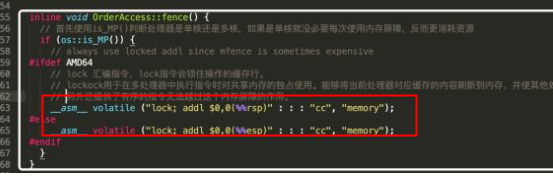
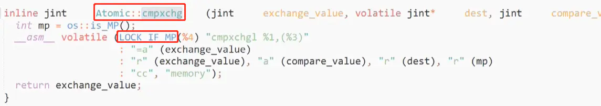

## 原子操作（atomic operation）
原子操作指的是不能被中断的一个或一系列操作

### CAS（Compare and Swap）
CAS操作包含三个操作数 —— 内存位置（V）、预期原值（A）和新值(B)
如果内存位置的值与预期原值相匹配，那么处理器会自动将该位置值更新为新值 。否则，处理器不做任何操作

**CAS存在的问题**
>1）循环时间开销大
>2）ABA问题：使用版本号解决

 

## 原子操作-cpu实现（X86架构）
（1）使用总线锁实现
（2）使用缓存锁实现

### lock前缀指令
上述的两种实现方式，都是通过lock前缀指令具体实现的

>**lock前缀指令的功能：**
>（1）将当前处理器缓存行的数据写回到系统内存
>（2）使在其他CPU里缓存了该内存地址的数据无效

>**lock前缀只能加在这些指令前面：**
>add、adc、and、btc、btr、bts、cmpxchg、cmpxch8b，cmpxchg16b，dec，inc，neg，not，or，sbb，sub，xor，xadd和xchg

早期，统一锁总线，但是开销太大（指的是当前处理器独占一块内存区域，其他处理器不能访问）
现在，分情况，能用锁定缓存会优先使用
>（1）一般是使用锁定缓存，锁定操作数据的缓存行
>     通过 **缓存一致性协议** 来阻止多个处理器同时修改这部分内存区域对应得缓存行
>     然后回写到内存，再通过 **缓存一致性协议** 使其他处理器的该内存的缓存行失效
>（2）依旧使用锁总线：操作的数据跨多个缓存行
>（3）依旧使用锁总线：处理器不支持锁缓存
>（4）依旧使用锁总线：bts、btr、btc、xadd、cmpxchg、add、or等指令和lock一起使用时，对操作的内存区域加锁，其他处理器不能同时访问

 

### 缓存一致性协议
>例如：IA-32和Intel 64处理器使用的MESI缓存一致性协议
>通过环形总线ring bus连接所有cpu核心，使其可以互相感知其他cpu的缓存行状态
>缓存行的状态：M（修改Modified）、E（独享Exclusive）、S(共享Shared)、I（无效Invalid）
>https://www.cnblogs.com/yanlong300/p/8986041.html

 

## 原子操作-jvm实现
jvm在cpu实现原子操作的基础上，使用 **volatile** 和 **cas（Atomic::cmpxchg）** 实现原子操作

根据jvm源码和上面部分可以得知：
如果是多处理器， **lock add** 和 **lock cmpxchg** 这两组指令都是锁总线的
所以jvm中 volatile 和 cas（Atomic::cmpxchg）都是基于锁总线的