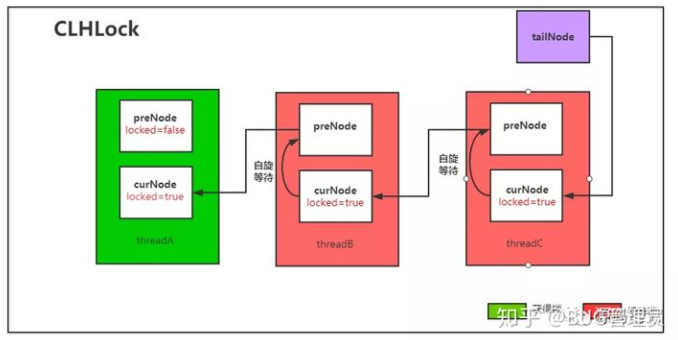
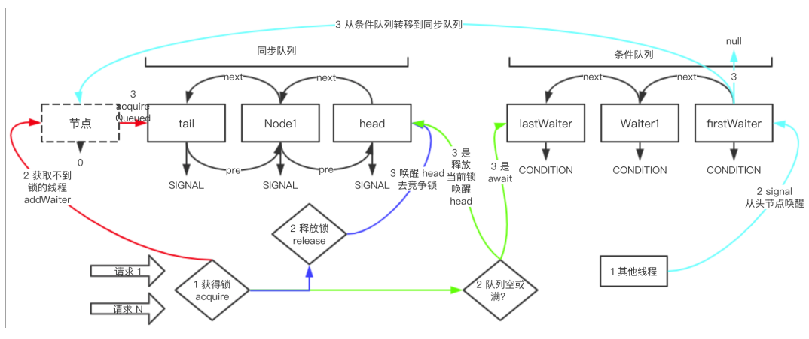
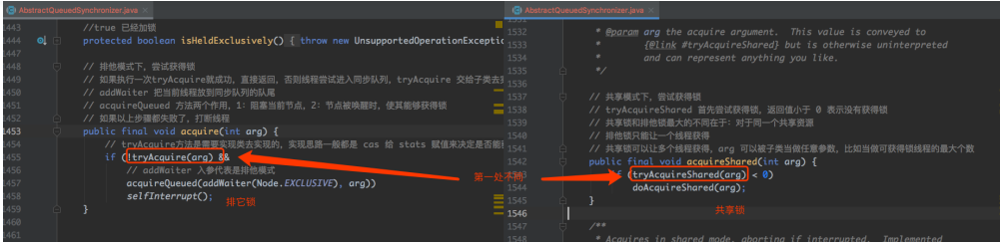
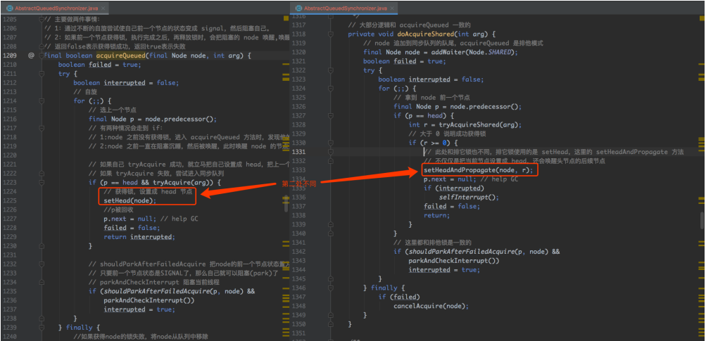
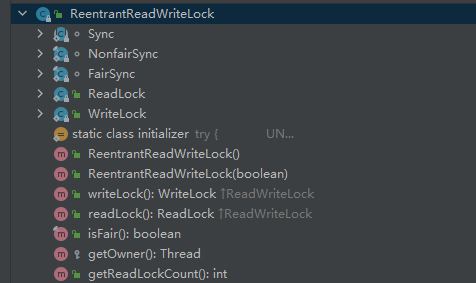

## Lock接口

java.util.concurrent.locks.Lock

``` java
//获得锁方法，获取不到锁的线程会到同步队列中阻塞排队
void lock();
//获取可中断的锁
void lockInterruptibly() throws InterruptedException;
//尝试获得锁，如果锁空闲，立马返回 true，否则返回 false
boolean tryLock();
//带有超时等待时间的锁，如果超时时间到了，仍然没有获得锁，返回 false
boolean tryLock(long time, TimeUnit unit) throws InterruptedException;
//释放锁
void unlock();
//得到新的 Condition
Condition newCondition();
```

**比较：**
>synchronized 使用简单，系统自动管理同步，非公平锁；
>Lock接口 使用可操作性高，可超时获取锁、中断的获取锁以及可实现 公平/非公平 等

<br/>
<hr/>

## AQS（同步器）
java.util.concurrent.locks.AbstractQueuedSynchronizer，实现Lock接口和其他并发工具类的底层数据结构

### CLH锁

CLH是一种基于单向链表的 **公平、高性能** 的自旋锁，AQS实现是CLH锁的变体

**基本原理：**
>申请加锁的线程通过前驱结点的状态进行自旋。在前置结点解锁后，当前结点会结束自旋，并进行加锁



### AQS源码

AQS 中的主要数据结构：同步队列 + 条件队列，底层数据结构两者都是链表



#### 1）类定义
``` java
//AQS 是个抽象类，就是给各种锁子类继承用的
//使用模板方法设计模式，定义了很多如何获得锁，如何释放锁的抽象方法让子类去实现
public abstract class AbstractQueuedSynchronizer
    extends AbstractOwnableSynchronizer
    implements java.io.Serializable {}

//继承的 AbstractOwnableSynchronizer 很简单
//就是为了知道当前是那个线程获得了锁
//方便监控
public abstract class AbstractOwnableSynchronizer
    implements java.io.Serializable {
    private static final long serialVersionUID = 3737899427754241961L;
    protected AbstractOwnableSynchronizer() { }
    //当前获得了锁的线程引用
    private transient Thread exclusiveOwnerThread;
    protected final void setExclusiveOwnerThread(Thread thread) {
        exclusiveOwnerThread = thread;
    }
    protected final Thread getExclusiveOwnerThread() {
        return exclusiveOwnerThread;
    }
}
```

#### 2）重要属性
AQS 的属性可简单分为 5 类：同步器AQS简单属性、同步队列属性、条件队列属性、公用Node类、条件ConditionObject类

##### （1）同步器AQS属性
``` java
//同步器AQS的状态，子类会根据状态字段进行判断是否可以获得锁
//比如 CAS 成功给 state 赋值 1 算得到锁，赋值失败为得不到锁， CAS 成功给 state 赋值 0 算释放
//可重入锁，每次获得锁 +1，每次释放锁 -1
//注意此字段是 volatile 修饰
private volatile int state;

// 自旋超时阀值，单位纳秒
// 当设置等待时间时才会用到这个属性
static final long spinForTimeoutThreshold = 1000L;
```

##### （2）同步队列属性

**同步队列的作用：**
>**阻塞获取不到锁的线程，并在适当时机释放这些线程**
>
>当多个线程都来请求锁时
>某一时刻有且只有一个线程能够获得锁（排它锁）
>其他获取不到锁的线程
>都会到同步队列中去排队并阻塞自己
>
>当有线程主动释放锁时
>就会从**同步队列列头**开始释放一个排队的线程
>让线程重新去竞争锁


**同步队列属性：**
``` java
//同步队列底层数据结构是个双向链表
//volatile 修饰头尾结点保证可见性

// 同步队列的头
private transient volatile Node head;
// 同步队列的尾
private transient volatile Node tail;
```

##### （3）条件队列属性
条件队列用来实现 wait/notify 等待通知机制的，配合锁使用

``` java
// 条件队列，从属性上可以看出是链表结构
public class ConditionObject implements Condition, java.io.Serializable {
private static final long serialVersionUID = 1173984872572414699L;
// 条件队列中第一个 node
private transient Node firstWaiter;
// 条件队列中最后一个 node
private transient Node lastWaiter;
}
```

##### （4）公用Node类
Node 非常重要，即是同步队列的结点，又是条件队列的结点
在入队的时用 Node 把线程包装一下，然后把 Node 放入两个队列中
需要重点关注 waitStatus 字段

``` java
static final class Node {

//（1）同步队列单独的属性

//node 是共享模式
static final Node SHARED = new Node();
//node 是排它模式
static final Node EXCLUSIVE = null;
//当前结点的前结点
//结点 acquire 成功后就会变成head
//head 结点不能被 cancelled
volatile Node prev;
//当前结点的下一个结点
volatile Node next;

//（2）两个队列共享的属性

//表示当前结点的状态，通过结点的状态来控制结点的行为
volatile int waitStatus;

//waitStatus的状态
//0：普通同步结点，waitStatus默认值
//1：被取消的结点
//由于在同步队列中等待的线程等待超时或者被中断
//进入到此状态的结点将不会再变化
static final int CANCELLED = 1;
//-1：后继结点的线程必定处于等待状态
//当前结点释放锁或者被取消时
//将会通知后继结点得以运行
static final int SIGNAL = -1;
//-2：当前结点在等待队列中
//等待在Condition上
//当其他线程对Condition调用了singal()方法后
//该结点会转移到同步队列中开始准备获取锁
static final int CONDITION = -2;
//-3：表示下一次共享式同步状态获取将会无条件传播下去
static final int PROPAGATE = -3;

//线程引用
volatile Thread thread;

//在同步队列中，nextWaiter 用来区分是共享模式/排他模式
//值为 Node.SHARED 或 NODE.EXCLUSIVE（null）
//在条件队列中，nextWaiter 就是表示下一个结点元素
Node nextWaiter;
```

##### （5）条件ConditionObject类
ConditionObject实现了Condition接口

**Condition接口：**
>当 lock 代替 synchronized 来加锁时
>可以用 Condition 来代替 Object 中相应的监控方法
>比如 Object#wait ()、Object#notify、Object#notifyAll
>Condition 实例是绑定在锁上的
>通过 Lock#newCondition 方法可以产生该实例

``` java
//使当前线程一直等待，直到被 signalled 或被打断
void await() throws InterruptedException;
//返回的 long 值表示剩余的给定等待时间，如果返回的时间小于等于 0 ，说明等待时间过了
//选择纳秒是为了避免计算剩余等待时间时的截断误差
long awaitNanos(long nanosTimeout) throws InterruptedException;
//虽然入参可以是任意单位的时间，但底层仍然转化成纳秒
boolean await(long time, TimeUnit unit) throws InterruptedException;

当以下四种情况发生时，条件队列中的线程将被唤醒
1. 有线程使用了 signal 方法，正好唤醒了条件队列中的当前线程；
2. 有线程使用了 signalAll 方法；
3. 其它线程打断了当前线程，并且当前线程支持被打断；
4. 被虚假唤醒
// 唤醒条件队列中的一个线程，在被唤醒前必须先获得锁
void signal();
// 唤醒条件队列中的所有线程
void signalAll();
```

#### 3）获取锁

使用 Lock.lock() 方法来获得锁，lock方法一般会调用 AQS 的 acquire 或 tryAcquire方法

##### （1）acquire 获取排他锁
``` java
//（1）尝试执行一次tryAcquire获得锁，获得锁直接返回，否则走2
//（AQS未实现，子类实现一般都是 cas 给 state 赋值来决定是否能获得）
//（2）把当前线程包装为Node放到同步队列的队尾
//addWaiter 方法（入参为排他模式）
//（3）自旋，阻塞当前结点，结点被唤醒时，使其能够获得锁
acquireQueued 方法，阻塞当前结点时要先把同步队列中的前置结点状态设置为SIGNAL
//（4）满足 !2&&3，即怎么也获取不到锁时，打断线程

public final void acquire(int arg) {
    if (!tryAcquire(arg) &&
        //Node.EXCLUSIVE==null
        acquireQueued(addWaiter(Node.EXCLUSIVE), arg))
        selfInterrupt();
}


//（1）tryAcquire方法
protected boolean tryAcquire(int arg) {
    throw new UnsupportedOperationException();
}

//（2）addWaiter方法：node 追加到同步队列的队尾
private Node addWaiter(Node mode) {
    Node node = new Node(Thread.currentThread(), mode);
    //这部分逻辑和下面的enq()方法基本一致
    //区别在于enq()方法多了同步队列tail队尾为空、也就是第一次的初始化逻辑
    //这么做的原因：
    //先简单尝试一下是否可以入队成功
    //大部分都可以一次入队成功
    //就无需自旋入队
    Node pred = tail;
    if (pred != null) {
        node.prev = pred;
        if (compareAndSetTail(pred, node)) {
            pred.next = node;
            return node;
        }
    }
    //自旋使node入队队尾
    enq(node);
    return node;
}


//自旋（死循环）入队队尾
private Node enq(final Node node) {
    for (;;) {
        Node t = tail;
        if (t == null) {
            //同步队列为空的情况
            //这一遍走完只是设置一个无意义的头结点
            //下一遍循环走下面的else分支才会设置node正常入队尾
            if (compareAndSetHead(new Node()))
                tail = head;
        } else {
            node.prev = t;
            if (compareAndSetTail(t, node)) {
                t.next = node;
                return t;
            }
        }
    }
}

//（3）acquireQueued方法：阻塞当前线程
final boolean acquireQueued(final Node node, int arg) {
    boolean failed = true;
    try {
        boolean interrupted = false;
        for (;;) {
            //获取前一个结点
            final Node p = node.predecessor();
            if (p == head && tryAcquire(arg)) {
                //前一个结点是头结点，则尝试获取锁
                //获取锁成功，则设置当前结点为头结点
                setHead(node);
                p.next = null; // help GC
                failed = false;
                //返回未阻塞当前线程，即获取锁成功
                return interrupted;
            }
            //是否可以阻塞当前线程：只要前一个结点状态是 SIGNAL
            if (shouldParkAfterFailedAcquire(p, node) &&
                //阻塞当前线程
                //阻塞后，当被唤醒时，依然在自旋中，可以继续走上面的逻辑获得锁
                parkAndCheckInterrupt())
                interrupted = true;
        }
    } finally {
        //发生了异常，移除当前结点
        if (failed)
            cancelAcquire(node);
    }
}
//是否可以阻塞当前线程：只要前一个结点状态是 SIGNAL
private static boolean shouldParkAfterFailedAcquire(Node pred, Node node) {
    int ws = pred.waitStatus;
    if (ws == Node.SIGNAL)
        //是SIGNAL，直接满足
        return true;
    if (ws > 0) {
        //大于0，是取消状态1的结点
        //一直往前找，找到第一个不是取消状态的结点
        //剔除中间取消状态的结点，重新关联结点关系
        //
        do {
            node.prev = pred = pred.prev;
        } while (pred.waitStatus > 0);
        pred.next = node;
    } else {
        //其他状态直接CAS设置前一个结点为SIGNAL
        //不需要阻塞当前线程
        compareAndSetWaitStatus(pred, ws, Node.SIGNAL);
    }
    return false;
}
```

##### （2）acquireShared 获取共享锁
大致逻辑和获取排他锁一样，只有2个地方不一样
（1）传递的入参不一致，一个是传递Node.EXCLUSIVE（null），一个是Node.SHARED
（2）结点获得排它锁时，仅仅把自己设置为同步队列的头结点即可（setHead 方法），但如果是共享锁的话，还会去唤醒自己的后续结点（并且也是共享模式的），一起来获得该锁（setHeadAndPropagate 方法）



#### 4）释放锁

使用 Lock.unLock() 方法来释放锁，lock方法一般会调用 AQS 的 release 或 tryRelease方法

##### （1）release 释放排他锁
``` java
public final boolean release(int arg) {
    //tryRelease交给实现类去实现
    //一般就是用当前同步器状态减去 arg
    if (tryRelease(arg)) {
        Node h = head;
        if (h != null && h.waitStatus != 0)
            //头结点不为空，并且非初始化状态，从头开始唤醒等待锁的结点
            unparkSuccessor(h);
        return true;
    }
    return false;
}
//从头开始唤醒等待锁的结点
//通过唤醒机制,保证线程不会一直在同步队列中阻塞等待
private void unparkSuccessor(Node node) {
    //node 结点是当前释放锁的结点，也是同步队列的头结点
    int ws = node.waitStatus;
    if (ws < 0)
        //如果结点已经被取消了，把结点的状态置为初始化
        compareAndSetWaitStatus(node, ws, 0);
    Node s = node.next;
    if (s == null || s.waitStatus > 0) {
        //node的后面一个结点为空或者状态是取消状态
        //从队尾开始，向前遍历找到第一个不是取消状态的结点
        //尾遍历的原因？
        //入队时，结点加在队尾以及设置结点前后关系并非原子操作
        //enq()方法这部分代码，如果头遍历就可能漏掉最后这个结点
        //node.prev = t;
        //if (compareAndSetTail(t, node)) {
        //    t.next = node;
        //    return t;
        //}
        s = null;
        for (Node t = tail; t != null && t != node; t = t.prev)
            if (t.waitStatus <= 0)
                s = t;
    }
    if (s != null)
        //唤醒线程
        LockSupport.unpark(s.thread);
}
```

##### （2）releaseShared 释放共享锁
大致逻辑和释放排他锁一样
``` java
public final boolean releaseShared(int arg) {
    if (tryReleaseShared(arg)) {
        doReleaseShared();
        return true;
    }
    return false;
}
```

#### 5）条件队列
为什么还需要条件队列？
>遇到 **锁 + 队列** 的场景时
>如果队列满或者空的时候
>可以使用 Condition 实现等待/通知机制来管理这些线程

##### （1）入条件队列等待 await

``` java
public final void await() throws InterruptedException {
    if (Thread.interrupted())
        throw new InterruptedException();
    //（1）加入到条件队列的队尾
    Node node = addConditionWaiter();
    //（2）会释放 lock 时申请的资源，唤醒同步队列队列头的结点
    //不然当该线程拿到锁时别的线程将永远无法拿到锁
    int savedState = fullyRelease(node);
    int interruptMode = 0;
    //（3）确认结点不在同步队列上，再阻塞
    while (!isOnSyncQueue(node)) {
        LockSupport.park(this);
        if ((interruptMode = checkInterruptWhileWaiting(node)) != 0)
            break;
    }
    //（4）阻塞后被其他线程signal唤醒（结点已经在同步队列里了），从这里开始执行
    //acquireQueued方法尝试阻塞当前线程并等待获取锁
    if (acquireQueued(node, savedState) && interruptMode != THROW_IE)
        interruptMode = REINTERRUPT;
    if (node.nextWaiter != null) // clean up if cancelled
        //（5）删除非条件队列的结点（状态不是CONDITION的结点）
        unlinkCancelledWaiters();
    if (interruptMode != 0)
        reportInterruptAfterWait(interruptMode);
}
```

##### （2）单个唤醒 signal
``` java
//唤醒阻塞在条件队列中的头结点
public final void signal() {
    if (!isHeldExclusively())
        throw new IllegalMonitorStateException();
    //从头结点开始唤醒
    Node first = firstWaiter;
    if (first != null)
        //doSignal方法会把条件队列中的结点转移到同步队列中去
        doSignal(first);
}

private void doSignal(Node first) {
    do {
        //nextWaiter为空，说明到队尾了
        if ( (firstWaiter = first.nextWaiter) == null)
            lastWaiter = null;
        first.nextWaiter = null;
    //transferForSignal 方法会把结点转移到同步队列中去
    //通过 while 保证能成功
    //等待队列中的结点不用处理，await唤醒时会自动清除无效的结点
    } while (!transferForSignal(first) &&
             (first = firstWaiter) != null);
}

final boolean transferForSignal(Node node) {
    //将 node 的状态从 CONDITION 修改成初始化，失败返回 false
    if (!compareAndSetWaitStatus(node, Node.CONDITION, 0))
        return false;
    //自旋（死循环）入同步队列队尾，返回前置结点
    Node p = enq(node);
    int ws = p.waitStatus;
    if (ws > 0 || !compareAndSetWaitStatus(p, ws, Node.SIGNAL))
        //如果前置节点被取消或者状态不能修改为SIGNAL，直接唤醒当前线程
        //出现这种情况是同步队列里只有当前这一个有效结点（等待获取锁）
        LockSupport.unpark(node.thread);
    return true;
}
```

##### （3）全部唤醒 signalAll
``` java
//唤醒阻塞在条件队列中的全部结点
public final void signalAll() {
    if (!isHeldExclusively())
        throw new IllegalMonitorStateException();
    Node first = firstWaiter;
    if (first != null)
        //从头节点开始唤醒条件队列中的所有结点
        doSignalAll(first);
}

private void doSignalAll(Node first) {
    lastWaiter = firstWaiter = null;
    do {
        Node next = first.nextWaiter;
        first.nextWaiter = null;
        transferForSignal(first);
        //遍历所有结点转移到同步队列中
        first = next;
    } while (first != null);
}
```

<br/>
<hr/>

## ReentrantLock（重入锁）
可以直接替代 synchronized 关键字，同时也支持 **可重入（重复加锁）、公平锁、非公平锁**

### 1）使用方式

``` java
private int num;
//所有并发线程必须共享此锁
private ReentrantLock reentrantLock = new ReentrantLock();

@Test
public void mainTest() throws Exception {
    int threadCount = 1000;
    //计数器，并发工具类，是为了让主线程等待所有子线程结束时再执行
    CountDownLatch countDownLatch = new CountDownLatch(threadCount);

    Runnable runnable = () -> {
        //为了效果明显，实现类似的wait()的效果，不释放锁/资源 等待
        LockSupport.parkNanos(1000000);

        //获取锁操作不需要放入try块是因为如果获取过程中失败会自动释放锁
        reentrantLock.lock();
        try {
            //需要线程同步的操作
            num++;
        } finally {
            //必须安全释放锁，避免死锁
            reentrantLock.unlock();
        }

        //每个线程执行完要将计数器减一，计数器为0时主线程的await()方法将不再等待
        countDownLatch.countDown();
    };

    for (int i = 0; i < threadCount; i++) {
        new Thread(runnable).start();
    }

    countDownLatch.await();
    System.out.println("结束：" + num);
}
```

### 2）源码

java.util.concurrent.locks.ReentrantLock

#### （1）类结构
实现了Lock接口，底层实现交给静态内部类 ReentrantLock.Sync 以及其子类 ReentrantLock.NonfairSync（非公平） 和 ReentrantLock.FairSync（公平）
``` java
public class ReentrantLock implements Lock, java.io.Serializable {
    //Sync 继承 AQS
    abstract static class Sync extends AbstractQueuedSynchronizer {}
    //NonfairSync 继承 Sync
    static final class NonfairSync extends Sync {}
    //FairSync 继承 Sync
    static final class FairSync extends Sync {}
    
    //同步器成员变量
    private final Sync sync;
}
```

#### （2）构造方法
``` java
//无参构造方法默认是非公平锁
public ReentrantLock() {
    sync = new NonfairSync();
}
//可选公平锁/非公平锁
public ReentrantLock(boolean fair) {
    sync = fair ? new FairSync() : new NonfairSync();
}
```
#### （3）Sync同步器
nonfairTryAcquire()方法、tryRelease()方法

``` java
//尝试获得非公平锁
final boolean nonfairTryAcquire(int acquires) {
    final Thread current = Thread.currentThread();
    //AQS的方法，获取AQS锁状态state值
    int c = getState();
    if (c == 0) {
        //0，表示同步器的锁没有线程持有
        //设置当前线程持有，成功返回true，否则返回false
        if (compareAndSetState(0, acquires)) {
            setExclusiveOwnerThread(current);
            return true;
        }
    }
    else if (current == getExclusiveOwnerThread()) {
        //state已经被持有锁了，且是当前线程
        //可重入逻辑，state值为重复的次数
        int nextc = c + acquires;
        //如果新的值超过int最大值会溢出变成负数
        if (nextc < 0) // overflow
            throw new Error("Maximum lock count exceeded");
        //由于获取锁时的阻塞了其他线程
        //所以同一时刻在这部分逻辑里只有一个线程
        setState(nextc);
        return true;
    }
    return false;
}

//释放锁方法，非公平和公平锁都使用
protected final boolean tryRelease(int releases) {
    //当前同步器的状态减去释放的个数，releases 一般为 1
    int c = getState() - releases;
    if (Thread.currentThread() != getExclusiveOwnerThread())
        throw new IllegalMonitorStateException();
    boolean free = false;
    if (c == 0) {
        free = true;
        setExclusiveOwnerThread(null);
    }
    //不为0，说明是可重入锁
    //这里也是同理，同一时刻只有有一个线程走到这里
    setState(c);
    return free;
}
```

#### （4）FairSync 公平锁
``` java
//获取锁
final void lock() {
    //acquire 是 AQS 的方法，表示先尝试获得锁，失败之后进入同步队列阻塞等待
    acquire(1);
}

//tryAcquire 方法是 AQS 在 acquire 方法中留给子类实现的抽象方法
//上面的acquire里边调用的具体获取锁的方法
protected final boolean tryAcquire(int acquires) {
    final Thread current = Thread.currentThread();
    int c = getState();
    if (c == 0) {
        //hasQueuedPredecessors 是实现公平的关键
        //会判断当前线程是不是属于同步队列的头节点的下一个节点(头节点是释放锁的节点)
        //如果是(返回false)，符合先进先出的原则，可以获得锁
        //如果不是(返回true)，则此方法什么都不做返回false
        //调用方AQS的acquire方法会让其继续排队等待
        if (!hasQueuedPredecessors() &&
            compareAndSetState(0, acquires)) {
            setExclusiveOwnerThread(current);
            return true;
        }
    }
    else if (current == getExclusiveOwnerThread()) {
        //重入锁逻辑
        int nextc = c + acquires;
        if (nextc < 0)
            throw new Error("Maximum lock count exceeded");
        setState(nextc);
        return true;
    }
    return false;
}
```

#### （5）NonfairSync 非公平锁

``` java
//获取锁
final void lock() {
    //非公平锁首先会尝试获取一次锁
    //然后才调用AQS的acquire方法会让其继续排队等待
    //所以非公平
    if (compareAndSetState(0, 1))
        setExclusiveOwnerThread(Thread.currentThread());
    else
        acquire(1);
}

protected final boolean tryAcquire(int acquires) {
    return nonfairTryAcquire(acquires);
}
```

#### （6）Lock 接口的实现

##### （6.1）lock()获得锁

**公平lock：**
FairSync.lock() -> AQS.acquire() -> FairSync.tryAcquire()

**非公平lock：**
NoFairSync.lock() -> AQS.acquire() -> NoFairSync.tryAcquire() -> Sync.noFairTryAcquire()

##### （6.2）tryLock()获得锁

tryLock()
只有非公平的：Sync.noFairTryAcquire()

tryLock(时间入参)：只是加了一个自旋计时的功能
公平lock： FairSync.tryAcquire()
非公平lock：NoFairSync.tryAcquire() -> Sync.noFairTryAcquire()

##### （6.3）unlock()释放锁
``` java
//释放锁，直接调用的AQS的
public void unlock() {
    sync.release(1);
}
```

##### （6.4）newCondition()获得Condition
``` java
//直接调用的AQS的
public Condition newCondition() {
    return sync.newCondition();
}
```

<br/>
<hr/>

## ReentrantReadWriteLock（读写锁）

### 1）使用方式

``` java
private int threadCount = 1000;
private ReentrantReadWriteLock rwl = new ReentrantReadWriteLock();
private Lock r = rwl.readLock();
private Lock w = rwl.writeLock();
@Test
public void mainTest() throws Exception {
    int threadCount = 1000;
    CountDownLatch countDownLatch = new CountDownLatch(threadCount);

    Runnable runnable = () -> {
        LockSupport.parkNanos(1000000);

        r.lock();
        try {
            //读操作，共享锁
            System.out.println(num);
        } finally {
            r.unlock();
        }

        w.lock();
        try {
            //写操作，互斥锁，当有线程进入此块时，
            //一定没有进入读操作块的线程和写操作块的线程（除了它自己）
            num++;
        } finally {
            w.unlock();
        }

        countDownLatch.countDown();
    };

    for (int i = 0; i < threadCount; i++) {
        new Thread(runnable).start();
    }

    countDownLatch.await();
    System.out.println("结束：" + num);
}
```

### 2）源码

java.util.concurrent.locks.ReentrantReadWriteLock

大致实现和 ReentrantLock 差不多，只是多了2个内部类去分别实现读/写锁，底层调用的是AQS的共享锁和排他锁


### 3）非公平时的写锁饥饿问题
由于默认是非公平的
当读锁线程远大于写锁线程数量时
有可能想获得写锁的线程一直拿不到锁
造成了写锁饥饿问题

解决办法：
（1）设置为公平锁
（2）使用StampedLock