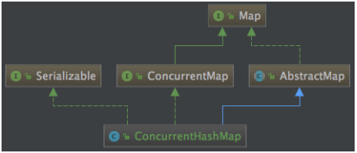

## ConcurrentHashMap（线程安全的Map）

java.util.concurrent.ConcurrentHashMap 高性能、线程安全的Map

### 1）基本结构



和 HashMap 结构很相似，与 HashMap 比较：
> **（1）相同：**
> 数组+链表结构几乎相同，底层对数据结构操作思路是一样的
>
>**（2）不同：**
> （2.1）红黑树结构略有不同
> HashMap红黑树结点叫做 TreeNode
> 不仅有属性还维护着红黑树的结构
> ConcurrentHashMap中分为两部分
> TreeNode仅维护属性和查找功能
> 新增TreeBin来维护红黑树的结构，并负责根结点的加锁解锁
> （2.2）ConcurrentHashMap新增了ForwardingNode （转移）节点
> 用来保证扩容时的线程安全
> 而HashMap只有数组 + 链表 + 红黑树

### 2）put方法

put方法整体上思路和HashMap相同，但加了很多保障线程安全的代码

#### （1）源码

``` java
final V putVal(K key, V value, boolean onlyIfAbsent) {
    //key和value都不能为null
    if (key == null || value == null) throw new NullPointerException();
    //计算hash值
    //基本和Hashmap一样
    //只是最后多了一步和int最大值做与运算
    int hash = spread(key.hashCode());
    int binCount = 0;
    for (Node<K,V>[] tab = table;;) {
        Node<K,V> f; int n, i, fh;
        //tab为空，进行初始化
        if (tab == null || (n = tab.length) == 0)
            tab = initTable();
        //当前索引位置没有值，直接创建
        else if ((f = tabAt(tab, i = (n - 1) & hash)) == null) {
            //cas 在 i 位置创建新的元素
            //成功，break
            //失败，for循环再来一遍
            if (casTabAt(tab, i, null,
                         new Node<K,V>(hash, key, value, null)))
                break;                   // no lock when adding to empty bin
        }
        else if ((fh = f.hash) == MOVED)
            //如果检测到某个节点的hash值是MOVED
            //则表示正在进行数组扩张的数据复制阶段
            tab = helpTransfer(tab, f);
        else {
            V oldVal = null;
            //锁定当前索引位置处的首结点
            synchronized (f) {
                //这里需要再次判断f是否为首结点
                //因为前面f赋值到锁定f中间还有可能被别的线程扩容引起变化
                if (tabAt(tab, i) == f) {
                    //fh是首结点的hash值，大于等于0代表是链表结点
                    if (fh >= 0) {
                        binCount = 1;
                        //头->尾遍历链表
                        for (Node<K,V> e = f;; ++binCount) {
                            K ek;
                            if (e.hash == hash &&
                                ((ek = e.key) == key ||
                                 (ek != null && key.equals(ek)))) {
                                oldVal = e.val;
                                //链表中已经存在结点，根据入参是否更新旧值
                                if (!onlyIfAbsent)
                                    e.val = value;
                                break;
                            }
                            Node<K,V> pred = e;
                            //新增的元素赋值到链表的最后，退出自旋
                            if ((e = e.next) == null) {
                                pred.next = new Node<K,V>(hash, key,
                                                          value, null);
                                break;
                            }
                        }
                    }
                    //红黑树
                    else if (f instanceof TreeBin) {
                        Node<K,V> p;
                        binCount = 2;
                        //添加结点到红黑树
                        if ((p = ((TreeBin<K,V>)f).putTreeVal(hash, key,
                                                       value)) != null) {
                            oldVal = p.val;
                            //是否更新旧值
                            if (!onlyIfAbsent)
                                p.val = value;
                        }
                    }
                }
            }
            //不等于0代表结点已经新增成功
            if (binCount != 0) {
                //链表是否需要转换为红黑树，大于等于8
                if (binCount >= TREEIFY_THRESHOLD)
                    treeifyBin(tab, i);
                if (oldVal != null)
                    return oldVal;
                break;
            }
        }
    }
    //数组是否需要扩容
    addCount(1L, binCount);
    return null;
}

```

#### （2）线程安全

##### （2.1）数组初始化时的线程安全

通过对字段 sizeCtl 的变量CAS赋值来保证数组只能被初始化一次

``` java
//初始化 table
private final Node<K,V>[] initTable() {
    Node<K,V>[] tab; int sc;
    while ((tab = table) == null || tab.length == 0) {
        //小于0代表有线程正在初始化
        //放弃cpu调度，通过不满足while条件跳出方法
        if ((sc = sizeCtl) < 0)
            Thread.yield(); // lost initialization race; just spin
        //CAS对变量设置sizeCtl变量为-1
        //保证只有一个线程执行初始化
        else if (U.compareAndSwapInt(this, SIZECTL, sc, -1)) {
            try {
                if ((tab = table) == null || tab.length == 0) {
                    //默认长度16
                    int n = (sc > 0) ? sc : DEFAULT_CAPACITY;
                    @SuppressWarnings("unchecked")
                    //初始化
                    Node<K,V>[] nt = (Node<K,V>[])new Node<?,?>[n];
                    table = tab = nt;
                    sc = n - (n >>> 2);
                }
            } finally {
                sizeCtl = sc;
            }
            break;
        }
    }
    return tab;
}
```

##### （2.2）新增结点时的线程安全

（1）新增结点时通过 CAS + 自旋 一定保证新增成功 （2）新增首结点时使用 casTabAt() 方法进行新增，CAS新增成功，退出死循环，CAS失败，说明已经有首结点了，外层的死循环重新新增结点

``` java
static final <K,V> boolean casTabAt(Node<K,V>[] tab, int i,
                                    Node<K,V> c, Node<K,V> v) {
    return U.compareAndSwapObject(tab, ((long)i << ASHIFT) + ABASE, c, v);
}
```

（3）当前索引处有值，即非首结点时，synchronized 锁住首结点，保证线程安全 （4）红黑树旋转时，锁住红黑树的根结点保证线程安全，通过对字段 lockState 进行CAS操作锁定

``` java
final TreeNode<K,V> putTreeVal(int h, K k, V v) {}

private final void lockRoot() {
    if (!U.compareAndSwapInt(this, LOCKSTATE, 0, WRITER))
        contendedLock(); // offload to separate method
}

private final void unlockRoot() {
    lockState = 0;
}
```

##### （2.3）扩容时的线程安全

addCount() 方法里调用的 transfer() 方法是扩容逻辑

> 从数组尾到头进行拷贝，遍历时，会把原数组的每个索引处的首结点锁住synchronized
> 拷贝成功后就把原数组索引处的首结点设置成转移节点
> 等扩容拷贝都完成之后，直接把新数组的值赋值给数组容器

``` java
//扩容主要分 2 步，第一新建新的空数组，第二移动拷贝每个元素到新数组中去
//tab：原数组，nextTab：新数组
private final void transfer(Node<K,V>[] tab, Node<K,V>[] nextTab) {
    int n = tab.length, stride;
    if ((stride = (NCPU > 1) ? (n >>> 3) / NCPU : n) < MIN_TRANSFER_STRIDE)
        stride = MIN_TRANSFER_STRIDE; // subdivide range
    //如果新数组为空，初始化，大小为原数组的两倍，n << 1
    if (nextTab == null) {            // initiating
        try {
            @SuppressWarnings("unchecked")
            Node<K,V>[] nt = (Node<K,V>[])new Node<?,?>[n << 1];
            nextTab = nt;
        } catch (Throwable ex) {      // try to cope with OOME
            sizeCtl = Integer.MAX_VALUE;
            return;
        }
        nextTable = nextTab;
        transferIndex = n;
    }
    int nextn = nextTab.length;
    //代表转移节点，如果原数组上是转移节点，说明该节点正在被扩容
    ForwardingNode<K,V> fwd = new ForwardingNode<K,V>(nextTab);
    boolean advance = true;
    boolean finishing = false; // to ensure sweep before committing nextTab
    //无限自旋，i 的值会从原数组的最大值开始，慢慢递减到 0
    for (int i = 0, bound = 0;;) {
        Node<K,V> f; int fh;
        while (advance) {
            int nextIndex, nextBound;
            //结束循环的标志
            if (--i >= bound || finishing)
                advance = false;
            //已经拷贝完成
            else if ((nextIndex = transferIndex) <= 0) {
                i = -1;
                advance = false;
            }
            //每次减少i的值
            else if (U.compareAndSwapInt
                     (this, TRANSFERINDEX, nextIndex,
                      nextBound = (nextIndex > stride ?
                                   nextIndex - stride : 0))) {
                bound = nextBound;
                i = nextIndex - 1;
                advance = false;
            }
        }
        //任意条件满足说明拷贝结束
        if (i < 0 || i >= n || i + n >= nextn) {
            int sc;
            //拷贝结束，直接赋值，因为每次拷贝完一个节点，都在原数组上放转移节点，所以拷贝完成
            //原数组发现是转移节点，是不会操作的，会一直等待转移节点消失之后在进行操作
            //也就是说数组节点一旦被标记为转移节点，是不会再发生任何变动的，所以不会有任何线程
            //所以此处直接赋值，没有任何问题
            if (finishing) {
                nextTable = null;
                table = nextTab;
                sizeCtl = (n << 1) - (n >>> 1);
                return;
            }
            if (U.compareAndSwapInt(this, SIZECTL, sc = sizeCtl, sc - 1)) {
                if ((sc - 2) != resizeStamp(n) << RESIZE_STAMP_SHIFT)
                    return;
                finishing = advance = true;
                i = n; // recheck before commit
            }
        }
        else if ((f = tabAt(tab, i)) == null)
            advance = casTabAt(tab, i, null, fwd);
        else if ((fh = f.hash) == MOVED)
            advance = true; // already processed
        else {
            //锁住首结点进行拷贝
            synchronized (f) {
                if (tabAt(tab, i) == f) {
                    Node<K,V> ln, hn;
                    if (fh >= 0) {
                        int runBit = fh & n;
                        Node<K,V> lastRun = f;
                        for (Node<K,V> p = f.next; p != null; p = p.next) {
                            int b = p.hash & n;
                            if (b != runBit) {
                                runBit = b;
                                lastRun = p;
                            }
                        }
                        if (runBit == 0) {
                            ln = lastRun;
                            hn = null;
                        }
                        else {
                            hn = lastRun;
                            ln = null;
                        }
                        for (Node<K,V> p = f; p != lastRun; p = p.next) {
                            int ph = p.hash; K pk = p.key; V pv = p.val;
                            if ((ph & n) == 0)
                                ln = new Node<K,V>(ph, pk, pv, ln);
                            else
                                hn = new Node<K,V>(ph, pk, pv, hn);
                        }
                        //在新数组位置上放置拷贝的值
                        setTabAt(nextTab, i, ln);
                        setTabAt(nextTab, i + n, hn);
                        //在老数组位置上放上 ForwardingNode 节点
                        //put时发现是转移结点，就不会动数据
                        setTabAt(tab, i, fwd);
                        advance = true;
                    }
                    //红黑树的拷贝
                    else if (f instanceof TreeBin) {
                        TreeBin<K,V> t = (TreeBin<K,V>)f;
                        TreeNode<K,V> lo = null, loTail = null;
                        TreeNode<K,V> hi = null, hiTail = null;
                        int lc = 0, hc = 0;
                        for (Node<K,V> e = t.first; e != null; e = e.next) {
                            int h = e.hash;
                            TreeNode<K,V> p = new TreeNode<K,V>
                                (h, e.key, e.val, null, null);
                            if ((h & n) == 0) {
                                if ((p.prev = loTail) == null)
                                    lo = p;
                                else
                                    loTail.next = p;
                                loTail = p;
                                ++lc;
                            }
                            else {
                                if ((p.prev = hiTail) == null)
                                    hi = p;
                                else
                                    hiTail.next = p;
                                hiTail = p;
                                ++hc;
                            }
                        }
                        ln = (lc <= UNTREEIFY_THRESHOLD) ? untreeify(lo) :
                            (hc != 0) ? new TreeBin<K,V>(lo) : t;
                        hn = (hc <= UNTREEIFY_THRESHOLD) ? untreeify(hi) :
                            (lc != 0) ? new TreeBin<K,V>(hi) : t;
                        setTabAt(nextTab, i, ln);
                        setTabAt(nextTab, i + n, hn);
                        //在老数组位置上放上 ForwardingNode 节点
                        setTabAt(tab, i, fwd);
                        advance = true;
                    }
                }
            }
        }
    }
}
```

### 3）get方法

get不需要同步控制，和HashMap差不多

``` java
//get不需要同步控制的原因？
//数组和Node结点的值都用 volatile 修饰了
//保证了修改后其他线程的可见性
//而HashMap并没有用 volatile 修饰
transient volatile Node<K,V>[] table;
static class Node<K,V> implements Map.Entry<K,V> {
        final int hash;
        final K key;
        volatile V val;
        volatile Node<K,V> next;
}

public V get(Object key) {
    Node<K,V>[] tab; Node<K,V> e, p; int n, eh; K ek;
    int h = spread(key.hashCode());
    if ((tab = table) != null && (n = tab.length) > 0 &&
        (e = tabAt(tab, (n - 1) & h)) != null) {
        if ((eh = e.hash) == h) {
            if ((ek = e.key) == key || (ek != null && key.equals(ek)))
                return e.val;
        }
        else if (eh < 0)
            return (p = e.find(h, key)) != null ? p.val : null;
        while ((e = e.next) != null) {
            if (e.hash == h &&
                ((ek = e.key) == key || (ek != null && key.equals(ek))))
                return e.val;
        }
    }
    return null;
}

//数组和node结点的值都用volatile修饰，保证了可见性
//但是获取数组第一个链表结点时的可见性如何保证？
//使用Unsafe.getObjectVolatile可以直接获取指定内存的数据
//保证了每次拿到数据都是最新的
static final <K,V> Node<K,V> tabAt(Node<K,V>[] tab, int i) {
    return (Node<K,V>)U.getObjectVolatile(tab, ((long)i << ASHIFT) + ABASE);
}
```

<br/>
<hr/>

## CopyOnWriteArrayList（线程安全的ArrayList）

java.util.concurrent.CopyOnWriteArrayList 线程安全的 ArrayList，基本结构和 ArrayList 是一致的，只是操作数组时增加了线程安全的处理
**volatile数组 + 加锁 + 数组拷贝**

### 1）基本结构

volatile 修饰数组字段 array，保证可见性 lock字段用来做同步操作

``` java
private transient volatile Object[] array;

final transient ReentrantLock lock = new ReentrantLock();
```

### 2）add方法

volatile数组 + 加锁 + 数组拷贝

``` java
//为什么加锁了还要数据拷贝？
//volatile只有数组的引用发生变化时才会触发可见性
//如果不拷贝只修改索引位置的值，那么不会触发可见性
public boolean add(E e) {
    final ReentrantLock lock = this.lock;
    //加锁
    lock.lock();
    try {
        Object[] elements = getArray();
        int len = elements.length;
        //拷贝到新数组里面，新数组的长度是 + 1 的，因为新增会多一个元素
        Object[] newElements = Arrays.copyOf(elements, len + 1);
        newElements[len] = e;
        //替换掉原来的数组
        setArray(newElements);
        return true;
    } finally {
        //释放锁
        lock.unlock();
    }
}
```

### 3）remove方法

volatile数组 + 加锁 + 数组拷贝

``` java
public E remove(int index) {
    final ReentrantLock lock = this.lock;
    //加锁
    lock.lock();
    try {
        Object[] elements = getArray();
        int len = elements.length;
        E oldValue = get(elements, index);
        int numMoved = len - index - 1;
        if (numMoved == 0)
            setArray(Arrays.copyOf(elements, len - 1));
        else {
            Object[] newElements = new Object[len - 1];
            System.arraycopy(elements, 0, newElements, 0, index);
            System.arraycopy(elements, index + 1, newElements, index,
                             numMoved);
            setArray(newElements);
        }
        return oldValue;
    } finally {
        //解锁
        lock.unlock();
    }
}
```

<br/>
<hr/>

## ConcurrentLinkedQueue（线程安全的非阻塞队列）

java.util.concurrent.ConcurrentLinkedQueue
**CAS + 自旋 更新链表结点保证线程安全**


<br/>
<hr/>

## BlockingQueue （线程安全的阻塞队列）

java.util.concurrent.BlockingQueue
**基本原理：**
使用 ReentrantLock + Condition 实现等待通知机制，用于阻塞

> 有界无界：容量是否有上限
> 是否阻塞：容器达到容量上限时
>
>ArrayBlockingQueue：一个由数组结构组成的 有界阻塞 队列
> LinkedBlockingQueue：一个由链表结构组成的 有界阻塞 队列
> PriorityBlockingQueue：一个支持优先级排序的 无界阻塞 队列
> DelayQueue：一个使用优先级队列实现的 无界阻塞 队列
> SynchronousQueue：一个不存储元素的 阻塞队列
> LinkedTransferQueue：一个由链表结构组成的 无界阻塞 队列
> LinkedBlockingDeque：一个由链表结构组成的 双向阻塞 队列