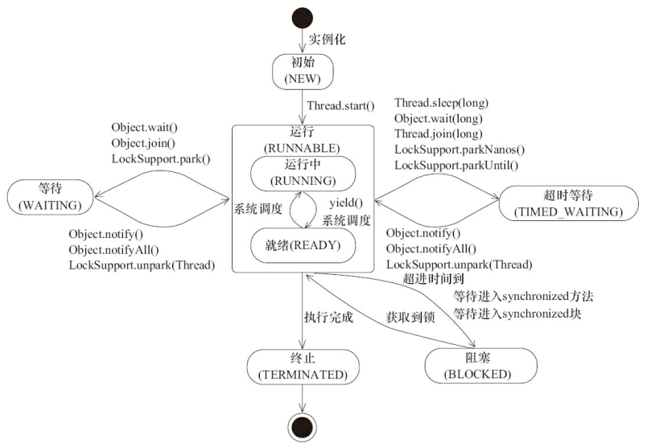

## 进程与线程
**进程：** 资源分配的最小单元（内存地址、 文件I/O等），一个进程就是一个正在执行的程序的实例
**线程：** cpu执行调度的最小单元，轻量级进程，java的线程是基于操作系统原生线程模型来实现的，采用 1:1 的线程模型

**线程调度**
>1）协同式调度：线程的执行时间由自身控制，执行完之后主动通知系统切换到另外一个线程
>2）抢占式调度：由操作系统来分配每个线程的执行时间，线程的切换不由线程自身来决定

**线程优先级**
不是一项稳定的调节手段，操作系统大多会忽略我们的优先级设置
而且操作系统的线程优先级和java中的1-10优先级不一致，例如：win系统中只有7个


<br/>
<hr/>

## java线程

### 1）用户线程/守护线程
**用户线程：** 默认新创建的是用户线程，当jvm中不存在用户线程的时，jvm进程将会退出
**守护线程：** 创建线程时且启动前设置Thread.setDaemon(true)，例如GC线程

### 2）线程的状态
**操作系统线程状态：** 运行中、阻塞、就绪、终止
**java线程状态：** java.lang.Thread.State，共6种状态
>**（1）初始状态-NEW：** 线程被创建，但没有调用start()
>**（2）运行状态-RUNNABLE：** 将操作系统中的就绪和运行统称为运行态，调用了start方法后的状态
>**（3）阻塞状态-BLOCKED：** 线程阻塞于锁（synchronized），被动的
>**（4）等待状态-WAITING：** 线程进入等待状态，需要等待其他线程做出（通知或中断），主动的
>**（5）超时等待状态-TIME_WAITING：** 该状态不同于WAITING，它可以在指定时间自行返回，主动的
>**（6）终止状态-TERMINATED：** 表示当前线程已经执行完毕



### 3）线程的启动/停止
#### （1）构造
（1）继承Thread类，重写run方法（线程的主方法），创建实例
（2）实现Runnable接口，重写run方法，然后再利用Thread的构造方法创建Thread实例，new Thread(() -> {System.out.println("子线程");});

#### （2）启动
调用线程对象的thread.start()方法

#### （3）停止
（1）安全停止：使用实例字段标志判断，推荐使用
``` java
new Thread(new Runnable() {
    private volatile boolean flag = true;
    @Override
    public void run() {
        while (flag) {
            //do something
        }
    }
}).start();
```
（2）停止（已过时，不要使用）thread.stop()
（3）中断（不建议使用）：提前中断结束线程，如果遇到抛出InterruptedException的方法，则发生异常
>设置中断线程标志：调用线程对象的thread.interrupt()方法，不会立即中断线程，只是在线程的中断线程标志打上标记
>判断线程是否中断：
>  调用线程对象的thread.isInterrupted()方法，不会复位中断标记
>  调用线程类Thread.interrupted()静态方法，会复位中断标记为false

#### （4）暂停/恢复（已过时，不要使用）
thread.suspend()，thread.resume()，由于暂停后依旧占用着资源，容易死锁，所以标记为过期方法，使用wait(),notify()替代

### 4）线程间通信

#### （1）volatile、synchronized
通过同步关键字利用 **共享变量** 进行通信

#### （2）等待/通知机制（synchronized块中使用）

object为锁对象：object.wait()，object.notify()，object.notifyAll()，thread.join()

**notify()和notifyAll()区别：**
>如果线程调用了对象的wait()方法，
>那么线程便会处于该对象的等待池中，
>等待池中的线程不会去竞争该对象的锁。
>当有线程调用了对象的 notifyAll()方法（唤醒所有 wait 线程）或 notify()方法（只随机唤醒一个 wait 线程），
>被唤醒的的线程便会进入该对象的锁池中，
>锁池中的线程会去竞争该对象锁。
>
>所以notify()使用不当时，会造成等待池中挂起了多个线程无法正常获取锁，
>优先使用notifyAll()


**thread.join()**
当前线程等待thead线程执行完成后再返回该方法
https://blog.csdn.net/u010983881/article/details/80257703
>原理：
>join是Thread的synchronized方法，
>锁对象是thread对象，
>join方法里面调用了wait()方法，
>在线程结束的时候会唤醒锁对象notify，
>当前线程接受到了通知，继续执行
>
>调用thread.join()相当于当前主线程对thread对象加锁，
>里面调用了wait()方法，
>导致主线程阻塞，
>直到thread线程结束时，
>jvm会自动调用这个thread锁对象的notify唤醒当前主线程


``` java
//伪代码实现生产者消费者

//生产者
synchronized(锁对象){
    改变条件
    锁对象.notifyAll();
    //执行notifyAll()方法，通知其他同一个锁对象的处于WAITTING状态的线程在此同步块结束后可以竞争这个锁对象
}

//消费者
synchronized(锁对象){
    while(条件不满足){
        锁对象.wait();
        //执行wait()方法后，该线程将释放锁，释放资源，处于WAITING状态
        //必须得等到得到其他线程调用锁对象.notify()后才有机会竞争锁
        //竞争到锁以后继续执行后面的代码
        //注意：这里使用的是while，是为了等待唤醒时，再次循环判断条件，满足时才执行后面的逻辑
    }
    条件满足时的处理逻辑
}
```

#### （3）其他方法
static sleep(); 睡眠不会释放锁资源，所以睡眠时，其它线程是无法得到锁的
static yield(); 当前线程做出让步，放弃当前cpu，让cpu重新选择线程，避免线程过度使用cpu

<br/>
<hr/>

## ThreadLocal（单线程中的全局变量）

java.lang.ThreadLocal

### 1）ThreadLocal、ThreadLocalMap、Thread 的关系

每个线程都有自己的 ThreadLocalMap ，key是 ThreadLocal 变量，value 是存储的值

``` java
public class Thread implements Runnable {
    //子线程不可以继承的threadLocals
    ThreadLocal.ThreadLocalMap threadLocals = null;
    //子线程可以继承的threadLocals，如果需要，使用 InheritableThreadLocal 类
    ThreadLocal.ThreadLocalMap inheritableThreadLocals = null;
    
    //线程初始化方法
    private void init(ThreadGroup g, Runnable target, String name,
                      long stackSize, AccessControlContext acc) {
        //...
        //初始化线程时，只复制了父线程的inheritableThreadLocals
        if (parent.inheritableThreadLocals != null)
            this.inheritableThreadLocals =
                ThreadLocal.createInheritedMap(parent.inheritableThreadLocals);
        //...
    }
}    
```

### 2）ThreadLocal源码

#### （1）基本属性

``` java
public class ThreadLocal<T> {
    //threadLocalHashCode 表示当前 ThreadLocal 的 hashCode
    //用于计算当前 ThreadLocal 在 ThreadLocalMap 中的索引位置
    private final int threadLocalHashCode = nextHashCode();

    //计算 ThreadLocal 的 hashCode 值(就是递增)
    //从0开始
    private static AtomicInteger nextHashCode = new AtomicInteger();
    
    //static + AtomicInteger 保证了在一台机器中每个 ThreadLocal 的 threadLocalHashCode 是唯一的
    //被 static 修饰非常关键，因为一个线程在处理业务的过程中
    //ThreadLocalMap 是会被 set 多个 ThreadLocal 的
    //多个 ThreadLocal 就依靠 threadLocalHashCode 进行区分
    private static final int HASH_INCREMENT = 0x61c88647;
    
    //当一个线程有多个 ThreadLocal 时
    //需要一个容器来管理多个 ThreadLocal
    //一个简单的map
    static class ThreadLocalMap {
            static class Entry extends WeakReference<ThreadLocal<?>> {
                //当前 ThreadLocal 关联的值
                Object value;
                //WeakReference 的引用 referent 就是 ThreadLocal
                Entry(ThreadLocal<?> k, Object v) {
                    super(k);
                    value = v;
                }
            }
            //数组的初始化大小
            private static final int INITIAL_CAPACITY = 16;
            //存储 ThreadLocal 的数组
            private Entry[] table;
            //扩容的阈值，默认是数组大小的三分之二
            private int threshold;
    }
}
```

#### （2）set方法
设置值

``` java
//set 操作每个线程都是串行的，不会有线程安全的问题
public void set(T value) {
    Thread t = Thread.currentThread();
    //和Thread是一个包，所以可以直接调用 Thread 的 protected map 字段
    ThreadLocalMap map = getMap(t);
    //当前 thradLocal 之前有设置值，直接设置，否则初始化
    if (map != null)
        //调用ThreadLocalMap.set()方法
        map.set(this, value);
    //初始化ThreadLocalMap
    else
        createMap(t, value);
}

//第一次，创建map
void createMap(Thread t, T firstValue) {
    t.threadLocals = new ThreadLocalMap(this, firstValue);
}

//ThreadLocalMap.set()方法
private void set(ThreadLocal<?> key, Object value) {
    Entry[] tab = table;
    int len = tab.length;
    //计算 key 在数组中的下标，其实就是 ThreadLocal 的 hashCode 和数组大小-1取与运算
    int i = key.threadLocalHashCode & (len-1);

    //整体策略：查看 i 索引位置有没有值，有值的话，索引位置 + 1，直到找到没有值的位置
    //这种解决 hash 冲突的策略，也导致了其在 get 时查找策略有所不同，体现在 getEntryAfterMiss 中
    for (Entry e = tab[i];
         e != null;
         //nextIndex 就是让在不超过数组长度的基础上，把数组的索引位置 + 1
         e = tab[i = nextIndex(i, len)]) {
        ThreadLocal<?> k = e.get();
        //找到内存地址一样的 ThreadLocal，直接替换
        if (k == key) {
            e.value = value;
            return;
        }
        //当前 key 是 null，说明 ThreadLocal 被清理了，直接替换掉
        if (k == null) {
            replaceStaleEntry(key, value, i);
            return;
        }
    }
    //当前 i 位置是无值的，可以被当前 thradLocal 使用
    tab[i] = new Entry(key, value);
    int sz = ++size;
    //当数组大小大于等于扩容阈值(数组大小的三分之二)时，进行扩容
    if (!cleanSomeSlots(i, sz) && sz >= threshold)
        rehash();
}
```

#### （3）get方法
获取值

``` java
public T get() {
    Thread t = Thread.currentThread();
    ThreadLocalMap map = getMap(t);
    if (map != null) {
        //从ThreadLocalMap中获取值
        ThreadLocalMap.Entry e = map.getEntry(this);
        if (e != null) {
            @SuppressWarnings("unchecked")
            T result = (T)e.value;
            return result;
        }
    }
    return setInitialValue();
}

//ThreadLocalMap.getEntry方法
private Entry getEntry(ThreadLocal<?> key) {
    int i = key.threadLocalHashCode & (table.length - 1);
    Entry e = table[i];
    //直接根据计算出的索引找到了，entry!=null && entry.get()获取弱引用threadLocal=入参key
    if (e != null && e.get() == key)
        return e;
    else
        //否则继续索引位置++直到找到
        return getEntryAfterMiss(key, i, e);
}

//自旋 i+1，直到找到为止
private Entry getEntryAfterMiss(ThreadLocal<?> key, int i, Entry e) {
    Entry[] tab = table;
    int len = tab.length;
    //在大量使用不同 key 的 ThreadLocal 时，其实还蛮耗性能的
    while (e != null) {
        ThreadLocal<?> k = e.get();
        //内存地址一样，表示找到了
        if (k == key)
            return e;
        //删除没用的 key
        if (k == null)
            expungeStaleEntry(i);
        //继续使索引位置 + 1
        else
            i = nextIndex(i, len);
        e = tab[i];
    }
    return null;
}
```

#### （4）resize方法
* 扩容后数组大小是原来数组的 2 倍
* 扩容时是没有线程安全问题的
>因为 ThreadLocalMap 是线程的一个属性，
>一个线程同一时刻只能对 ThreadLocalMap 进行操作，
>同一个线程执行业务逻辑必然是串行的，
>那么操作 ThreadLocalMap 必然也是串行的

``` java
//扩容
private void resize() {
    //拿出旧的数组
    Entry[] oldTab = table;
    int oldLen = oldTab.length;
    //新数组的大小为老数组的两倍
    int newLen = oldLen * 2;
    //初始化新数组
    Entry[] newTab = new Entry[newLen];
    int count = 0;
    //老数组的值拷贝到新数组上
    for (int j = 0; j < oldLen; ++j) {
        Entry e = oldTab[j];
        if (e != null) {
            ThreadLocal<?> k = e.get();
            if (k == null) {
                e.value = null; //Help the GC
            } else {
                //计算 ThreadLocal 在新数组中的位置
                int h = k.threadLocalHashCode & (newLen - 1);
                //如果索引 h 的位置值不为空，往后+1，直到找到值为空的索引位置
                while (newTab[h] != null)
                    h = nextIndex(h, newLen);
                //给新数组赋值
                newTab[h] = e;
                count++;
            }
        }
    }
    //给新数组初始化下次扩容阈值，为数组长度的三分之二
    setThreshold(newLen);
    size = count;
    table = newTab;
}

```

#### （5）remove方法
``` java
 public void remove() {
     ThreadLocalMap m = getMap(Thread.currentThread());
     if (m != null)
         m.remove(this);
 }
```


### 3）ThreadLocalMap的key=ThreadLocal为什么使用弱引用包装？

弱引用对象：在没有强引用的时候，gc时会直接被回收

```
引用链关系：Thread -> ThreadLocalMap -> ThreadLocalMap.Entry[] -> referent（ThreadLocal）


>假设一个场景：tomcat服务器 + 线程池处理请求
>
>（1）ThreadLocal没有使用弱引用
>使用一个ThreadLocal变量（作用域是单个请求），
>当使用完没有使用remove，本次请求完成，
>使用的线程没有销毁，被线程池回收，
>那么上面的这个变量将永远不会被回收，
>一直保留在这个线程的ThreadLocalMap里，
>而且存储的value也一直保留，
>造成内存泄露
>
>
>（2）ThreadLocal使用了弱引用
>当本次请求完成时，
>ThreadLocal变量除了弱引用外没有别的强引用，
>gc时就会回收ThreadLocal变量，
>这个线程的ThreadLocalMap就会出现key为null的Entry元素，
>当别的请求进来再次使用这个线程，
>再次ThreadLocal.set/get/remove访问到key=null时，
>里面会有逻辑清除key为null的Entry元素

static class Entry extends WeakReference<ThreadLocal<?>> {
    //当前 ThreadLocal 关联的值
    Object value;
    //弱引用WeakReference 的 referent 就是 ThreadLocal
    Entry(ThreadLocal<?> k, Object v) {
        super(k);
        value = v;
    }
}


所以，使用弱引用是为了尽量避免使用不当造成内存泄露
但如果ThreadLocal变量的其他强引用都不存在了
之后一直没有调用set/get/remove访问到key时
还是会造成内存泄露

```

<br/>
<hr/>


## 虚假唤醒
线程有可能再没有 notify 的情况下被唤醒
所以在有条件判断去 wait 的场景使用 while 而不是 if

``` java
synchronized(lock){
  //应该使用while
  while(条件){
    lock.wait();
  }
  //不能使用if
  if(条件){
    lock.wait();
  }
}
```