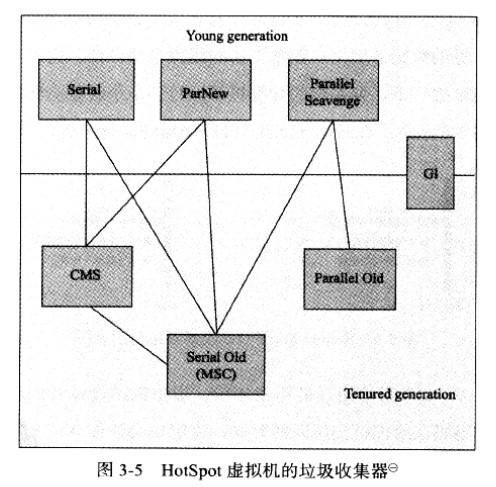

垃圾回收调优相关参数介绍
https://docs.oracle.com/javase/8/docs/technotes/guides/vm/gctuning/

## java中的引用
reference类型的数据中存储的数值代表着另一块内存的地址，称之位这块内存的一个引用

> **引用类型分类：**
> 1）强引用：GC Roots中的部分引用，只要被引用就不会被回收
> 2）软引用：SoftReference，当系统内存充足时，不会被回收，当系统内存不足时，会被回收
> 3）弱引用：WeakReference，只要发生GC，不管内存空间是否足够，都会被回收
> 4）虚引用：PhantomReference，和没有任何引用一样,在任何时候都可能被回收
> 
> 
>  ThreadLocal静态内部类ThreadLocalMap中的Entry中的key就是一个弱引用


<br/>
<hr/>

## 对象存活算法

### 1）引用计数算法

> **1）原理：**
> 给每个对象添加一个引用计数器，当有一个地方引用它，计数器+1，引用失效-1
> **2）存在的问题：**
> 相互引用的两个对象（各自的实例字段引用着对方），则会造成计数器永远不会为0，也就永远不会被回收

### 2）可达性分析算法

#### （1）原理
以 **GC Roots** 为起点向下搜索引用的GC对象，直到最后没有引用任何对象
任何不在 **GC Roots 引用链** 上的对象都是可回收的垃圾对象


#### （2）GC Roots（一组活跃的引用）
> （1）虚拟机栈/本地方法栈 中的引用（正在被调用的方法的引用类型的 参数/局部变量/临时值）
> （2）自带的3个类加载器或系统类加载器的引用（包括类加载器对象中引用的所加载类的Class对象，Class对象中的静态字段的引用）
> （3）方法区字符串常量池的引用，类型的元数据常量池中的String字面量的引用
> （4）synchronized锁住的对象引用
> （5）vm内部其他对GC对象的引用

#### （3）安全点/安全区域
stop the world（STW）：暂停运行所有的java用户线程
> **枚举GC Root时为什么需要STW？**
> 必须保证所有的java用户线程都运行到 **一个引用关系可以确定的点/区域** 
> 才能保证枚举GC Root的准确性

**安全点：** hotspot在 **jit编译后的方法的机器码** 中的 调用方法返回前、循环迭代的回跳前、可能抛异常的位置 设置安全点
**安全区域：** 指在一段代码片段中，引用关系不会发生变化。例如线程处于sleep或blocked状态

#### （4）怎么快速的找到 GC Roots 引用
**OopMap结构**，利用此结构可以避免GC扫描大量的内存空间，从而快速的直接找到需要的引用

（1）类型元数据里都有记录自己的OopMap，里面记录着该类型的实例对象内什么偏移位置是引用
（2）每个被jit编译过后的方法也会在一些特定的位置（安全点）记录栈帧上的引用位置到OopMap


<br/>
<hr/>

## 垃圾收集算法（3种基础回收算法）

### 1）标记-清除算法（sweep）

> **1）原理：**
> 先标记存活的对象，然后清除未被标记的垃圾对象
> **2）特点：**
> 清除后产生内存碎片，分配新对象需要遍历所有的空闲内存，大对象无法分配时需要提前触发新一轮GC

### 2）标记-整理算法（compact）

> **1）原理：**
> 先标记存活的对象，统一移动到内存一端，然后清除另一端内存
> **2）特点：**
> 解决了内存碎片问题，代价是移动算法的性能开销

### 3）复制算法（copy）

> **1）原理：**
> 将内存分为2部分，每次只是用1块内存分配对象，当这块内存占用完了，将存活的对象复制到另一块内存，清除本块内存
> **2）缺点：**
> 对象存活率较高时，频繁的复制带来的性能开销

<br/>
<hr/>

## 垃圾收集理论（hotspot）

### 1）对象字段的读/写屏障（read barrier/write barrier）
> （1）**读屏障**（读取对象字段时的切面）
>        读取前后字段值没有发生变化，所以读前读后没有区别（类似AOP切面的前置/后置）
> （2）**写屏障**（给对象字段赋值时的切面）
>        给字段赋值前后分旧对象/新对象，所以写前写后有区别

``` java
//伪代码

//读对象字段
oop oop_field_load(oop* field) {
    //。。。
    
    //（1）读前屏障
    pre_load_barrier(field);
    
    //。。。
    return *field;
}

//写对象字段
void oop_field_store(oop* field, oop new_value) {
    //（2）写前屏障
    //能拿到旧的值，所以后面的G1的SATB在这里处理
    pre_write_barrier(field);

    //引用字段赋值操作
    *field = new_value;

    //（3）写后屏障
    //能拿到新的值，拿不到旧的值，所以后面的CMS在这里处理
    post_write_barrier(field, new_value);
}
```

### 2）分代理论

3个分代假说
> （1）弱分代假说：绝大多数对象都是朝生夕灭
> （2）强分代假说：熬过越多次垃圾收集过程的对象就越难以消亡
> （3）跨代引用假说：跨代引用相对于同代引用来说仅占极少数

#### （1）基于假说1、2
> 将堆内存分为 2 部分：
> **新生代** young generation：（eden区 + survivor区[from/to]）
> **老年代** old generation
>
> **为什么需要2个survivor区？**
> -XX:SurvivorRatio=8，默认值，Eden:S0:S1=8:1:1
> 如果新生代只分为2个区域E和S，复制算法执行后，必须要在另外一块区域分配新对象，所以两块区域必须等分
> 那么young gc的频率就会变得比较高，分为E/S0/S1区后，相当于每次分配新对象的区域就变成了十分之九


#### （2）基于假说3
> minor gc进行的比较频繁，如果新生代的对象被老年代引用，就不得不遍历整个 （老年代+固定的GC Roots） 进行可达性分析
> 基于假说3，只有极少数的跨代引用，所以在新生代上建一个记忆集Remembered Set用来存储老年代引用新生代对象的内存地址
> 这样minor gc时进行可达性分析的就是 （GC Roots + 新生代记忆集Remembered Set）

**记忆集（Remembered Set）**
> 是一种 **用于记录收集区域被非收集区域的引用集合** 的数据结构
> 具体实现：（根据记录的精度）
> 1）字长精度
> 2）对象精度
> 3）卡表精度（内存块精度），每个记录对应一小块内存区域

跨代引用并不只是新生代、老年代才有的问题，任何涉及部分区域回收都会面临此问题（G1，ZGC，Shenandoah）

##### （2.1）卡表（Card Table）
hotspot采用的是卡表的方式来实现记忆集的
``` java
//用数组实现，全局唯一，每个记录代表一块内存区域
//用对象的地址右移9位（除以512）得到卡表索引
//相当于进程内虚拟地址（32位2^32，64位2^48）按照 512字节 进行等分，每个记录本身占1个字节，表示着512字节的内存区域
//如果这块内存区域的存在着指向被收集区域的引用，则置为1（变脏Dirty）
//
//hotspot记录引用变化时不区分分代，只要有引用改变，其对应的card都会被记录
//也就是说这个card table记录的不只是old -> young引用，而是所有发生了变化的引用的出发端，无论在old还是young
//
CARD_TABLE [this address >> 9] = 0;
```

##### （2.2）卡表记录何时变脏？
hotspot在对对象字段进行 **读取/赋值** 时 采用 **读/写屏障** 来维护卡表状态的

##### （2.3）卡表记录何时恢复？
当对被收集区域进行垃圾回收完成后，将卡表记录恢复（置为0）
hotspot是用新生代垃圾收集器来恢复卡表状态的
所以一般只有新生代的垃圾收集器才可以直接使用卡表
并发的老年代的收集器CMS不能直接使用，因为可能在并发阶段又发生了young gc，新生代收集器重置了卡表
所以CMS使用了card table + mod union table

##### （2.4）卡表记录伪共享问题
**伪共享**
> 现代中央处理器的缓存系统中是以缓存行（Cache Line）为单位存储的，64字节
> 当多线程修改互相独立的变量时，如果这些变量恰好共享同一个缓存行，就会彼此影响（写、无效化、同步）而导致性能降低

卡表记录的伪共享
> 缓存行64个字节，假设一个缓存行里面存储的都是卡表记录（64个）
> 则这些64个卡表记录代表着64*512=32KB内存区域
> 如果多线程更新不同的卡表记录刚好在同一个缓存行，就会影响性能
>
> **解决优化：**
> 先检查卡表元素是否被标记（变脏），只有未被标记的才去写，尽可能的减少对缓存行的无效操作
> -XX:+UseCondCardMark（默认false）
> 但是这样会额外增加一次判断开销
``` java
if (CARD_TABLE [this address >> 9] != 0)
    CARD_TABLE [this address >> 9] = 0;
```

#### （3）对象分配的区域

##### （3.1）TLAB
> 内存是规整的，指针碰撞
> 内存不是规整的，有多个间隙（内存碎片），采用空闲列表记录哪些区域是空闲的可以分配内存的

> 多线程时，分配对象会有线程安全问题，解决办法采用同步加锁处理 或 TLAB

> hotspot为每个线程分配一个TLAB（Thread Local Allocation Buffer线程本地分配缓存区）
> 只能本线程在此区域分配对象，使用完了就重新从eden区拿新的TLAB，大于TLAB空间的直接在eden区分配

> -XX:UseTLAB 默认true
> -XX:TLABWasteTargetPercent 默认1%，占整个Eden空间比例

##### （3.2）对象优先分配在eden区
> 一般的对象都优先分配在eden区

##### （3.3）大对象直接分配在老年代
> 比如大字符串，元素数量庞大的数组

##### （3.4）长期存活的对象晋升老年代
> 对象经过一次young gc后年龄（记录在对象头的markword里）就增加1，超过 -XX:MaxTenuringThreshold的值后就直接晋升到老年代 

> **Parallel Scavenge中默认值为15，CMS中默认值为6，G1中默认值为15**

> 这个值最大是15，因为对象头存储年龄的只有4bit，超出限制报错
``` java
Error: Could not create the Java Virtual Machine.
Error: A fatal exception has occurred. Program will exit.
MaxTenuringThreshold of 20 is invalid; must be between 0 and 15
```

**动态年龄判断：**
-XX:TargetSurvivorRatio，默认值50
如果survivor区中（年龄1+年龄2+年龄3+年龄n）的对象的大小总和大于survivor空间的此值，年龄大于或等于n的对象都直接进入老年代，无需等到上述设置的年龄值


### 3）三色标记算法
GC Roots进行可达性分析时，遍历对象图，使用三色标记法（Tri-color Marking）

可达性分析从 GC Roots + Remember Set 开始遍历对象图，遍历过程中将对象标识为 3 种颜色

> **白色：** 尚未访问过
> **黑色：** 本对象已访问过，而且本对象 引用到 的其他对象 也全部访问过了
> **灰色：** 本对象已访问过，但是本对象 引用到 的其他对象 尚未全部访问完
>           临界状态，待全部访问后，将会转换为黑色，相当于一个推动遍历的点

**具体的遍历过程：**
> 初始时，所有对象都是白色的
> 然后以 GC Roots + Remember Set 直接引用的对象开始，先标记为灰色
> 遍历每个灰色对象，将灰色对象中所有的引用的其他对象标记为灰色，然后将当前这个灰色对象标记为黑色
> 依此类推，当遍历完成时
> 只会存在 **黑色对象（存活的对象）** 和 **白色对象（垃圾对象，从未访问过，不可达）**

#### 并发收集时的问题
如果在整个垃圾回收的过程中，全程STW，则没有任何问题
但是如果要支持 CMS/G1等 并发垃圾回收
并发阶段时，对象间的引用关系可能发生变化
就会发生对存活的对象 **多标** 或 **漏标**

##### （1）多标记（存活的对象）
多标记的对象是垃圾对象，本应该被回收，称之为 **浮动垃圾**
**浮动垃圾不影响程序的正确性**，只需要等待下一轮垃圾回收时清除

> 例如：
> A(黑)->B(灰)->C(白)->D(白)
> 垃圾收集线程已经遍历到了B，然后用户线程断开了 A->B 的引用，那么BCD都应该是垃圾了
> 但是由于已经遍历到了B，垃圾收集线程本次收集后的结果是ABCD都是存活的
> 相当于多标记了 BCD 这 3 个存活的对象

##### （2）漏标记（存活的对象）
漏标记的对象，本应该是存活的，结果被回收了，**直接影响了程序的正确性**，所以必须要处理，漏标记分为2种情况：

###### （2.1）新增了的对象


###### （2.2）旧对象的引用关系发生了变化

> 例如：
> A(黑)->B(灰)->C(白)->D(白)
> 垃圾收集线程已经遍历到了B，然后用户线程断开了 B->C 的引用，增加了 A->C 的引用
> 此时的引用关系是：A(黑)->C(白)  B(灰)
> 由于A是黑色的，B没有引用任何对象了
> 所以将会结束可达性分析，这时认为 CD 是垃圾对象（白色）将会被回收
> 但实际上，A引用了C，C也是存活的对象

由上述例子可以看出，这种对象引用关系发生变化的漏标记，必须同时满足 2 个条件：
> （1）灰色对象 断开了 白色对象的引用
> （2）黑色对象 重新引用了 该白色对象

对应的解决办法：**利用 读/写屏障，在并发期间记录引用变动的部分，然后处理，具体查看下面部分的CMS/G1**

### 4）垃圾回收名词
> 1）minor gc （young gc）新生代垃圾回收
> 2）major gc （old gc）老年代垃圾回收，cms之前的老年代垃圾收集器实际上是full gc，回收整个gc堆
> 3）mixed gc 混合回收（新生代和部分老年代的垃圾回收），目前只有G1有
> 4）full gc 全部垃圾回收，整个java堆和方法区的垃圾回收


<br/>
<hr/>

## 垃圾收集器（hotspot）



young gc 时，如果对象的年龄超过特定值，就会晋升到老年代

### 1）Serial GC算法

单线程

Serial收集器 + Serial Old收集器

| 垃圾收集器 | 使用位置 | 回收算法 | 是否STW | 触发条件 |
|---|---|---|---|---|
|**Serial收集器** |young gc，新生代，扫描（GC Roots + 卡表） | 复制算法 | 全程STW | eden区满了 |
|**Serial Old收集器** | full gc，整个GC堆（新生代+老年代），扫描GC Roots | 标记-整理算法 | 全程STW | young gc 时预测晋升到老年代的对象总大小超过老生代剩余空间大小|

### 2）Parallel GC算法

多线程（Serial GC算法的多线程版本）

ParNew收集器 + Parallel Old收集器
Parallel Scavenge收集器  + Parallel Old收集器（jdk8默认收集器）

| 垃圾收集器 | 使用位置 | 回收算法 | 是否STW | 触发条件 |
|---|---|---|---|---|
|**ParNew收集器** | young gc，新生代，扫描（GC Roots + 卡表） | 复制算法 | 全程STW | eden区满了 |
|**Parallel Scavenge收集器**，以获取最大吞吐量为目标 | young gc，新生代，扫描（GC Roots + 卡表） | 复制算法 | 全程STW | eden区满了 |
|**Parallel Old收集器** | full gc，整个GC堆（新生代+老年代），扫描GC Roots | 标记-整理算法 | 全程STW | young gc 时预测晋升到老年代的对象总大小超过老生代剩余空间大小|

### 3）CMS算法（Concurrent Mark Sweep）

ParNew收集器 + CMS收集器 + Serial Old收集器

| 垃圾收集器 | 使用位置 | 回收算法 | 是否STW | 触发条件 |
|---|---|---|---|---|
|**ParNew收集器** | young gc，新生代，扫描（GC Roots + 卡表） | 复制算法 | 全程STW | eden区满了 |
|**CMS收集器**，以获取最短STW时间为目标 | old gc，老年代，初始标记和重新标记详见下面 | 标记-清除算法 | 部分阶段STW | 老生代使用比率超过特定值 |
|**Serial Old收集器** | full gc，整个GC堆（新生代+老年代），扫描GC Roots | 标记-整理算法 | 全程STW | 1）老年代存放新的对象时，由于内存碎片没有足够的连续空间存放，触发full gc；2）CMS并发阶段新产生的大对象无法存放在老年代时，出现并发失败（Concurrent Mode Failure）后，触发full gc  |

#### CMS收集器
> 1）初始标记（initial mark）：标记 **GC Roots** 引用能直接关联到的对象，STW
> 2）并发标记（concurrent mark）：对初始标记的对象进行可达性分析，Tracing，并发
> 3）重新标记（remark）：修正并发标记期间用户程序继续执行而导致标记变动影响的对象，增量更新incremental update，STW
> 4）并发清除（concurrent sweep）：清除垃圾对象，并发

##### （1）初始标记中，标记的对象仅仅是 GC Roots 的原因？
> 所有回收部分区域，都需要考虑收集区域被非收集区域引用的情况
> 例如：
> （1）单独回收新生代时，老年代垃圾对象还没被回收，但是引用着新生代的对象，那么这个新生代的对象就不能被提前回收，就需要扫描 GC Roots + 卡表card table
> （2）单独回收老年代时，新生代垃圾对象还没被回收，但是引用着老年代的对象，那么这个老年代的对象也不能被提前回收
>     为什么不扫描新生代？
>     cms垃圾回收必定是由于young gc触发的，此时的新生代没有垃圾对象，所以不会出现上面这种情况，只扫描GC Roots是可以的

##### （2）重新标记中，怎么解决漏标（增量更新incremental update）？
> **cms收集器 并发标记阶段 会发生的问题：**
>   多标：修改了的引用（解决不了，不影响程序正确性，下次gc时再回收）
>   漏标：新产生的对象 + 修改了的引用（必须要解决）
>
> **解决：重新标记阶段，扫描（GC Roots + 新生代 + card table + mod union table）**
> （1）GC Roots + 新生代：扫描这两部分，可以解决漏标中新产生的对象（cms并发阶段产生的对象只能在新生代中）
>      这里重新扫描GC Roots一般很快，因为在可达性分析时只要遇到黑结点就跳过（初始标记和并发标记已经标记过了）
>      **特殊情况：当前面2个阶段中产生了大量的对象，使得新生代中对象较多，重新标记阶段有可能会非常慢**
>      解决办法：-XX:CMSScavengeBeforeRemark，默认false，使remark前强制进行一次young gc
>      
> （2）card table + mod union table：可以解决漏标中修改了的引用
>  A(黑)->B(灰)->C(白)，发生漏标的2个条件：B断开了C，A重新引用了C
>
>  只有在并发标记阶段，利用**写后屏障**记录新增加的引用关系（同步），即使用card table和mod union table记录对象C
>  视对象C为灰色结点，重新标记时扫描C就可以避免漏标
>  
>  为什么（1）中已经扫描了GC Roots，还需要记录对象C？
>  因为（1）中遇到了A（黑）就会直接跳过，扫描不到C以及C后面引用的对象，所以要单独记录
>
>  mod union table 和 card table 结构相似，mut中的每个记录对应着card table中的卡表记录
>  如果在cms的并发标记阶段，新生代垃圾收集器会在将card table中对应的卡表记录清除（置为0）之前
>  将mod union table中对应此卡表记录变脏（置为1）
>  在重新标记阶段，cms将在 mod union table 和 card table 这2个结构中找到变脏的记录
>  找到对应的内存区域来重新扫描
>
> （*）为什么上述（1）（2）的处理叫做增量更新（incremental update）
>  因为重新扫描 mod union table 和 card table，相当于补偿扫描（增量更新）了漏标的对象

##### （3）触发full gc的条件
>  （1）由于内存碎片CMS只会标记清除，不会整理碎片，当老年代存放新的对象时没有足够的连续空间时，会触发full gc
>  （2）CMS并发阶段（并发标记和并发清除）新产生的大对象无法存放在老年代时，出现并发失败（Concurrent Mode Failure）后，触发full gc

##### （4）并发执行时cpu敏感
>  并发标记等默认启动的并发线程数 = （处理器核心数量+3）/4，并发执行时由于垃圾回收线程过多而影响用户线程

##### （5）内存碎片问题
>  cms是标记清除算法，没有整理内存的动作
>  -XX:UseCMSCompactAtFullCollection，默认true，开启full gc内存碎片整理
>  -XX:CMSFullGCsBeforeCompaction=0，代表进行多少次full gc时进行内存整理，默认为0，表示cms回收引发full gc时每次都进行内存整理

##### （6）浮动垃圾问题
>  cms并发阶段用户线程执行时产生的新的垃圾对象，本次无法回收
>  可能会导致concurrent mode failure异常，老年代没有足够的空间（有可能没有连续空间，同内存碎片问题）放入新生代晋升的对象
>  改进：降低CMS GC频率或者增加频率、减少GC时长
>  -XX:CMSInitiatingOccupancyFraction=70 老年代内存使用率达到70%的时候开始GC
>  -XX:UseCMSInitiatingOccupancyOnly，默认false，如果不指定，上述参数仅在第一次生效，后续会变


### 4）G1算法

G1收集器 + Serial Old收集器

#### G1收集器

##### region
> **（1）G1将堆内存等分成大小固定相等的region区：**
> Region的大小可以通过参数-XX:G1HeapRegionSize设定，取值范围从1M到32M，且是2的指数
> 如果不设定，那么G1会根据Heap大小自动决定
> size =（堆最小值+堆最大值）/ TARGET_REGION_NUMBER(2048)
> 然后size取最靠近2的幂次数值，并将size控制在[1M,32M]之间
> 
> **（2）每个region在使用时会给定一个角色（eden、survivor、old）直到整个region被清空回收**
> 
> **（3）Humongous区域：**
> 专门用来存储大对象，G1中如果对象大小超过了一个region的一半即可判定为大对象
> 超过1个region大小的对象，采用多个region保存
> 大多数情况将H区作为old角色

##### rset（Remembered Set）
每个region都有一个rset，结合全局的 card table 来实现记录其他region指向自己的引用关系
> rset本质是一个hashtable，key=引用关系中其他region的起始地址，value=card table的索引，表示其他region指向本region
>
> G1的rset实现是只记录了old角色的region指向young角色region
> 因为G1只有young gc是部分区域回收，而mixed gc则是新生代+老年代回收，不需要记录rset
>
> **维护rset的过程：**
> 与cms一样，也使用写后屏障维护rset，但此rset结构复杂，所以采用了logging barrier（日志屏障）异步处理


##### cset（Collection Set）
用于记录需要回收的的region，根据分代gc分为2种模式

> young gc：记录新生代里（eden + survivor0）角色的所有region
> mixed gc：记录新生代里（eden + survivor0）角色的所有region + cleanup统计得到的收集收益高的部分old角色的region

> **停顿预测模型Pause Prediction Model：**
>
> 参数-XX:MaxGCPauseMillis指定一个G1收集过程目标停顿时间，默认值200ms
> mixed gc时回收时cset中的region个数，取决于此参数


##### G1分代算法

###### （1）young gc（收集新生代）
> **触发时机：** 新生代满了
>
> 扫描所有的GC Roots，顺带做 mixed gc 的 initial mark（触发mixed gc的全局并发标记），也可以不做


###### （2）mixed gc（收集新生代 + 老年代）

（2.1）全局并发标记（global concurrent marking）

> **触发时机：** 某些young gc触发
>
> （1）初始标记（initial mark）：标记 **GC Roots** 引用能直接关联到的对象，STW
> （2）并发标记（concurrent mark）：对初始标记的对象进行可达性分析，Tracing，并发
> （3）最终标记（final mark）：修正并发标记期间用户程序继续执行而导致标记变动影响的对象，STW
> （4）清理（cleanup）：从mark bitmap里统计每个region存活的对象，如果region全是垃圾直接清除回收到free
>
> 不使用对象头的mark word里的mark bit，使用外部的bitmap来记录mark信息


**最终标记中，怎么解决漏标（原始快照SATB）？**
> **G1收集器 并发标记阶段 会发生的问题：**
>   多标：修改了的引用（解决不了，不影响程序正确性，下次gc时再回收）
>   漏标：新产生的对象 + 修改了的引用（必须要解决）
> 
> （1）解决漏标中新产生的对象：
> 每一个Region设计了两个名为TAMS（Top at Mark Start）的指针
> 并发阶段新产生的对象必须再这两个指针位置以上
> mixed gc回收时默认这两个指针位置为存活的，不进行收集
>
> （2）解决漏标中修改了的引用：
> A(黑)->B(灰)->C(白)，发生漏标的2个条件：B断开了C，A重新引用了C
>
> SATB，snapshot-at-the-beginning原始快照
> 只有在并发标记阶段，利用**写前屏障**将旧的引用关系所指向的对象C标记为存活
> 包括对象C所指向的其他对象都会递归标记为存活
> 相当于将并发标记阶段开始前（这一时刻的快照）的所有存活的对象都标记为存活，后续发生的变化不做处理
> 这里依然采用了logging barrier（日志屏障）进行异步处理

（2.2）拷贝存活对象（evacuation）

> **触发时机：** 全局并发标记阶段的clean up后，达到触发mixed GC拷贝复制的的阈值
> （XX:InitiatingHeapOccupancyPercent，默认45%）这里的阈值占比指的是非新生代占用全堆的比例（old+humongous）
>
> STW，依赖于第1步的全局并发标记，将cset的region中存活的对象拷贝到空的region里，回收原本的region空间

（2.3）整个g1的gc回收流程类似如下：
>启动程序
>-> young GC
>-> young GC
>-> young GC
>-> young GC + initial mark（触发全局并发标记）
>(... concurrent marking ...)
>-> young GC (... concurrent mark ...)
>(... concurrent marking ...)
>-> young GC (... concurrent mark ...)
>-> final mark
>-> cleanup
> 达到触发mixed GC拷贝复制的的阈值
>-> mixed GC（evacuation）
>-> mixed GC（evacuation）
>-> mixed GC（evacuation）
>...
>-> young GC + initial mark
>(... concurrent mark ...)

（2.4）连续多次的mixed gc拷贝复制：
> 为满足停顿时间要求，G1可能发生连续多次的mixed gc拷贝复制和用户线程交替执行

（2.5）触发full gc的条件：
> 当mixed gc实在无法跟上程序分配内存的速度，就会使用serial old GC（full GC）来收集整个GC heap


##### 最佳实践
https://docs.oracle.com/javase/8/docs/technotes/guides/vm/gctuning/g1_gc_tuning.html


<br/>
<hr/>

## 方法区的垃圾回收
主要回收类型元数据，具体查看 **类加载篇-类的卸载**
方法区的垃圾回收都是由full gc执行的，一般都是 Serial Old收集器

<br/>
<hr/>

## GC日志

### 1）jdk9之前
>查看GC基本信息
>-XX:+PrintGC/-verbose:gc
>查看GC详细信息
>-XX:+PrintGCDetails
>查看GC前后的堆/方法区可用容量变化
>-XX:+PrintHeapAtGC  
>查看GC过程中用户线程并发时间以及停顿的时间
>-XX:+PrintGCApplicationConcurrentTime 和 -XX:+PrintGCApplicationStoppedTime
>查看收集器Ergonomics机制（自动设置堆空间各分代区域大小、收集目标等内容）自动调节的相关信息
>-XX:+PrintAdaptive-SizePolicy
>查看熬过收集后剩余对象的年龄分布信息
>-XX:+PrintTenuring-Distribution
>进程退出后打印内存区域信息
>-XX:+PrintCommandLineFlags
>。。。


### 2）jdk9之后
>查看GC基本信息
>-Xlog:gc
>查看GC详细信息
>-X-log:gc*
>查看GC前后的堆/方法区可用容量变化
>-Xlog:gc+heap=debug
>查看GC过程中用户线程并发时间以及停顿的时间
>-Xlog:safepoint
>查看收集器Ergonomics机制（自动设置堆空间各分代区域大小、收集目标等内容）自动调节的相关信息
>-Xlog:gc+ergo*=trace
>查看熬过收集后剩余对象的年龄分布信息
>-Xlog:gc+age=trace
>。。。