## jdk提供的工具

https://docs.oracle.com/javase/8/docs/technotes/tools/unix/index.html

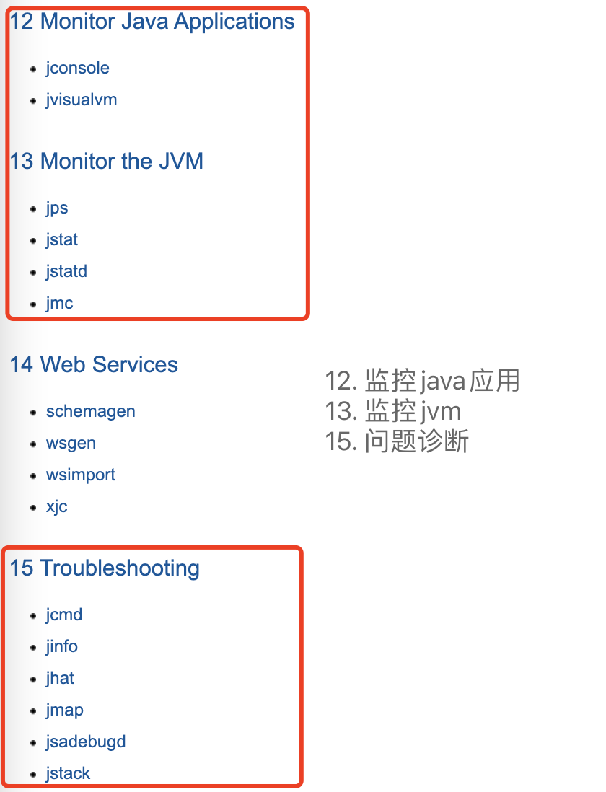

### 1) jps

``` bash
#查看运行中的java进程

#显示启动类全限定名
jps -l
#显示vm参数
jps -v
```

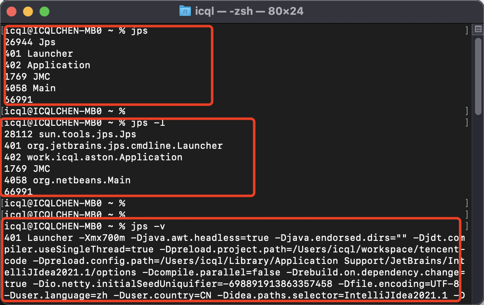

### 2) jstat

``` bash
#查看jvm进程相关统计，gc，class，jit即时编译等

#查看gc相关信息，-gc，-gcnew，-gcold，-gcutil等，显示的单位是kb，后缀C代表容量，后缀U代表使用
jstat -gc [pid] [间隔毫秒] [次数]

#查看class类加载的信息
jstat -class [pid] [间隔毫秒] [次数] 

#查看jit即时编译的信息
jstat -compiler [pid] [间隔毫秒] [次数] 
```

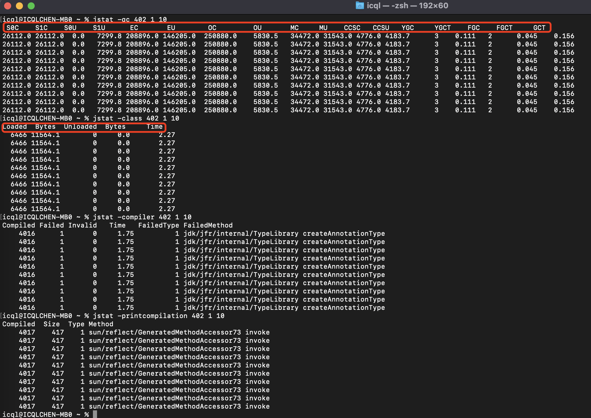

### 3) jmap

``` bash
#堆内存相关工具，堆内存简要信息，dump堆内存，堆内存对象统计等

#查看堆内存简要信息
jmap -heap [pid] 

#查看堆内存对象统计
jmap -histo [pid] 
jmap -histo:live [pid] 只统计存活的对象

#dump堆内存生成文件，使用jhat或者其他工具查看
jmap -dump:format=b,file=[生成文件路径] [pid]
```


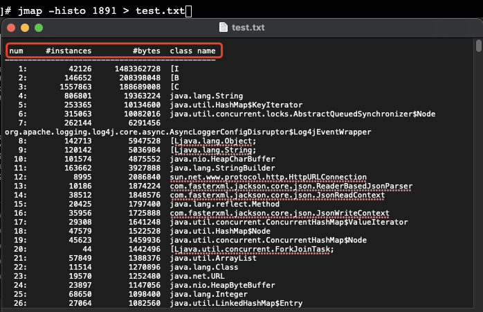

### 4) jhat

``` bash
#堆内存dump文件查看工具，其他参数可查看官方文档
jhat 堆内存dump文件
```
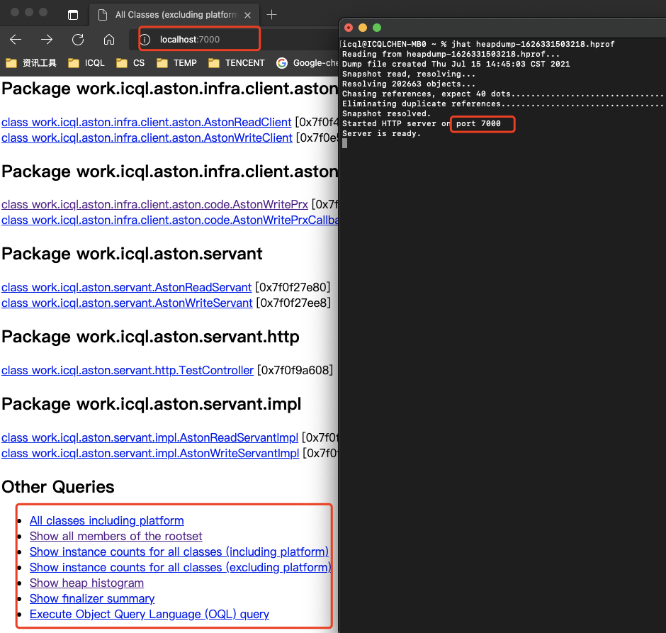


### 5) jstack

``` bash
#查看java线程，其他参数可查看官方文档
jstack [pid]
jstack -l [pid] #查看更多的信息
```
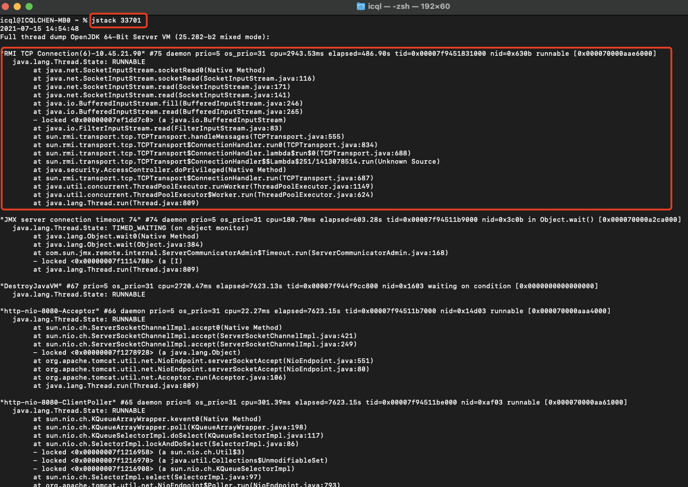

### 6) jinfo

``` bash
#查看或修改jvm相关参数

#查看所有信息
jinfo [pid] 

#查看所有系统属性
jinfo -sysprops [pid]

#查看 非默认值的vm参数 和 启动配置的vm参数
jinfo -flags [pid]

#查看某个参数的值
jinfo -flag [参数名] [pid]

#开启或者关闭某个参数
jinfo -flag +/-[参数名] [pid]

#修改某个参数的值
jinfo -flag [参数名]=值 [pid]
```
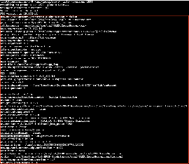
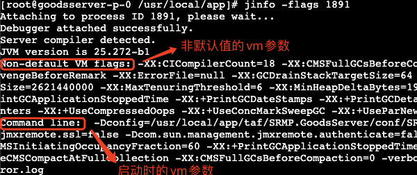

### 7) jcmd

``` bash
#强大的工具，给正在运行的vm发送诊断命令

#查看java进程
jcmd

#查看某个jvm进程可以使用的命令
jcmd [pid] help


#上述命令可能得到下面可以的命令，jcmd [pid] [参数]

VM.native_memory #NMT堆外内存分析，有性能损耗，需要先打开 -XX:NativeMemoryTracking=[off|summary|detail]
ManagementAgent.stop
ManagementAgent.start_local
ManagementAgent.start
VM.classloader_stats
GC.rotate_log
Thread.print #查看线程
GC.class_stats #查看类统计，需要打开-XX:+UnlockDiagnosticVMOptions
GC.class_histogram #查看加载的类直方图
GC.heap_dump #堆内存dump
GC.finalizer_info
GC.heap_info #查看堆
GC.run_finalization
GC.run #执行GC
VM.uptime #vm启动时间
VM.dynlibs
VM.flags #vm非默认值参数
VM.system_properties #vm系统属性
VM.command_line #vm启动参数
VM.version #vm版本
PerfCounter.print #统计信息
help

#jfr飞行记录器相关，开启后有性能损耗，生成文件后使用jmc工具分析
#飞行器记录模板默认在 jre/lib/jfr/ 文件夹下面，default、profile都没有开启完整功能
#可以使用jmc修改开启完成功能的模板或者直接复制一个profile全局替换false为true
VM.unlock_commercial_features
JFR.configure
JFR.stop
JFR.start
JFR.dump
JFR.check

jcmd [pid] VM.unlock_commercial_features  解锁商业特性
jcmd [pid] JFR.start name=test settings=飞行器记录模板文件路径 delay=5s duration=2m filename=生成文件名.jfr 开启飞行器记录
jcmd [pid] JFR.check name=test 检查飞行器记录
jcmd [pid] JFR.stop name=test 停止飞行器记录
jcmd [pid] JFR.dump name=test filename=test.jfr 停止飞行器记录并转储
```

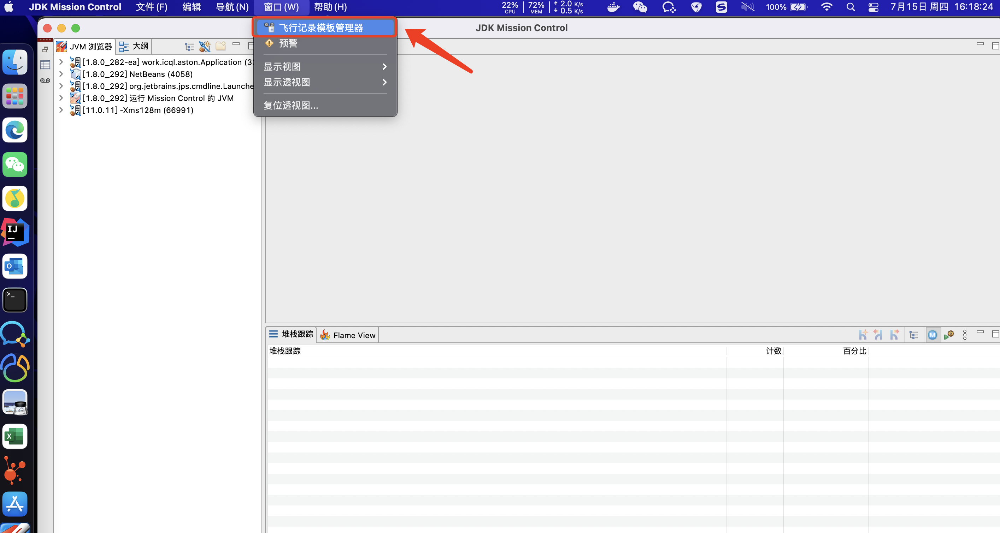
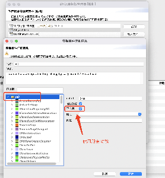


### 8) jmc

oracle_jdk: http://jdk.java.net/jmc/8/
adopt_openjdk: https://adoptopenjdk.net/jmc

``` bash
#jmc(jdk mission control)，飞行记录器用于记录vm进程运行中的详细信息

jcmd [pid] VM.unlock_commercial_features  解锁商业特性
jcmd [pid] JFR.start name=test settings=飞行器记录模板文件路径 delay=5s duration=2m filename=生成文件名.jfr 开启飞行器记录
jcmd [pid] JFR.check name=test 检查飞行器记录
jcmd [pid] JFR.stop name=test 停止飞行器记录
jcmd [pid] JFR.dump name=test filename=test.jfr 停止飞行器记录并转储

找到生成的文件，用jmc打开
```
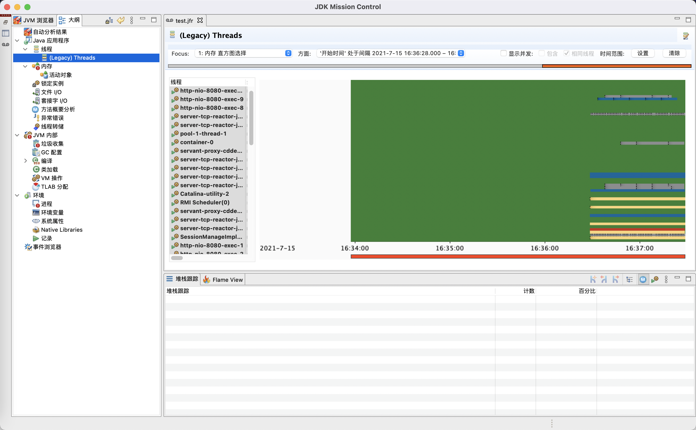

### 9) jconsole

``` bash
#jmx监控运行中的vm，https://docs.oracle.com/javase/8/docs/technotes/guides/management/agent.html

-Dcom.sun.management.jmxremote.port=10059
-Dcom.sun.management.jmxremote.ssl=false
-Dcom.sun.management.jmxremote.authenticate=false
```
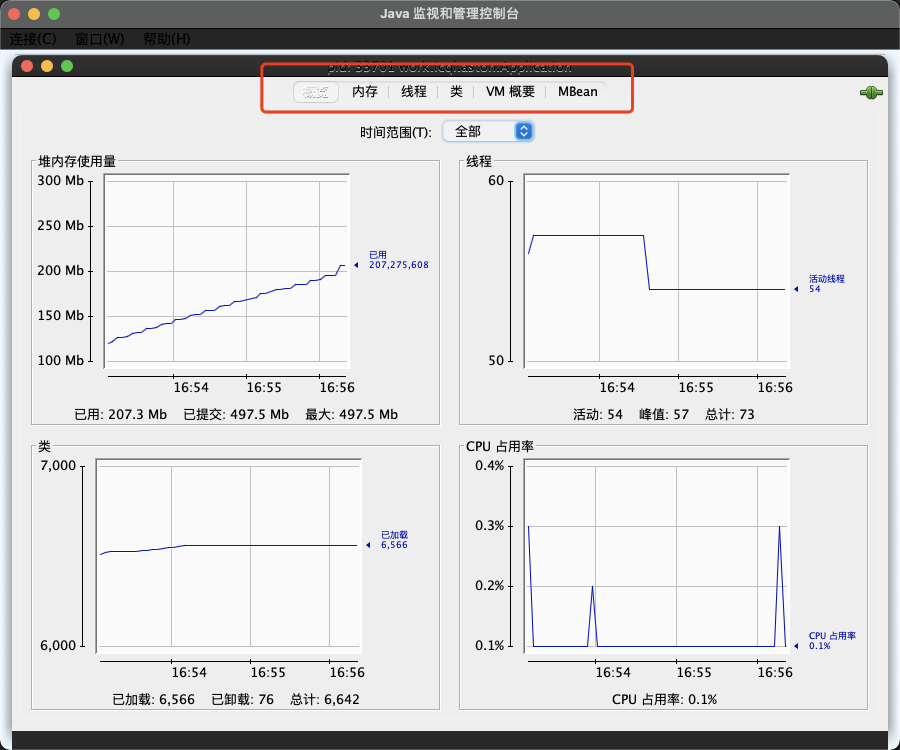


### 10) jvisualvm

下载链接: https://visualvm.github.io/download.html

``` bash
#功能齐全的可视化工具
支持运行时vm进程监控，分析各种转储文件等功能
```
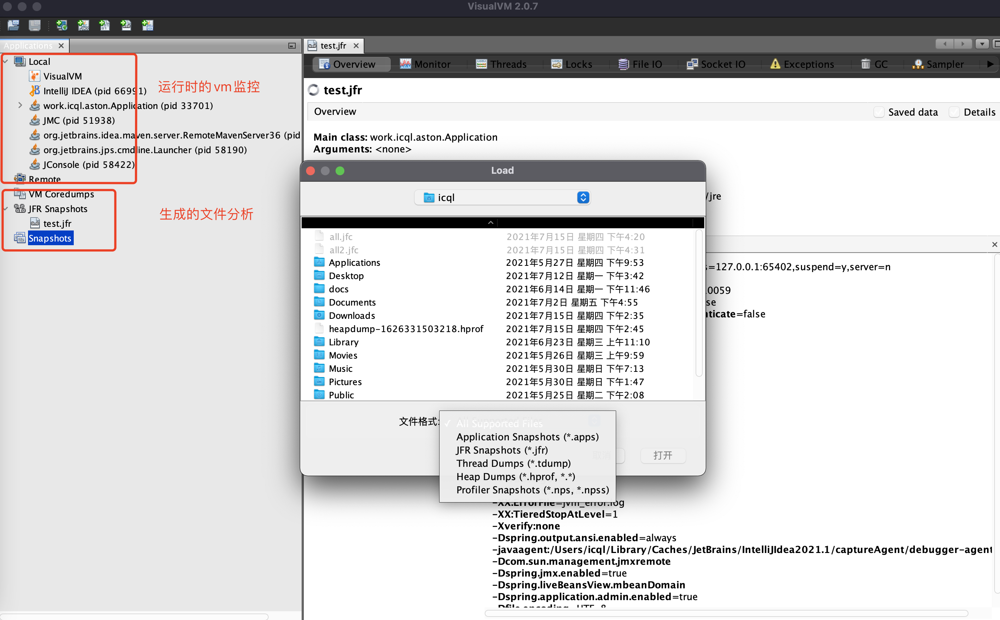


<br/>
<hr/>


## 其它工具

### 1) mat

https://eclipse.org/mat
分析堆转储文件工具

### 2) jprofile

https://www.ej-technologies.com/products/jprofiler/overview.html
功能比较全的工具

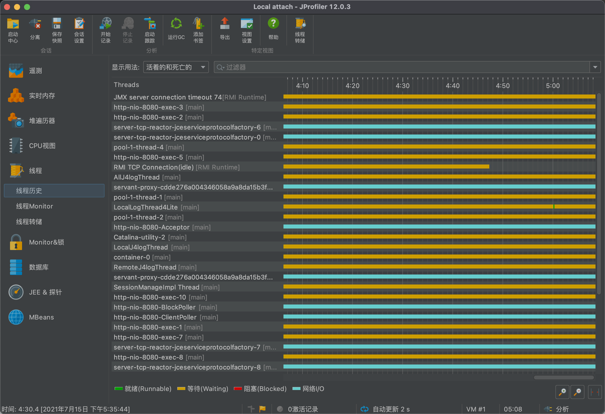

### 3) arthus

https://arthas.aliyun.com/zh-cn
便捷、功能齐全的命令工具

``` bash
#启动工具，输入端口号
curl -O https://arthas.aliyun.com/arthas-boot.jar
java -jar arthas-boot.jar
```
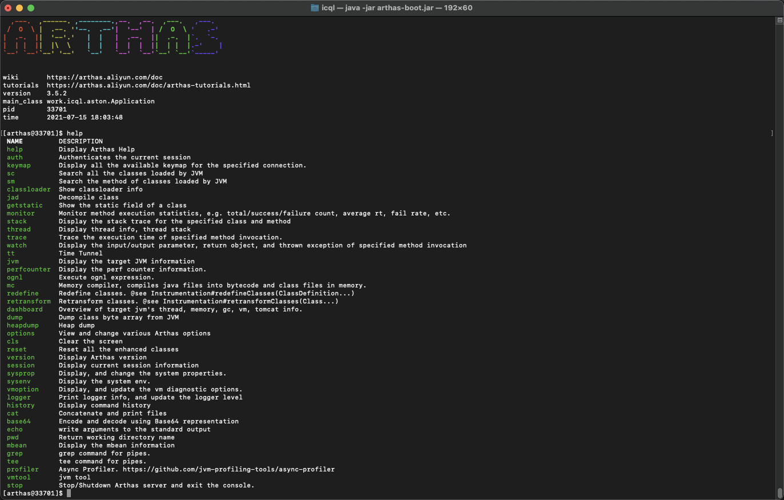
