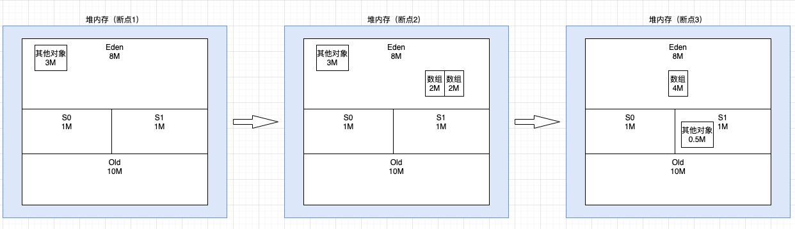
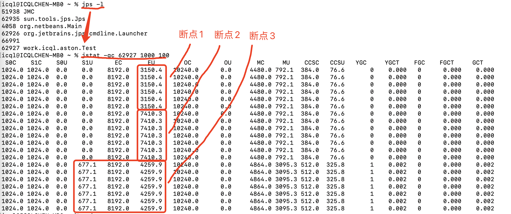
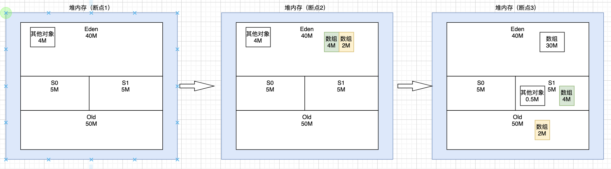
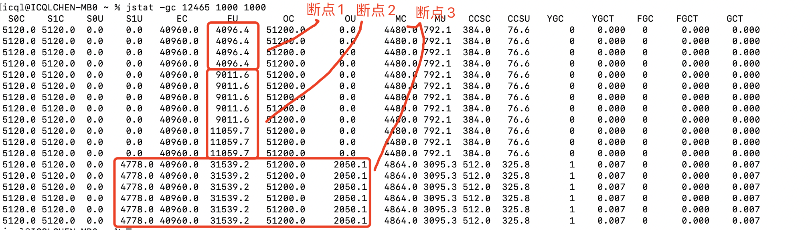
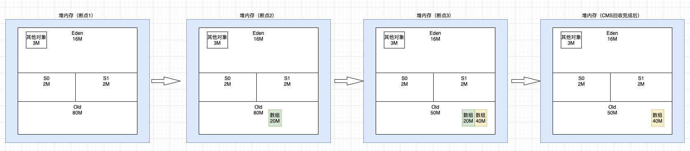
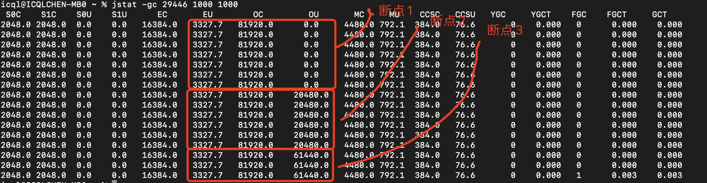

## 模拟GC

jdk8，使用 ParNew + CMS 的垃圾收集器组合

``` bash
#jdk环境：
java -version

openjdk version "1.8.0_292"
OpenJDK Runtime Environment (AdoptOpenJDK)(build 1.8.0_292-b10)
OpenJDK 64-Bit Server VM (AdoptOpenJDK)(build 25.292-b10, mixed mode)
```

### 1）模拟young gc

测试代码：
``` java
//vm参数：
//-Xms20m -Xmx20m -Xmn10m -Xss1m -XX:+UseParNewGC -XX:+UseConcMarkSweepGC -XX:+PrintGCDetails -XX:+PrintGCTimeStamps -Xloggc:/Users/icql/gc.log
public class Test {
    public static void main(String[] args) {
		//断点1
        byte[] object1 = new byte[2 * 1024 * 1024];
        object1 = new byte[2 * 1024 * 1024];
        object1 = null;
        //断点2
        byte[] object2 = new byte[4 * 1024 * 1024];
		//断点3
    }
}
```

gc日志：
``` text
OpenJDK 64-Bit Server VM (25.292-b10) for bsd-amd64 JRE (1.8.0_292-b10), built on Apr 20 2021 21:55:04 by "jenkins" with gcc 4.2.1 Compatible Apple LLVM 10.0.1 (clang-1001.0.46.4)
Memory: 4k page, physical 16777216k(263204k free)

/proc/meminfo:

CommandLine flags: -XX:InitialHeapSize=20971520 -XX:MaxHeapSize=20971520 -XX:MaxNewSize=10485760 -XX:MaxTenuringThreshold=6 -XX:NewSize=10485760 -XX:OldPLABSize=16 -XX:+PrintGC -XX:+PrintGCDetails -XX:+PrintGCTimeStamps -XX:ThreadStackSize=1024 -XX:+UseCompressedClassPointers -XX:+UseCompressedOops -XX:+UseConcMarkSweepGC -XX:+UseParNewGC 

0.171: [GC (Allocation Failure) 0.171: [ParNew: 6693K->610K(9216K), 0.0018878 secs] 6693K->610K(19456K), 0.0020834 secs] [Times: user=0.00 sys=0.00, real=0.00 secs] 

Heap
 par new generation   total 9216K, used 4870K [0x00000007bec00000, 0x00000007bf600000, 0x00000007bf600000)
  eden space 8192K,  52% used [0x00000007bec00000, 0x00000007bf0290f0, 0x00000007bf400000)
  from space 1024K,  59% used [0x00000007bf500000, 0x00000007bf598a58, 0x00000007bf600000)
  to   space 1024K,   0% used [0x00000007bf400000, 0x00000007bf400000, 0x00000007bf500000)
 concurrent mark-sweep generation total 10240K, used 0K [0x00000007bf600000, 0x00000007c0000000, 0x00000007c0000000)
 Metaspace       used 3130K, capacity 4496K, committed 4864K, reserved 1056768K
  class space    used 334K, capacity 388K, committed 512K, reserved 1048576K
```


步骤：

启动程序(debug)
程序执行到 断点1
终端执行 jps -l 查看程序 pid 为 62927
终端执行 jstat -gc 62927 1000 100 查看内存变化


分析：

断点1，程序刚启动，其他对象在 Eden 区占用 3M 左右（jstat 中 EU 显示 3150.4K）
断点2，new 了 2 个大小均约为 2M 的数组对象，Eden区总占用 3+2+2=7M（jstat 中 EU 显示 3150.4 + 4259.9 = 7410.3K）
继续执行，需要 new 1 个 4M 的数组对象，但是此时 Eden区+S0区=8+1=9M，已占用7M，显然放不下 4M数组，所以触发 young gc
查看 gc 日志可看到，Allocation Failure 所以触发 ParNew young gc，回收2个 2M 的垃圾数组对象和其他对象
断点3，young gc 回收完，Eden区就可以成功分配 4M 数组


0.171: [GC (Allocation Failure) 0.171: [ParNew: 7410K->677K(9216K), 0.0018878 secs] 7410K->677K(19456K), 0.0020834 secs] [Times: user=0.00 sys=0.00, real=0.00 secs]






### 2）模拟对象进入老年代
对象进入老年代的常见 4 种情况：

超过young gc次数限制（gc年龄，-XX:MaxTenuringThreshold，默认15，也是最大值）
动态年龄判定，S区内 （年龄1+年龄2+...+年龄n） 对象总和大于S区50%，年龄n以后的对象 young gc 进入老年代
young gc后存活对象太多大于S区容量，直接进入老年代（优先放入S区，放不下的才进入老年代）
大对象直接进入老年代（-XX:PretenureSizeThreshold=0，默认0B代表不受限制，大于Eden区容量时）


第3种情况分析：（第4种比较简单，第1、2种情况示例不太好调）

``` java
//vm参数：
//-Xms100m -Xmx100m -Xmn50m -Xss1m -XX:+UseParNewGC -XX:+UseConcMarkSweepGC -XX:+PrintGCDetails -XX:+PrintGCTimeStamps
public class Test {
    public static void main(String[] args) {
        //断点1
        byte[] object1 = new byte[4 * 1024 * 1024];
        byte[] object2 = new byte[2 * 1024 * 1024];
        //断点2
        byte[] object3 = new byte[30 * 1024 * 1024];
        //断点3
    }
}
```
(1) 断点1，程序刚启动，其他对象在 Eden 区占用 4M 左右（jstat 中 EU 显示 4096.4K）
(2) 断点2，new 了 2 个数组对象，Eden区总占用约 4+4+2=10M（jstat 中 EU 显示 11059.7K=10.8M）
(3) 继续执行，需要new一个30M的数组对象，显然 eden 区放不下了，需要进行 young gc
(4) young gc时，object1 和 object2 都是存活的，但是加起来 4+2=6M，大于 S1区的5M容量，此时是优先放入S1区，剩下的才进入老年代Old区，所以通过jstat可以很清晰的看到，4M Object1放入了S1区，而 2M Object2 则是直接进入了老年代Old区





### 3）模拟old gc

CMS 的 gc 分为 2 种：

1. background collector（并发的CMS gc，old gc）

后台线程定时扫描（-XX:CMSWaitDuration 默认为 2s）判断是否满足以下条件，需要触发 old 区的 CMS gc（普通的CMS标记清除算法）

（1）根据统计数据判断是否需要触发 CMS gc

若未配置-XX:+UseCMSInitiatingOccupancyOnly，第一次 old gc 触发的条件是 old 区占用超 50%，后续是动态的

若配置了-XX:+UseCMSInitiatingOccupancyOnly，根据 -XX:CMSInitiatingOccupancyFraction 的值进行判断，默认是-1，根据内部公式计算得到阈值为 92%

（2）默认 -XX+CMSClassUnloadingEnabled 开启，会对 metaspace 进行垃圾回收，所以 metaspace 扩容时也会触发 CMS gc

（3）之前young gc失败过，预测到下次还有可能失败时，会触发 CMS gc

2.  foreground collector（单线程串行的CMS gc，full gc）

具体见模拟 full gc


根据上述理论，CMS old gc 触发的情况较多，模拟最常见的第 （1） 种用来分析：

-XX:+UseCMSInitiatingOccupancyOnly -XX:CMSInitiatingOccupancyFraction=35 -XX:-CMSClassUnloadingEnabled

这 3 个参数用来排除其他情况触发CMS old gc，且设置老年代对象占比大于 35% 时触发 CMS old gc

``` java
//vm参数：
//-Xms100m -Xmx100m -Xmn20m -Xss1m -XX:+UseParNewGC -XX:+UseConcMarkSweepGC -XX:+UseCMSInitiatingOccupancyOnly -XX:CMSInitiatingOccupancyFraction=35 -XX:-CMSClassUnloadingEnabled -XX:+PrintGCDetails -XX:+PrintGCTimeStamps
public class Test {
    public static void main(String[] args) {
        //断点1
        byte[] object1 = new byte[20 * 1024 * 1024];
        object1 = null;
        //断点2
        byte[] object2 = new byte[40 * 1024 * 1024];
        //断点3
    }
}
```

gc日志：
``` text
30.097: [GC (CMS Initial Mark) [1 CMS-initial-mark: 61440K(81920K)] 64767K(100352K), 0.0028489 secs] [Times: user=0.01 sys=0.00, real=0.01 secs] 
30.100: [CMS-concurrent-mark-start]
30.100: [CMS-concurrent-mark: 0.000/0.000 secs] [Times: user=0.00 sys=0.00, real=0.00 secs] 
30.100: [CMS-concurrent-preclean-start]
30.100: [CMS-concurrent-preclean: 0.000/0.000 secs] [Times: user=0.00 sys=0.00, real=0.00 secs] 
30.100: [CMS-concurrent-abortable-preclean-start]
Heap
 par new generation   total 18432K, used 3655K [0x00000007b9c00000, 0x00000007bb000000, 0x00000007bb000000)
  eden space 16384K,  22% used [0x00000007b9c00000, 0x00000007b9f91f18, 0x00000007bac00000)
  from space 2048K,   0% used [0x00000007bac00000, 0x00000007bac00000, 0x00000007bae00000)
  to   space 2048K,   0% used [0x00000007bae00000, 0x00000007bae00000, 0x00000007bb000000)
 concurrent mark-sweep generation total 81920K, used 61440K [0x00000007bb000000, 0x00000007c0000000, 0x00000007c0000000)
 Metaspace       used 3100K, capacity 4556K, committed 4864K, reserved 1056768K
  class space    used 326K, capacity 392K, committed 512K, reserved 1048576K
```

(1) 断点1，程序刚启动，其他对象在 Eden 区占用 3M 左右（jstat 中 EU 显示 3327.7K）
(2) 断点2，new 了 1 个数组对象 20M，显然Eden区放不下直接进入老年代（jstat 中 OU 显示 20480.0K=20M），但此时未达到cms回收阈值 20/80=25% < 35%
(3) 断点3，继续 new 了 1 个数组对象 40M，依然直接进入老年代（jstat 中 OU 显示 61440.0K=60M），注意老年代空间充足，是先进入再 cms gc，如果放不下就是 background collector 的第4种情况
(4) 查看gc日志，可以清晰的看到cms的gc过程，60/80=75% > 35%


注意：jstat 结果中的 FGC 和 FGCT 对于CMS来说比较特殊，统计的是STW的次数和时间，CMS有2个阶段是STW的，所以一次完整CMS gc周期会在这里显示 2 次





### 4）模拟full gc
CMS 的 gc 分为 2 种：

1. background collector（并发的CMS gc，old gc）

具体见上面的模拟old gc

2.  foreground collector（单线程串行的CMS gc，full gc）

两种算法：

（1）MSC算法(标记-清理-压缩)，和 Serail Old收集器类似，单线程对整个堆进行垃圾回收，也就是真正意义上的 Full GC，STW要长于普通 CMS

（2）类似普通CMS算法

使用哪种算法取决于这2个参数，-XX:+UseCMSCompactAtFullCollection，-XX:CMSFullGCsBeforeCompaction=0，默认是每次full gc都进行压缩整理内存，即使用MSC算法，

-XX:CMSFullGCsBeforeCompaction=n，则代表n次full gc后进行压缩整理内存


触发的原因：

（1）晋升失败（Promotion Failed）

young gc后，存活对象从 S区 晋升到 Old区时，Old区放不下，一般是由于内存碎片放不下大对象 或 cms后台线程来不及回收导致放不下

（2）并发模式失败（Concurrent Mode Failure）

后台线程并发 Background CMS gc 正在执行（并发阶段），同时又有 Young GC 晋升的对象 Old 区放不下

（3）收集担保失败

统计之前young gc 晋升 Old 区的平均对象大小 和 young gc当前所有对象大小，只要old区目前剩余大小大于前两种之一，认为担保安全进行young gc，否则不安全直接进行full gc

（4）显式 GC

System.gc()调用，可以使用参数 -XX:+DisableExplicitGC 禁用，如果禁用，使用了DirectByteBuffer不显示调用System.gc()，有可能导致metespace OOM


不太好模拟，后续有再补。
