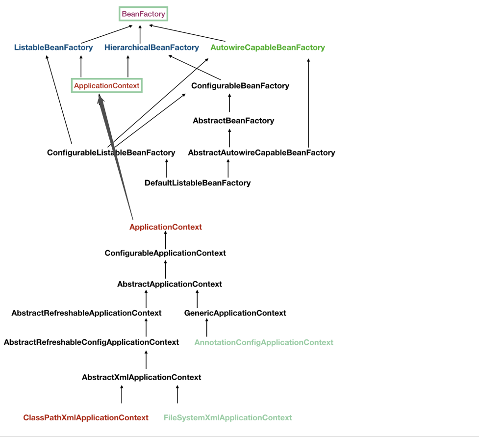
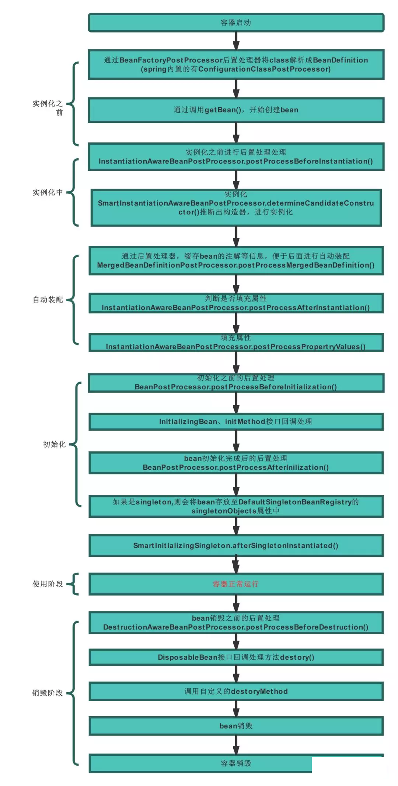

## ioc容器
spring bean的容器
控制反转ioc（Inversion of Control）指的是将我们手动创建bean的操作交给ioc容器，让ioc容器去负责管理bean的生命周期




## BeanFactory

The root interface for accessing a Spring bean container
负责生产和管理 bean 实例的工厂，但是此接口只提供了对单个 bean 的操作接口，功能有限，所以才有了结构图中如此之多的接口用来扩展功能

``` java
public interface BeanFactory {
    String FACTORY_BEAN_PREFIX = "&";

    Object getBean(String var1) throws BeansException;

    <T> T getBean(String var1, Class<T> var2) throws BeansException;

    <T> T getBean(Class<T> var1) throws BeansException;

    Object getBean(String var1, Object... var2) throws BeansException;

    <T> T getBean(Class<T> var1, Object... var2) throws BeansException;

    boolean containsBean(String var1);

    boolean isSingleton(String var1) throws NoSuchBeanDefinitionException;

    boolean isPrototype(String var1) throws NoSuchBeanDefinitionException;

    boolean isTypeMatch(String var1, ResolvableType var2) throws NoSuchBeanDefinitionException;

    boolean isTypeMatch(String var1, Class<?> var2) throws NoSuchBeanDefinitionException;

    Class<?> getType(String var1) throws NoSuchBeanDefinitionException;

    String[] getAliases(String var1);
}
```

### 1）ListableBeanFactory
Listable 的意思就是，通过这个接口，我们可以获取多个 Bean，提供了获取多个bean的许多方法

### 2）HierarchicalBeanFactory
Hierarchical 分层的意思，指可以在应用中起多个 BeanFactory，然后可以将各个 BeanFactory 设置为父子关系，例如spring mvc

### 3）AutowireCapableBeanFactory
Autowire 自动装配的意思，提供自动依赖注入的能力


<br/>
<hr/>

## ApplicationContext

Central interface to provide configuration for an application.
为应用提供配置的核心接口，在运行期是只读的，只提供重载功能

**ApplicationContext 的具体实现，都是通过父类组合的 DefaultListableBeanFactory 属性来提供容器功能的，而 DefaultListableBeanFactory 则间接的继承了 ListableBeanFactory、HierarchicalBeanFactory、AutowireCapableBeanFactory，提供了最完整的 BeanFactory 功能**

``` java
public abstract class AbstractRefreshableApplicationContext extends AbstractApplicationContext {
	/** Bean factory for this context */
	private DefaultListableBeanFactory beanFactory;
}

public class GenericApplicationContext extends AbstractApplicationContext implements BeanDefinitionRegistry {

	private final DefaultListableBeanFactory beanFactory;
}
```

### 1）ClassPathXmlApplicationContext
classpath路径下xml配置ioc容器

### 2）AnnotationConfigApplicationContext
java注解方式配置ioc容器

### 3）FileSystemXmlApplicationContext
文件系统路径下xml配置ioc容器

<br/>
<hr/>

## ioc容器的启动

环境搭建
``` xml
<dependency>
    <groupId>org.springframework</groupId>
    <artifactId>spring-context</artifactId>
    <version>5.2.13.RELEASE</version>
</dependency>
```

``` java
//Application.java
package work.icql.test;

import org.springframework.context.ApplicationContext;
import org.springframework.context.support.ClassPathXmlApplicationContext;
import work.icql.test.service.TestService;

public class Application {

    public static void main(String[] args) {
        ApplicationContext applicationContext = new ClassPathXmlApplicationContext("classpath:applicationContext.xml");
        TestService testService = applicationContext.getBean("testService", TestService.class);
        testService.test();
    }
}

//TestService.java
package work.icql.test.service;

public interface TestService {
    void test();
}

//TestServiceImpl.java
package work.icql.test.service;

public class TestServiceImpl implements TestService {
    public void test() {
        System.out.println("输出test");
    }
}
```

### 1）refresh方法（主流程）

创建 ioc 容器
``` java
//work.icql.test.Application#main
ApplicationContext applicationContext = new ClassPathXmlApplicationContext("classpath:applicationContext.xml");

//调用ClassPathXmlApplicationContext构造方法
//最后执行的重载构造方法
public ClassPathXmlApplicationContext(
        String[] configLocations, boolean refresh, @Nullable ApplicationContext parent)
        throws BeansException {
    //configLocations：支持多个配置xml，这是xml的路径数组
    //refresh：是否加载所有的 bean definition 并创建单例bean
    //parent：上面说个支持多层级的容器，父容器
    
    //执行父类的构造方法
    super(parent);
    //解析配置xml的路径
    setConfigLocations(configLocations);
    if (refresh) {
        //加载所有的 bean definition 并创建单例bean
        refresh();
    }
}
```

**refresh方法**
加载所有的 bean definition 并创建单例bean，ApplicationContext 建立起来以后，可以通过调用 refresh() 这个方法重建

``` java
@Override
public void refresh() throws BeansException, IllegalStateException {
    //启动和关闭容器时加锁，防止线程安全问题创建多个
    synchronized (this.startupShutdownMonitor) {
        //创建容器准备工作
        prepareRefresh();
        //创建容器并加载注册bean定义
        ConfigurableListableBeanFactory beanFactory = obtainFreshBeanFactory();
        //准备Bean容器
        prepareBeanFactory(beanFactory);

        try {
            //钩子方法，子类扩展添加 beanFactoryPostProcessor
            //目前源码中没有子类实现
            postProcessBeanFactory(beanFactory);
            //执行beanFactory容器的后置处理器
            invokeBeanFactoryPostProcessors(beanFactory);
            //注册bean的后置处理器
            registerBeanPostProcessors(beanFactory);
            //初始化messageSource
            initMessageSource();
            //初始化事件广播器
            initApplicationEventMulticaster();
            //钩子方法
            onRefresh();
            //注册监听器ApplicationListener
            registerListeners();

            //初始化非延迟加载的单例bean
            finishBeanFactoryInitialization(beanFactory);

            //广播事件，ApplicationContext 初始化完成
            finishRefresh();
        }

        catch (BeansException ex) {
            if (logger.isWarnEnabled()) {
                logger.warn("Exception encountered during context initialization - " +
                        "cancelling refresh attempt: " + ex);
            }

            // Destroy already created singletons to avoid dangling resources.
            destroyBeans();

            // Reset 'active' flag.
            cancelRefresh(ex);

            // Propagate exception to caller.
            throw ex;
        }

        finally {
            // Reset common introspection caches in Spring's core, since we
            // might not ever need metadata for singleton beans anymore...
            resetCommonCaches();
        }
    }
}
```

### 2）prepareRefresh 方法（创建容器准备工作）
``` java
//记录容器启动时间、设置启动/关闭标志位(AtomicBoolean)
protected void prepareRefresh() {
    this.startupDate = System.currentTimeMillis();
    this.closed.set(false);
    this.active.set(true);
    if (logger.isDebugEnabled()) {
        if (logger.isTraceEnabled()) {
            logger.trace("Refreshing " + this);
        }
        else {
            logger.debug("Refreshing " + getDisplayName());
        }
    }
    initPropertySources();
    //校验xml文件
    getEnvironment().validateRequiredProperties();
    //spring监听器相关
    if (this.earlyApplicationListeners == null) {
        this.earlyApplicationListeners = new LinkedHashSet<>(this.applicationListeners);
    }
    else {
        this.applicationListeners.clear();
        this.applicationListeners.addAll(this.earlyApplicationListeners);
    }
    this.earlyApplicationEvents = new LinkedHashSet<>();
}
```

### 3）obtainFreshBeanFactory 方法（创建容器并加载注册bean定义）

初始化 BeanFactory、加载 Bean、注册 Bean 等

``` java
//调用 AbstractApplicationContext#obtainFreshBeanFactory
protected ConfigurableListableBeanFactory obtainFreshBeanFactory() {
    //创建beanFactory
    //钩子方法，模板方法模式
    refreshBeanFactory();
    //获取beanFactory
    return getBeanFactory();
}

//调用 AbstractRefreshableApplicationContext#refreshBeanFactory
@Override
protected final void refreshBeanFactory() throws BeansException {
    //如果已经有了beanFactory，则销毁旧的
    //这里也是为了可以在运行期重置beanFactory
    if (hasBeanFactory()) {
        destroyBeans();
        closeBeanFactory();
    }
    try {
        //创建beanFactory，DefaultListableBeanFactory类型
        //这个类型基本上是功能最全的beanFactory
        DefaultListableBeanFactory beanFactory = createBeanFactory();
        beanFactory.setSerializationId(getId());
        //设置beanFactory的属性
        //是否允许 Bean 覆盖、是否允许循环引用
        customizeBeanFactory(beanFactory);
        //加载 Bean定义 到 BeanFactory 中
        loadBeanDefinitions(beanFactory);
        //赋值 beanFactory
        this.beanFactory = beanFactory;
    }
    catch (IOException ex) {
        throw new ApplicationContextException("I/O error parsing bean definition source for " + getDisplayName(), ex);
    }
}

//createBeanFactory()最后调用DefaultListableBeanFactory的构造方法
//存储了很多信息，例如bean定义的map等等
public DefaultListableBeanFactory(@Nullable BeanFactory parentBeanFactory) {
    super(parentBeanFactory);
    this.autowireCandidateResolver = SimpleAutowireCandidateResolver.INSTANCE;
    this.resolvableDependencies = new ConcurrentHashMap(16);
    this.beanDefinitionMap = new ConcurrentHashMap(256);
    this.mergedBeanDefinitionHolders = new ConcurrentHashMap(256);
    this.allBeanNamesByType = new ConcurrentHashMap(64);
    this.singletonBeanNamesByType = new ConcurrentHashMap(64);
    this.beanDefinitionNames = new ArrayList(256);
    this.manualSingletonNames = new LinkedHashSet(16);
}
```

#### （1）customizeBeanFactory 方法
``` java
//bean定义覆盖问题：
默认，allowBeanDefinitionOverriding 属性为 null
如果在同一配置文件中重复了，会抛错，但是如果不是同一配置文件中，会发生覆盖

//bean循环引用问题：
//A 依赖 B，而 B 依赖 A
//A 依赖 B，B 依赖 C，而 C 依赖 A
protected void customizeBeanFactory(DefaultListableBeanFactory beanFactory) {
    if (this.allowBeanDefinitionOverriding != null) {
        beanFactory.setAllowBeanDefinitionOverriding(this.allowBeanDefinitionOverriding);
    }
    if (this.allowCircularReferences != null) {
        beanFactory.setAllowCircularReferences(this.allowCircularReferences);
    }
}
```

#### （2）loadBeanDefinitions 方法
``` java
//调用AbstractXmlApplicationContext#loadBeanDefinitions
//这一部分解析xml中配置的bean定义，并注册到 beanDefinitionMap
//BeanDefinitionReaderUtils#registerBeanDefinition
@Override
protected void loadBeanDefinitions(DefaultListableBeanFactory beanFactory) throws BeansException, IOException {
    // Create a new XmlBeanDefinitionReader for the given BeanFactory.
    XmlBeanDefinitionReader beanDefinitionReader = new XmlBeanDefinitionReader(beanFactory);

    // Configure the bean definition reader with this context's
    // resource loading environment.
    beanDefinitionReader.setEnvironment(this.getEnvironment());
    beanDefinitionReader.setResourceLoader(this);
    beanDefinitionReader.setEntityResolver(new ResourceEntityResolver(this));

    // Allow a subclass to provide custom initialization of the reader,
    // then proceed with actually loading the bean definitions.
    initBeanDefinitionReader(beanDefinitionReader);
    loadBeanDefinitions(beanDefinitionReader);
}

```

### 4）prepareBeanFactory 方法（准备bean容器）

``` java
//调用AbstractApplicationContext#prepareBeanFactory
protected void prepareBeanFactory(ConfigurableListableBeanFactory beanFactory) {
    //设置加载bean的类加载器
    beanFactory.setBeanClassLoader(getClassLoader());
    //设置Bean表达式解析器
    beanFactory.setBeanExpressionResolver(new StandardBeanExpressionResolver(beanFactory.getBeanClassLoader()));
    //设置属性编辑器
    beanFactory.addPropertyEditorRegistrar(new ResourceEditorRegistrar(this, getEnvironment()));

    //添加 Aware 接口的 BeanPostProcessor
    //例如我们定义的bean想使用ApplicationContext，实现 ApplicationContextAware 即可
    beanFactory.addBeanPostProcessor(new ApplicationContextAwareProcessor(this));
    
    //bean 如果依赖于以下接口的实现类
    //在自动装配的时候忽略它们
    //会通过其他方式来处理这些依赖
    beanFactory.ignoreDependencyInterface(EnvironmentAware.class);
    beanFactory.ignoreDependencyInterface(EmbeddedValueResolverAware.class);
    beanFactory.ignoreDependencyInterface(ResourceLoaderAware.class);
    beanFactory.ignoreDependencyInterface(ApplicationEventPublisherAware.class);
    beanFactory.ignoreDependencyInterface(MessageSourceAware.class);
    beanFactory.ignoreDependencyInterface(ApplicationContextAware.class);

    //为几个特殊的bean赋值
    beanFactory.registerResolvableDependency(BeanFactory.class, beanFactory);
    beanFactory.registerResolvableDependency(ResourceLoader.class, this);
    beanFactory.registerResolvableDependency(ApplicationEventPublisher.class, this);
    beanFactory.registerResolvableDependency(ApplicationContext.class, this);

    //添加ApplicationListeners监听器的BeanPostProcessor
    beanFactory.addBeanPostProcessor(new ApplicationListenerDetector(this));

    //这是AspectJ相关内容
    if (beanFactory.containsBean(LOAD_TIME_WEAVER_BEAN_NAME)) {
        beanFactory.addBeanPostProcessor(new LoadTimeWeaverAwareProcessor(beanFactory));
        // Set a temporary ClassLoader for type matching.
        beanFactory.setTempClassLoader(new ContextTypeMatchClassLoader(beanFactory.getBeanClassLoader()));
    }

    //spring自动注册一些没有手动添加，但是很重要的bean
    //environment、systemProperties、systemEnvironment
    if (!beanFactory.containsLocalBean(ENVIRONMENT_BEAN_NAME)) {
        beanFactory.registerSingleton(ENVIRONMENT_BEAN_NAME, getEnvironment());
    }
    if (!beanFactory.containsLocalBean(SYSTEM_PROPERTIES_BEAN_NAME)) {
        beanFactory.registerSingleton(SYSTEM_PROPERTIES_BEAN_NAME, getEnvironment().getSystemProperties());
    }
    if (!beanFactory.containsLocalBean(SYSTEM_ENVIRONMENT_BEAN_NAME)) {
        beanFactory.registerSingleton(SYSTEM_ENVIRONMENT_BEAN_NAME, getEnvironment().getSystemEnvironment());
    }
}
```

### 5）finishBeanFactoryInitialization 方法（初始化非延迟加载的单例bean）

``` java
protected void finishBeanFactoryInitialization(ConfigurableListableBeanFactory beanFactory) {
    //如果配置了conversionService这个特殊的bean，先初始化
    //在 getBean 方法里视为延迟加载初始化的
    if (beanFactory.containsBean(CONVERSION_SERVICE_BEAN_NAME) &&
            beanFactory.isTypeMatch(CONVERSION_SERVICE_BEAN_NAME, ConversionService.class)) {
        beanFactory.setConversionService(
                beanFactory.getBean(CONVERSION_SERVICE_BEAN_NAME, ConversionService.class));
    }
    //注册一个默认的解析器，如果没有配置bean的后置处理器
    //主要用于解析属性值
    if (!beanFactory.hasEmbeddedValueResolver()) {
        beanFactory.addEmbeddedValueResolver(strVal -> getEnvironment().resolvePlaceholders(strVal));
    }
    //先初始化LoadTimeWeaverAware类型的bean
    //这是AspectJ相关内容
    String[] weaverAwareNames = beanFactory.getBeanNamesForType(LoadTimeWeaverAware.class, false, false);
    for (String weaverAwareName : weaverAwareNames) {
        getBean(weaverAwareName);
    }
    beanFactory.setTempClassLoader(null);
    //准备开始初始化bean，缓存这时候孩子解析的bean定义
    beanFactory.freezeConfiguration();
    //初始化
    beanFactory.preInstantiateSingletons();
}

//DefaultListableBeanFactory#preInstantiateSingletons
//初始化非延迟加载的单例bean
@Override
public void preInstantiateSingletons() throws BeansException {
    if (logger.isTraceEnabled()) {
        logger.trace("Pre-instantiating singletons in " + this);
    }
    List<String> beanNames = new ArrayList<>(this.beanDefinitionNames);
    for (String beanName : beanNames) {
        RootBeanDefinition bd = getMergedLocalBeanDefinition(beanName);
        //非抽象、单例、非延迟的bean
        if (!bd.isAbstract() && bd.isSingleton() && !bd.isLazyInit()) {
            //判断是否FactoryBean
            //instanceof用来判断实例
            //FactoryBean.class.isAssignableFrom(beanType)用来判断类型
            if (isFactoryBean(beanName)) {
                //FactoryBean的name是 &+beanName
                //getBean初始化FactoryBean
                Object bean = getBean(FACTORY_BEAN_PREFIX + beanName);
                if (bean instanceof FactoryBean) {
                    FactoryBean<?> factory = (FactoryBean<?>) bean;
                    //判断是否需要延迟加载
                    boolean isEagerInit;
                    if (System.getSecurityManager() != null && factory instanceof SmartFactoryBean) {
                        isEagerInit = AccessController.doPrivileged(
                                (PrivilegedAction<Boolean>) ((SmartFactoryBean<?>) factory)::isEagerInit,
                                getAccessControlContext());
                    }
                    else {
                        isEagerInit = (factory instanceof SmartFactoryBean &&
                                ((SmartFactoryBean<?>) factory).isEagerInit());
                    }
                    if (isEagerInit) {
                        //不需要延迟加载直接初始化
                        //在getBean方法里调用FactoryBean.getObject方法
                        getBean(beanName);
                    }
                }
            }
            //普通bean
            else {
                //执行bean的初始化
                getBean(beanName);
            }
        }
    }
    //所有的单例bean初始化完成后
    //执行SmartInitializingSingleton扩展点
    for (String beanName : beanNames) {
        Object singletonInstance = getSingleton(beanName);
        if (singletonInstance instanceof SmartInitializingSingleton) {
            SmartInitializingSingleton smartSingleton = (SmartInitializingSingleton) singletonInstance;
            if (System.getSecurityManager() != null) {
                AccessController.doPrivileged((PrivilegedAction<Object>) () -> {
                    smartSingleton.afterSingletonsInstantiated();
                    return null;
                }, getAccessControlContext());
            }
            else {
                smartSingleton.afterSingletonsInstantiated();
            }
        }
    }
}
```

### 6）finishRefresh 方法（应用启动完成）

``` java
protected void finishRefresh() {
    // Clear context-level resource caches (such as ASM metadata from scanning).
    clearResourceCaches();

    // Initialize lifecycle processor for this context.
    initLifecycleProcessor();

    // Propagate refresh to lifecycle processor first.
    getLifecycleProcessor().onRefresh();

    // Publish the final event.
    publishEvent(new ContextRefreshedEvent(this));

    // Participate in LiveBeansView MBean, if active.
    LiveBeansView.registerApplicationContext(this);
}
```

<br/>
<hr/>


## bean的生命周期

bean的生命周期从 getBean 方法开始
调用 AbstractBeanFactory # doGetBean，里面包含了初始化bean的逻辑

### 1）doGetBean方法（主流程）

``` java
protected <T> T doGetBean(
        String name, @Nullable Class<T> requiredType, @Nullable Object[] args, boolean typeCheckOnly)
        throws BeansException {
    //统一beanName
    //（1）<bean id="testService" name="t1, t2, t3" class="TestServiceImpl">
    //beanName=testService
    //（2）<bean name="t1, t2, t3" class="TestServiceImpl">
    //beanName=t1
    //（3）<bean class="TestServiceImpl">
    //beanName=TestServiceImpl
    String beanName = transformedBeanName(name);
    Object bean;

    //从singletonObjects属性（ConcurrentHashMap）获取单例bean
    Object sharedInstance = getSingleton(beanName);

    if (sharedInstance != null && args == null) {
        if (logger.isTraceEnabled()) {
            if (isSingletonCurrentlyInCreation(beanName)) {
                logger.trace("Returning eagerly cached instance of singleton bean '" + beanName +
                        "' that is not fully initialized yet - a consequence of a circular reference");
            }
            else {
                logger.trace("Returning cached instance of singleton bean '" + beanName + "'");
            }
        }
        //处理需要返回的bean实例
        //普通bean，直接返回
        //FactoryBean，特殊处理
        bean = getObjectForBeanInstance(sharedInstance, name, beanName, null);
    }

    else {
        if (isPrototypeCurrentlyInCreation(beanName)) {
            throw new BeanCurrentlyInCreationException(beanName);
        }

        //检查这个bean是否已经在父ioc容器中了
        //如果在直接返回
        BeanFactory parentBeanFactory = getParentBeanFactory();
        if (parentBeanFactory != null && !containsBeanDefinition(beanName)) {
            // Not found -> check parent.
            String nameToLookup = originalBeanName(name);
            if (parentBeanFactory instanceof AbstractBeanFactory) {
                return ((AbstractBeanFactory) parentBeanFactory).doGetBean(
                        nameToLookup, requiredType, args, typeCheckOnly);
            }
            else if (args != null) {
                // Delegation to parent with explicit args.
                return (T) parentBeanFactory.getBean(nameToLookup, args);
            }
            else if (requiredType != null) {
                // No args -> delegate to standard getBean method.
                return parentBeanFactory.getBean(nameToLookup, requiredType);
            }
            else {
                return (T) parentBeanFactory.getBean(nameToLookup);
            }
        }

        if (!typeCheckOnly) {
            //标记bean实例已创建
            markBeanAsCreated(beanName);
        }

        try {
            RootBeanDefinition mbd = getMergedLocalBeanDefinition(beanName);
            checkMergedBeanDefinition(mbd, beanName, args);
            //先初始化依赖的所有 Bean
            String[] dependsOn = mbd.getDependsOn();
            if (dependsOn != null) {
                for (String dep : dependsOn) {
                    if (isDependent(beanName, dep)) {
                        throw new BeanCreationException(mbd.getResourceDescription(), beanName,
                                "Circular depends-on relationship between '" + beanName + "' and '" + dep + "'");
                    }
                    registerDependentBean(dep, beanName);
                    try {
                        getBean(dep);
                    }
                    catch (NoSuchBeanDefinitionException ex) {
                        throw new BeanCreationException(mbd.getResourceDescription(), beanName,
                                "'" + beanName + "' depends on missing bean '" + dep + "'", ex);
                    }
                }
            }
            //创建单例bean的实例
            if (mbd.isSingleton()) {
                sharedInstance = getSingleton(beanName, () -> {
                    try {
                        //创建bean实例
                        return createBean(beanName, mbd, args);
                    }
                    catch (BeansException ex) {
                        destroySingleton(beanName);
                        throw ex;
                    }
                });
                //处理需要返回的bean实例，FactoryBean或普通Bean
                bean = getObjectForBeanInstance(sharedInstance, name, beanName, mbd);
            }
            //创建prototype原型类型的bean的实例
            else if (mbd.isPrototype()) {
                Object prototypeInstance = null;
                try {
                    beforePrototypeCreation(beanName);
                    //创建bean实例
                    prototypeInstance = createBean(beanName, mbd, args);
                }
                finally {
                    afterPrototypeCreation(beanName);
                }
                //处理需要返回的bean实例，FactoryBean或普通Bean
                bean = getObjectForBeanInstance(prototypeInstance, name, beanName, mbd);
            }
            //如果不是 singleton 和 prototype 的话，需要委托给相应的实现类来处理
            //例如spring mvc中的request、session等类型
            else {
                String scopeName = mbd.getScope();
                if (!StringUtils.hasLength(scopeName)) {
                    throw new IllegalStateException("No scope name defined for bean ´" + beanName + "'");
                }
                Scope scope = this.scopes.get(scopeName);
                if (scope == null) {
                    throw new IllegalStateException("No Scope registered for scope name '" + scopeName + "'");
                }
                try {
                    Object scopedInstance = scope.get(beanName, () -> {
                        beforePrototypeCreation(beanName);
                        try {
                            //创建bean实例
                            return createBean(beanName, mbd, args);
                        }
                        finally {
                            afterPrototypeCreation(beanName);
                        }
                    });
                    //处理需要返回的bean实例，FactoryBean或普通Bean
                    bean = getObjectForBeanInstance(scopedInstance, name, beanName, mbd);
                }
                catch (IllegalStateException ex) {
                    throw new BeanCreationException(beanName,
                            "Scope '" + scopeName + "' is not active for the current thread; consider " +
                            "defining a scoped proxy for this bean if you intend to refer to it from a singleton",
                            ex);
                }
            }
        }
        catch (BeansException ex) {
            cleanupAfterBeanCreationFailure(beanName);
            throw ex;
        }
    }

    //检查类型是否正确
    if (requiredType != null && !requiredType.isInstance(bean)) {
        try {
            T convertedBean = getTypeConverter().convertIfNecessary(bean, requiredType);
            if (convertedBean == null) {
                throw new BeanNotOfRequiredTypeException(name, requiredType, bean.getClass());
            }
            return convertedBean;
        }
        catch (TypeMismatchException ex) {
            if (logger.isTraceEnabled()) {
                logger.trace("Failed to convert bean '" + name + "' to required type '" +
                        ClassUtils.getQualifiedName(requiredType) + "'", ex);
            }
            throw new BeanNotOfRequiredTypeException(name, requiredType, bean.getClass());
        }
    }
    //返回实例
    return (T) bean;
}
```

### 2）createBean 方法（创建bean实例）

流程较长，只展示重要的逻辑 createBean() -> doCreateBean()

``` java
protected Object doCreateBean(String beanName, RootBeanDefinition mbd, @Nullable Object[] args)
        throws BeanCreationException {
    BeanWrapper instanceWrapper = null;
    if (mbd.isSingleton()) {
        instanceWrapper = this.factoryBeanInstanceCache.remove(beanName);
    }
    if (instanceWrapper == null) {
        //（1）创建bean实例
        instanceWrapper = createBeanInstance(beanName, mbd, args);
    }
    Object bean = instanceWrapper.getWrappedInstance();
    Class<?> beanType = instanceWrapper.getWrappedClass();
    if (beanType != NullBean.class) {
        mbd.resolvedTargetType = beanType;
    }

    // Allow post-processors to modify the merged bean definition.
    synchronized (mbd.postProcessingLock) {
        if (!mbd.postProcessed) {
            try {
                applyMergedBeanDefinitionPostProcessors(mbd, beanType, beanName);
            }
            catch (Throwable ex) {
                throw new BeanCreationException(mbd.getResourceDescription(), beanName,
                        "Post-processing of merged bean definition failed", ex);
            }
            mbd.postProcessed = true;
        }
    }

    //（4）解决循环依赖问题，后面仔细分析
    boolean earlySingletonExposure = (mbd.isSingleton() && this.allowCircularReferences &&
            isSingletonCurrentlyInCreation(beanName));
    if (earlySingletonExposure) {
        if (logger.isTraceEnabled()) {
            logger.trace("Eagerly caching bean '" + beanName +
                    "' to allow for resolving potential circular references");
        }
        addSingletonFactory(beanName, () -> getEarlyBeanReference(beanName, mbd, bean));
    }

    Object exposedObject = bean;
    try {
        //（2）属性装配，依赖注入
        populateBean(beanName, mbd, instanceWrapper);
        //（3）bean实例化属性装配后的各种回调
        exposedObject = initializeBean(beanName, exposedObject, mbd);
    }
    catch (Throwable ex) {
        if (ex instanceof BeanCreationException && beanName.equals(((BeanCreationException) ex).getBeanName())) {
            throw (BeanCreationException) ex;
        }
        else {
            throw new BeanCreationException(
                    mbd.getResourceDescription(), beanName, "Initialization of bean failed", ex);
        }
    }

    if (earlySingletonExposure) {
        Object earlySingletonReference = getSingleton(beanName, false);
        if (earlySingletonReference != null) {
            if (exposedObject == bean) {
                exposedObject = earlySingletonReference;
            }
            else if (!this.allowRawInjectionDespiteWrapping && hasDependentBean(beanName)) {
                String[] dependentBeans = getDependentBeans(beanName);
                Set<String> actualDependentBeans = new LinkedHashSet<>(dependentBeans.length);
                for (String dependentBean : dependentBeans) {
                    if (!removeSingletonIfCreatedForTypeCheckOnly(dependentBean)) {
                        actualDependentBeans.add(dependentBean);
                    }
                }
                if (!actualDependentBeans.isEmpty()) {
                    throw new BeanCurrentlyInCreationException(beanName,
                            "Bean with name '" + beanName + "' has been injected into other beans [" +
                            StringUtils.collectionToCommaDelimitedString(actualDependentBeans) +
                            "] in its raw version as part of a circular reference, but has eventually been " +
                            "wrapped. This means that said other beans do not use the final version of the " +
                            "bean. This is often the result of over-eager type matching - consider using " +
                            "'getBeanNamesForType' with the 'allowEagerInit' flag turned off, for example.");
                }
            }
        }
    }

    // Register bean as disposable.
    try {
        registerDisposableBeanIfNecessary(beanName, bean, mbd);
    }
    catch (BeanDefinitionValidationException ex) {
        throw new BeanCreationException(
                mbd.getResourceDescription(), beanName, "Invalid destruction signature", ex);
    }

    return exposedObject;
}
```

#### （1）createBeanInstance 方法（创建bean实例）

``` java
protected BeanWrapper createBeanInstance(String beanName, RootBeanDefinition mbd, @Nullable Object[] args) {
    //确保加载了bean的class
    Class<?> beanClass = resolveBeanClass(mbd, beanName);
    //校验类的访问权限
    if (beanClass != null && !Modifier.isPublic(beanClass.getModifiers()) && !mbd.isNonPublicAccessAllowed()) {
        throw new BeanCreationException(mbd.getResourceDescription(), beanName,
                "Bean class isn't public, and non-public access not allowed: " + beanClass.getName());
    }
    //Supplier回调创建bean
    Supplier<?> instanceSupplier = mbd.getInstanceSupplier();
    if (instanceSupplier != null) {
        return obtainFromSupplier(instanceSupplier, beanName);
    }
    //采用工厂方法创建bean
    //指的是配置bean的时候使用了 factory-method
    if (mbd.getFactoryMethodName() != null) {
        return instantiateUsingFactoryMethod(beanName, mbd, args);
    }

    //prototype的bean第二次创建时可以不用解析一些内容
    boolean resolved = false;
    boolean autowireNecessary = false;
    if (args == null) {
        synchronized (mbd.constructorArgumentLock) {
            if (mbd.resolvedConstructorOrFactoryMethod != null) {
                resolved = true;
                autowireNecessary = mbd.constructorArgumentsResolved;
            }
        }
    }
    if (resolved) {
        if (autowireNecessary) {
            //有参构造方法
            return autowireConstructor(beanName, mbd, null, null);
        }
        else {
            //无参构造方法
            return instantiateBean(beanName, mbd);
        }
    }

    // Candidate constructors for autowiring?
    Constructor<?>[] ctors = determineConstructorsFromBeanPostProcessors(beanClass, beanName);
    if (ctors != null || mbd.getResolvedAutowireMode() == AUTOWIRE_CONSTRUCTOR ||
            mbd.hasConstructorArgumentValues() || !ObjectUtils.isEmpty(args)) {
        //有参构造方法
        return autowireConstructor(beanName, mbd, ctors, args);
    }
    // Preferred constructors for default construction?
    ctors = mbd.getPreferredConstructors();
    if (ctors != null) {
        //有参构造方法
        return autowireConstructor(beanName, mbd, ctors, null);
    }

    //使用无参构造方法创建
    return instantiateBean(beanName, mbd);
}


//使用无参构造方法创建
protected BeanWrapper instantiateBean(String beanName, RootBeanDefinition mbd) {
    try {
        Object beanInstance;
        if (System.getSecurityManager() != null) {
            beanInstance = AccessController.doPrivileged(
                    (PrivilegedAction<Object>) () -> getInstantiationStrategy().instantiate(mbd, beanName, this),
                    getAccessControlContext());
        }
        else {
            //创建bean实例
            beanInstance = getInstantiationStrategy().instantiate(mbd, beanName, this);
        }
        BeanWrapper bw = new BeanWrapperImpl(beanInstance);
        initBeanWrapper(bw);
        return bw;
    }
    catch (Throwable ex) {
        throw new BeanCreationException(
                mbd.getResourceDescription(), beanName, "Instantiation of bean failed", ex);
    }
}
@Override
public Object instantiate(RootBeanDefinition bd, @Nullable String beanName, BeanFactory owner) {
    //如果不存在方法注入lookup-method、replaced-method
    //那就使用 java 反射进行实例化
    //否则使用 CGLIB
    if (!bd.hasMethodOverrides()) {
        Constructor<?> constructorToUse;
        synchronized (bd.constructorArgumentLock) {
            constructorToUse = (Constructor<?>) bd.resolvedConstructorOrFactoryMethod;
            if (constructorToUse == null) {
                final Class<?> clazz = bd.getBeanClass();
                if (clazz.isInterface()) {
                    throw new BeanInstantiationException(clazz, "Specified class is an interface");
                }
                try {
                    if (System.getSecurityManager() != null) {
                        constructorToUse = AccessController.doPrivileged(
                                (PrivilegedExceptionAction<Constructor<?>>) clazz::getDeclaredConstructor);
                    }
                    else {
                        constructorToUse = clazz.getDeclaredConstructor();
                    }
                    bd.resolvedConstructorOrFactoryMethod = constructorToUse;
                }
                catch (Throwable ex) {
                    throw new BeanInstantiationException(clazz, "No default constructor found", ex);
                }
            }
        }
        //根据反射得到的构造方法去创建bean实例
        return BeanUtils.instantiateClass(constructorToUse);
    }
    else {
        // Must generate CGLIB subclass.
        return instantiateWithMethodInjection(bd, beanName, owner);
    }
}

```

#### （2）populateBean 方法（属性装配，依赖注入）

``` java
protected void populateBean(String beanName, RootBeanDefinition mbd, @Nullable BeanWrapper bw) {
    //校验
    if (bw == null) {
        if (mbd.hasPropertyValues()) {
            throw new BeanCreationException(
                    mbd.getResourceDescription(), beanName, "Cannot apply property values to null instance");
        }
        else {
            // Skip property population phase for null instance.
            return;
        }
    }

    //InstantiationAwareBeanPostProcessors 处理
    if (!mbd.isSynthetic() && hasInstantiationAwareBeanPostProcessors()) {
        for (BeanPostProcessor bp : getBeanPostProcessors()) {
            if (bp instanceof InstantiationAwareBeanPostProcessor) {
                InstantiationAwareBeanPostProcessor ibp = (InstantiationAwareBeanPostProcessor) bp;
                if (!ibp.postProcessAfterInstantiation(bw.getWrappedInstance(), beanName)) {
                    return;
                }
            }
        }
    }

    PropertyValues pvs = (mbd.hasPropertyValues() ? mbd.getPropertyValues() : null);

    int resolvedAutowireMode = mbd.getResolvedAutowireMode();
    if (resolvedAutowireMode == AUTOWIRE_BY_NAME || resolvedAutowireMode == AUTOWIRE_BY_TYPE) {
        MutablePropertyValues newPvs = new MutablePropertyValues(pvs);
        //根据名称获取需要装配的值
        if (resolvedAutowireMode == AUTOWIRE_BY_NAME) {
            autowireByName(beanName, mbd, bw, newPvs);
        }
        //根据类型获取需要装配的值
        if (resolvedAutowireMode == AUTOWIRE_BY_TYPE) {
            autowireByType(beanName, mbd, bw, newPvs);
        }
        pvs = newPvs;
    }

    boolean hasInstAwareBpps = hasInstantiationAwareBeanPostProcessors();
    boolean needsDepCheck = (mbd.getDependencyCheck() != AbstractBeanDefinition.DEPENDENCY_CHECK_NONE);

    PropertyDescriptor[] filteredPds = null;
    if (hasInstAwareBpps) {
        if (pvs == null) {
            pvs = mbd.getPropertyValues();
        }
        for (BeanPostProcessor bp : getBeanPostProcessors()) {
            if (bp instanceof InstantiationAwareBeanPostProcessor) {
                InstantiationAwareBeanPostProcessor ibp = (InstantiationAwareBeanPostProcessor) bp;
                PropertyValues pvsToUse = ibp.postProcessProperties(pvs, bw.getWrappedInstance(), beanName);
                if (pvsToUse == null) {
                    if (filteredPds == null) {
                        filteredPds = filterPropertyDescriptorsForDependencyCheck(bw, mbd.allowCaching);
                    }
                    pvsToUse = ibp.postProcessPropertyValues(pvs, filteredPds, bw.getWrappedInstance(), beanName);
                    if (pvsToUse == null) {
                        return;
                    }
                }
                pvs = pvsToUse;
            }
        }
    }
    if (needsDepCheck) {
        if (filteredPds == null) {
            filteredPds = filterPropertyDescriptorsForDependencyCheck(bw, mbd.allowCaching);
        }
        checkDependencies(beanName, mbd, filteredPds, pvs);
    }

    if (pvs != null) {
        //设置bean实例的属性值
        applyPropertyValues(beanName, mbd, bw, pvs);
    }
}
```

#### （3）initializeBean 方法（bean实例化属性装配后的各种回调）

``` java
protected Object initializeBean(String beanName, Object bean, @Nullable RootBeanDefinition mbd) {
    if (System.getSecurityManager() != null) {
        AccessController.doPrivileged((PrivilegedAction<Object>) () -> {
            invokeAwareMethods(beanName, bean);
            return null;
        }, getAccessControlContext());
    }
    else {
        //BeanNameAware、BeanClassLoaderAware 或 BeanFactoryAware接口回调
        invokeAwareMethods(beanName, bean);
    }

    Object wrappedBean = bean;
    if (mbd == null || !mbd.isSynthetic()) {
        //BeanPostProcessor 的 before 回调
        wrappedBean = applyBeanPostProcessorsBeforeInitialization(wrappedBean, beanName);
    }

    try {
        //回调 bean 中定义的 init-method
        //回调 bean实现的 InitializingBean 接口的afterPropertiesSet()
        invokeInitMethods(beanName, wrappedBean, mbd);
    }
    catch (Throwable ex) {
        throw new BeanCreationException(
                (mbd != null ? mbd.getResourceDescription() : null),
                beanName, "Invocation of init method failed", ex);
    }
    if (mbd == null || !mbd.isSynthetic()) {
        //BeanPostProcessor 的 after 回调
        //@PostConstruct就是一个CommonAnnotationBeanPostProcessor
        wrappedBean = applyBeanPostProcessorsAfterInitialization(wrappedBean, beanName);
    }

    return wrappedBean;
}
```

#### （4）循环引用问题

spring只能解决属性注入引起的循环依赖，构造方法注入引起的解决不了

>**基本原理：**
>bean实例的初始化分为2步：1）半成品bean实例，2）属性值注入
>假设 A->B，B->A：
>A1完成（放入二级map或三级map）
>A2注入属性值B时发现依赖B（一、二、三级map中都找不到）
>A2暂停
>B1完成
>B2注入属性值A时发现依赖A（一找不到，二或三级map可以找到）
>B2完成
>B完成
>A2完成
>A完成

``` java
//解决循环引用的3个map
//DefaultSingletonBeanRegistry类


//一级缓存，缓存的是完整可用的bean实例
private final Map<String, Object> singletonObjects = new ConcurrentHashMap<>(256);

//二级缓存，缓存的是半成品bean实例，属性还没完成自动注入
private final Map<String, Object> earlySingletonObjects = new HashMap<>(16);

//三级缓存，用来处理代理类的bean，
//key=beanName，value=ObjectFactory
//可以通过ObjectFactory中的getObject()生成bean并包装bean
//例如AOP的功能实现
private final Map<String, ObjectFactory<?>> singletonFactories = new HashMap<>(16);
```

``` java
protected Object getSingleton(String beanName, boolean allowEarlyReference) {
    //一级map中获取
    Object singletonObject = this.singletonObjects.get(beanName);
    if (singletonObject == null && isSingletonCurrentlyInCreation(beanName)) {
        synchronized (this.singletonObjects) {
            //二级map中获取
            singletonObject = this.earlySingletonObjects.get(beanName);
            if (singletonObject == null && allowEarlyReference) {
                //三级map中获取Factory
                ObjectFactory<?> singletonFactory = this.singletonFactories.get(beanName);
                if (singletonFactory != null) {
                    //三级map中的factory获取
                    singletonObject = singletonFactory.getObject();
                    
                    this.earlySingletonObjects.put(beanName, singletonObject);
                    this.singletonFactories.remove(beanName);
                }
            }
        }
    }
    return (singletonObject != NULL_OBJECT ? singletonObject : null);
}
```

https://segmentfault.com/a/1190000015221968
https://blog.csdn.net/qq_35457078/article/details/112409302

同一个类多个代理类时还是会报循环引用错误，例如同一个类使用了@Transactional、@Async，具体分析
https://blog.csdn.net/luoyang_java/article/details/105835112

### 3）getObjectForBeanInstance 方法（处理bean实例，FactoryBean）

``` java
protected Object getObjectForBeanInstance(
        Object beanInstance, String name, String beanName, @Nullable RootBeanDefinition mbd) {
    //前面这段逻辑主要返回普通bean实例
    if (BeanFactoryUtils.isFactoryDereference(name)) {
        if (beanInstance instanceof NullBean) {
            return beanInstance;
        }
        if (!(beanInstance instanceof FactoryBean)) {
            throw new BeanIsNotAFactoryException(beanName, beanInstance.getClass());
        }
        if (mbd != null) {
            mbd.isFactoryBean = true;
        }
        return beanInstance;
    }
    if (!(beanInstance instanceof FactoryBean)) {
        return beanInstance;
    }

    Object object = null;
    if (mbd != null) {
        mbd.isFactoryBean = true;
    }
    else {
        //获取已经缓存的单例FactoryBean创建的bean实例
        //可以看到这个属性和普通bean实例的缓存容器不是同一个map
        //factoryBeanObjectCache
        object = getCachedObjectForFactoryBean(beanName);
    }
    if (object == null) {
        FactoryBean<?> factory = (FactoryBean<?>) beanInstance;
        if (mbd == null && containsBeanDefinition(beanName)) {
            mbd = getMergedLocalBeanDefinition(beanName);
        }
        boolean synthetic = (mbd != null && mbd.isSynthetic());
        //FactoryBean.getObject获取需要的bean实例
        //根据是否单例，缓存到factoryBeanObjectCache容器
        object = getObjectFromFactoryBean(factory, beanName, !synthetic);
    }
    return object;
}
```

### 4）bean生命周期图


