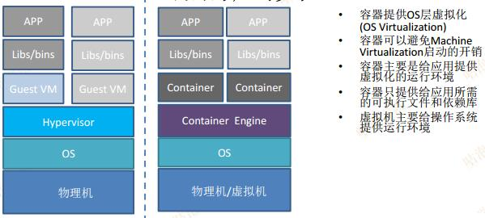
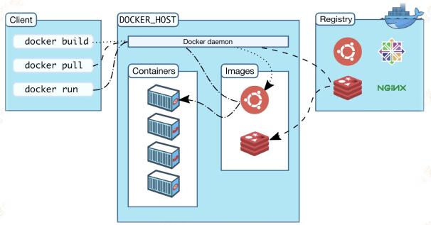

官方文档：https://docs.docker.com

## 虚拟化技术
1）Hypervisor：VMware vSphere、微软Hyper-V
2）基于容器的虚拟化：Docker Container




<br/>
<hr/>

## docker架构



### 1）docker daemon：守护进程
处理docker api请求
管理docker对象

### 2）docker client：客户端
docker client使用docker api和docker daemon进行交互
可以根多个不同的docker daemon进行通讯


### 3）docker registries：注册中心
存储docker镜像
公有docker hub和私有docker registry

### 4）docker对象
镜像：用于创建容器的只读模板
容器：镜像的运行实例

### 5）docker网络模型
None网络模型：容器不能对外进行网络通信
Bridge网络模型：同一主机上同一个bridge网络的所有容器可以互相通信，不同的bridge不能直接通信，不同主机间也不能直接通信
Host网络模型：和宿主机公用网络
Overlay网络模型：支持多主机间直接通讯

<br/>
<hr/>

## 安装docker

``` bash
# 安装docker
yum install docker

# 查看Docker版本
docker -v

# 启动与停止
systemctl start docker
systemctl stop docker
systemctl restart docker
systemctl status docker

# 开机启动
systemctl enable docker

# 查看docker概要信息
docker info

# 切换阿里的registry镜像源
vi /etc/docker/daemon.json
{
"registry-mirrors": ["https://zhfojaep.mirror.aliyuncs.com"]
}
systemctl daemon-reload
systemctl restart docker

# 查看docker帮助，所有命令
docker --help
```

<br/>
<hr/>

## docker镜像


运行中的容器，所有变化都在可写入层
一旦容器删除，可写入层随之删除
多个容器共享base镜像

### 1）创建docker镜像
1）docker commit，不常用
2）通过Dockerfile，[Dockerfile命令详解](https://www.cnblogs.com/dazhoushuoceshi/p/7066041.html "Dockerfile命令详解")

### 2）常见操作
``` bash
# 查看本地镜像
docker images

# 网络搜索镜像
docker search nginx

# 网络拉取镜像，版本号为5.7
docker pull nginx:5.7

# 删除镜像
docker rmi nginx

# 找出tag为<none>的
docker rmi $(docker images -q -f "dangling=true")
```

<br/>
<hr/>

## docker容器

常见docker容器操作

``` bash
# 获取容器/镜像的元数据
docker inspect name/id

# 查看正在运行容器
docker ps

# 查看所有的容器（启动过的历史容器）
docker ps -a

# 查看最后一次运行的容器
docker ps –l

# 查看停止的容器
docker ps -f status=exited

# 创建守护式容器（退出不会停止）
docker run -di --name=mycentos centos:7

# 登录守护式容器
docker exec -it container_name (或者 container_id)  /bin/bash

# 启动容器
docker start name/id

# 停止容器
docker stop name/id

# 拷贝文件
docker cp 需要拷贝的文件或目录 容器名称:容器目录
docker cp 容器名称:容器目录 需要拷贝的文件或目录

# 删除指定的容器
docker rm CONTAINER_ID/NAME

# 删除所有容器
docker rm `docker ps -a -q`

# 查看docker容器日志
docker logs [OPTIONS] CONTAINER

# 删除所有失败的容器
docker rm $(docker ps -q -f status=exited)
```

<br/>
<hr/>

## 容器编排

### 1）docker-compose

安装
``` bash
curl -L https://github.com/docker/compose/releases/download/1.14.0/docker-compose-`uname -s`-`uname -m` > /usr/local/bin/docker-compose

chmod +x /usr/local/bin/docker-compose

docker-compose -version
```

常用命令
``` bash
# docker-compose容器相关命令必须在有docker-compose.yml文件的上下文中执行

# 具体参数可以使用docker-compose up --help 查看

# 启动容器(后台)
docker-compose up -d 

# 查看运行的容器
docker-compose ps

# 查看容器日志
docker-compose logs

# 停止容器
docker-compose stop

# 删除容器
docker-compose rm

# 重新构建容器
docker-compose build
```

### 2）k8s
详见k8s篇

### 3) portainer

``` bash
docker run -p 20000:9000 -p 20001:8000 --name icqlchen-portainer \
--restart=always \
-v /var/run/docker.sock:/var/run/docker.sock \
-v /data/docker/portainer/data:/data \
-d portainer/portainer-ce:latest
```


<br/>
<hr/>

## 常用容器

mariadb
``` bash
docker run \
-p 23306:3306 \
--name icqlchen-mariadb \
--restart=always \
-v /data/docker/mariadb/data:/var/lib/mysql \
-v /data/docker/mariadb/conf:/etc/mysql \
-e MYSQL_ROOT_PASSWORD=root \
-d \
mariadb:latest

my.cnf文件
[mysqld]
character-set-server=utf8
default-time-zone='+08:00'
[client]
default-character-set=utf8
[mysql]
default-character-set=utf8
```

redis
``` bash
docker run \
-p 26379:6379 \
--name icqlchen-redis \
--restart=always \
-v /data/docker/redis/data:/data \
-v /data/docker/redis/conf:/usr/local/etc/redis \
-d \
redis:latest \
redis-server /usr/local/etc/redis/redis.conf
```

elasticsearch，kibana
``` bash
version: '3.1'

services:
  elasticsearch:
    image: elasticsearch:7.14.0
    container_name: icqlchen-elasticsearch
    restart: always
    ports:
      - 29200:9200
      - 29300:9300
    environment:
      - ES_CLUSTERNAME=elasticsearch
      - "discovery.type=single-node"
  kibana:
    image: kibana:7.14.0
    container_name: icqlchen-kibana
    restart: always
    ports:
      - 25601:5601
    environment:
      - ELASTICSEARCH_URL=http://elasticsearch:29200


```

ubuntu-desktop
``` bash
docker run \
--name icqlchen-ubuntu-desktop \
-p 21000:5900 \
-p 21001:80 \
-e "VNC_PASSWORD=Cqljia19930618" \
-v /data/docker/ubuntu-desktop/data:/dev/shm \
-d \
dorowu/ubuntu-desktop-lxde-vnc:latest
```