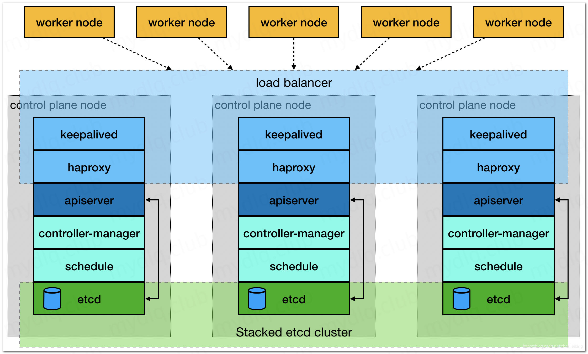

官方文档：https://kubernetes.io/zh/docs/home/

## k8s架构


### 1）Master
``` bash
k8s的大脑，运行daemon服务

1）kube-apiserver：提供管理Cluster各种资源的restful接口
2）kube-scheduler：调度中心，决定Pod放在哪个Node上运行
3）kube-controller-manager：Controller中心，管理各种资源
4）etcd：配置中心，存储集群的信息
5）Pod网络
```

### 2）Node
``` bash
运行Pod的节点，Master也是一个Node

1）kubelet：维持运行中的Pods以及提供kuberntes运行时环境
2）kube-proxy：外界通过Service访问Pod，kube-proxy负责将访问Service的TCP/UDP数据转发到Pod，还会实现负载均衡
3）Pod网络
```

<br/>
<hr/>

## k8s基础
``` bash
* k8s资源
* 两种探针
* rbac
```

<br/>
<hr/>

## 部署k8s集群（minikube）
``` bash
# 安装依赖
wget https://download.docker.com/linux/centos/7/x86_64/edge/Packages/containerd.io-1.2.6-3.3.el7.x86_64.rpm
yum -y install containerd.io-1.2.6-3.3.el7.x86_64.rpm

# 安装docker-ce
curl -fsSL https://get.docker.com | bash -s docker --mirror Aliyun
systemctl start docker && systemctl enable docker

# 切换阿里的registry镜像源
vi /etc/docker/daemon.json
{
"registry-mirrors": ["https://zhfojaep.mirror.aliyuncs.com"]
}
systemctl daemon-reload
systemctl restart docker

# 下载kubectl
wget "https://storage.googleapis.com/kubernetes-release/release/v1.17.3/bin/linux/amd64/kubectl" -O "/usr/local/bin/kubectl" 
chmod +x /usr/local/bin/kubectl

# 下载minikube
wget https://storage.googleapis.com/minikube/releases/latest/minikube-linux-amd64 -O "/usr/local/bin/minikube" 
chmod +x /usr/local/bin/minikube

# 启动
minikube start --vm-driver=none --registry-mirror=https://registry.docker-cn.com --image-repository=registry.cn-hangzhou.aliyuncs.com/google_containers

# 开机自启
systemctl enable docker
systemctl enable kubelet

# 启用ingress
minikube addons enable ingress

# 启用dashboard
minikube dashboard
```

<br/>
<hr/>

## 部署k8s集群（kubeadm）
### 1、简介

本部分内容参考转载自 http://www.mydlq.club/article/4/#wow23

注意：配置文件中相关敏感信息已处理，需要自行替换

#### 1）环境

| 软件 | 版本 |
| - | - |
| CentOS | 7.6 |
| Docker | 18.06.1-ce |
| Kubernetes | 1.18.2 |
| Kuberadm | 1.18.2 |
| Kuberlet | 1.18.2 |
| Kuberctl | 1.18.2 |

#### 2）集群架构


### 2、前期准备（所有机器）

#### 1）机器分配
| ip | 主机名 | CPU & 内存 | 角色 |
| - | - | - | - |
| 172.16.0.100 | icql-vip | 1C & 1G | vip
| 172.16.0.101 | icql-master1 | 2C & 2G | master
| 172.16.0.102 | icql-master2 | 2C & 2G | master
| 172.16.0.103 | icql-master3 | 2C & 2G | master
| 172.16.0.201 | icql-node1 | 2C & 2G | node
| 172.16.0.202 | icql-node2 | 2C & 2G | node

#### 2）机器端口
* master节点

| 协议 | 端口 | 使用者
| - | - | - |
| TCP | 6443 | k8s api |
| TCP | 2379-2380 | etcd server |
| TCP | 10250 | kubelet api |
| TCP | 10251 | kube-scheduler |
| TCP | 10252 | kube-controller-manager |


* node节点

| 协议 | 端口 | 使用者
| - | - | - |
| TCP | 10250 | kubelet api |
| TCP | 30000-32767 | NodePort Services |

#### 3）环境设置
* 修改主机名
``` bash
# 具体参考机器分配
hostnamectl set-hostname icql-vip
```

* 主机名称解析
``` bash
vi /etc/hosts

172.16.0.100 vip.k8s.icql.work icql-vip
172.16.0.101 master1.k8s.icql.work icql-master1 
172.16.0.102 master2.k8s.icql.work icql-master2
172.16.0.103 master3.k8s.icql.work icql-master3 
172.16.0.201 node1.k8s.icql.work icql-node1
172.16.0.202 node2.k8s.icql.work icql-node2
```

* 主机时间同步
``` bash
systemctl start chronyd.service && systemctl enable chronyd.service
```

* 关闭防火墙
``` bash
systemctl stop firewalld && systemctl disable firewalld
```

* 关闭并禁用SELinux
``` bash
# 关闭selinux
setenforce 0
# 编辑／etc/sysconfig selinux 文件，以彻底禁用 SELinux
sed -i 's/^SELINUX=enforcing$/SELINUX=disabled/' /etc/selinux/config
# 查看selinux状态
getenforce 
```

* 禁用 Swap 设备
``` bash
swapoff -a && sed -ri 's/.*swap.*/#&/' /etc/fstab
```

* 允许路由转发
``` bash
vi /etc/sysctl.d/k8s.conf

net.ipv4.ip_forward = 1
net.bridge.bridge-nf-call-ip6tables = 1
net.bridge.bridge-nf-call-iptables = 1

# 挂载br_netfilter
modprobe br_netfilter

# 使配置生效
sysctl --system
```

* 调整资源限制
``` bash
vi /etc/security/limits.conf

# 删除 End of file 行后的所有东西，加入以下内容
* soft nofile 65536
* hard nofile 65536
* soft nproc 65536
* hard nproc 65536
* soft memlock unlimited
* hard memlock unlimited
```

### 3、master高可用方案：Keepalived + haproxy（所有master机器）
待补充

### 4、安装docker（所有机器）

``` bash
# 获取docker-ce.repo
wget http://mirrors.aliyun.com/docker-ce/linux/centos/docker-ce.repo -O "/etc/yum.repos.d/docker-ce.repo"

# 更新yum源并安装
yum update && yum install \
  containerd.io-1.2.10 \
  docker-ce-19.03.4 \
  docker-ce-cli-19.03.4

# 启动docker
systemctl start docker

# docker推荐设置，切换阿里的registry镜像源
vi /etc/docker/daemon.json

{
  "exec-opts": ["native.cgroupdriver=systemd"],
  "log-driver": "json-file",
  "log-opts": {
    "max-size": "100m"
  },
  "storage-driver": "overlay2",
  "storage-opts": [
    "overlay2.override_kernel_check=true"
  ],
  "registry-mirrors": ["https://zhfojaep.mirror.aliyuncs.com"]
}

# 启动docker
systemctl start docker && systemctl enable docker

# 设置镜像存储目录
vi /lib/systemd/system/docker.service

#找到 ExecStart 这行后面加上存储目录，例如这里是 --graph /data/docker
ExecStart=/usr/bin/dockerd --graph /data/docker

# 重启docker
systemctl daemon-reload && systemctl restart docker

# 确认iptables，查看开始的几行是否有ACCEPT
iptables -nvL
```

### 5、安装kubeadm/kubelet/kubectl（所有机器）

| 软件包 | 作用 |
| - | - |
| kubeadm | 用来初始化集群的指令 |
| kubelet | 在集群中的每个节点上用来启动 pod 和 container 等 |
| kubectl | 用来与集群通信的命令行工具 |

``` bash
# 设置k8s源
vi /etc/yum.repos.d/kubernetes.repo

[kubernetes]
name=Kubernetes
baseurl=https://mirrors.aliyun.com/kubernetes/yum/repos/kubernetes-el7-x86_64
enabled=1
gpgcheck=0
repo_gpgcheck=0
gpgkey=https://mirrors.aliyun.com/kubernetes/yum/doc/yum-key.gpg https://mirrors.aliyun.com/kubernetes/yum/doc/rpm-package-key.gpg

# 安装kubeadm，kubelet和kubectl,指定版本
yum install -y kubelet-1.18.2 kubeadm-1.18.2 kubectl-1.18.2

# 自启动kubelet
systemctl enable kubelet
```

### 6、集群初始化（第一个master机器）
``` bash
# 初始化
kubeadm init \
--apiserver-advertise-address=172.18.123.163 \
--image-repository registry.aliyuncs.com/google_containers \
--kubernetes-version v1.18.2 \
--service-cidr=10.1.0.0/16 \
--pod-network-cidr=10.244.0.0/16

# 授权kubectl工具
mkdir -p $HOME/.kube && cp -i /etc/kubernetes/admin.conf $HOME/.kube/config && chown $(id -u):$(id -g) $HOME/.kube/config
```

### 7、集群安装网络插件flannel（第一个master机器）

#### 1）获取镜像，如果失败请搜索查询解决办法
``` bash
# 获取Pod网络插件镜像
docker pull quay.io/coreos/flannel:v0.12.0-amd64
```

#### 2）部署
* [官方部署文件](https://raw.githubusercontent.com/coreos/flannel/v0.12.0/Documentation/kube-flannel.yml)
* [我的部署文件-gitee](https://gitee.com/icql/icql-jenkins/tree/dk-icql-k8s/conf/kube-system/flannel)
* [我的部署文件-github](https://github.com/icql/icql-jenkins/tree/dk-icql-k8s/conf/kube-system/flannel)

### 8、设置master节点可调度pod

``` bash
# 设置master节点可调度pod，如有需要
kubectl taint node icql-master node-role.kubernetes.io/master-
```

### 9、加入集群（其他机器）
``` bash
# 加入集群
kubeadm join 172.18.123.163:6443 --token ygmmsu.8mpvlippqezbkyln \
    --discovery-token-ca-cert-hash sha256:feff014c4302ea55feca17c259d207559d6d42f7087e02df17cb58a236ea50dc

# 节点角色
kubectl label node icql-node1 node-role.kubernetes.io/node=
```

### 10、安装ingress（master机器）
ingress 用来暴露从集群外到集群内服务的HTTP或HTTPS路由

https://kubernetes.github.io/ingress-nginx/

* [我的部署文件-gitee](https://gitee.com/icql/icql-jenkins/tree/dk-icql-k8s/conf/kube-system/ingress)
* [我的部署文件-github](https://github.com/icql/icql-jenkins/tree/dk-icql-k8s/conf/kube-system/ingress)

### 11、安装 dashboard 和 metrics
dashboard 用来可视化管理k8s集群，metrics用来监控各资源占用的cpu和内存，使用http-basic-auth代替默认的dashboard的token登录
* [我的部署文件-dashboard-gitee](https://gitee.com/icql/icql-jenkins/tree/dk-icql-k8s/conf/kube-system/dashboard)
* [我的部署文件-dashboard-github](https://github.com/icql/icql-jenkins/tree/dk-icql-k8s/conf/kube-system/dashboard)
* [我的部署文件-metrics-gitee](https://gitee.com/icql/icql-jenkins/tree/dk-icql-k8s/conf/kube-system/metrics)
* [我的部署文件-metrics-github](https://github.com/icql/icql-jenkins/tree/dk-icql-k8s/conf/kube-system/metrics)
