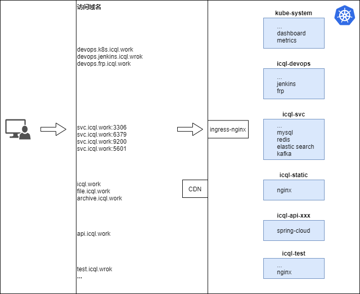
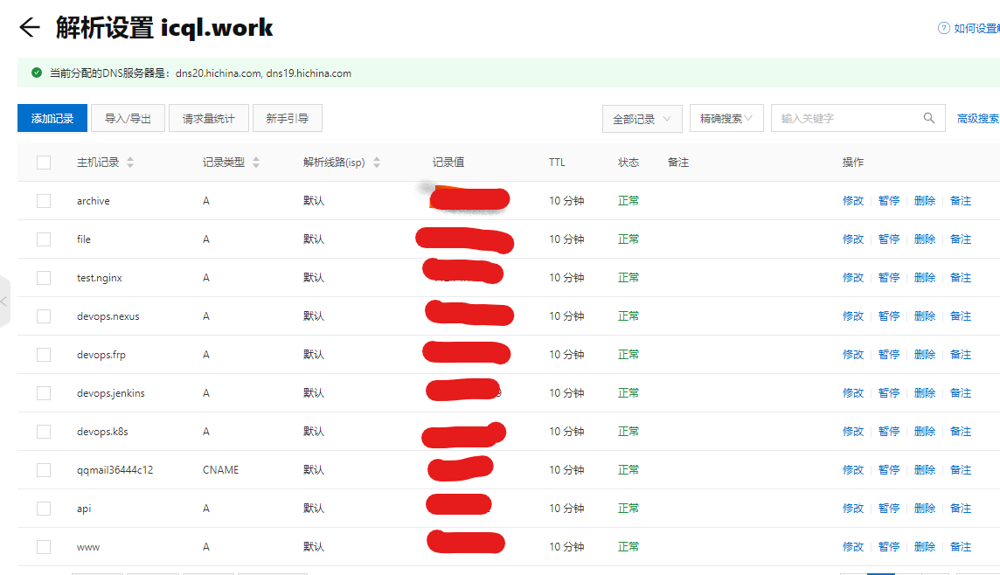
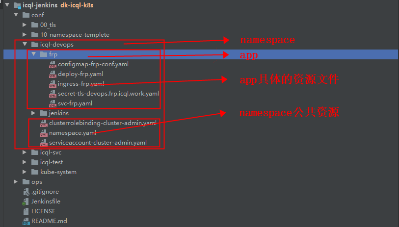
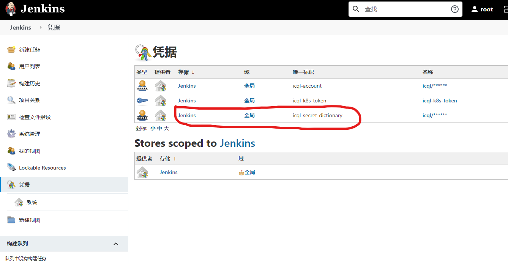

## 背景介绍
原腾讯云1C1G1M服务器即将到期，需要将上面的服务迁移到阿里云2C8G5M上，考虑到新服务器内存较大，所以上车k8s入门学习一下

<br/>
<br/>
<hr/>

## 资源部署图



<br/>
<br/>
<hr/>

## 准备工作
### 域名解析
设置域名解析指向服务器公网ip地址

### https证书
https://freessl.cn 网站申请免费ssl证书

<br/>
<br/>
<hr/>

## 搭建k8s集群
k8s集群搭建过程，详见 [k8s基础-部署k8s集群](/2020/04/28/500_k8s/520_k8s-基础)（包括dashboard 和 metrics）

<br/>
<br/>
<hr/>

## 部署k8s资源
部署yaml文件按照一个资源一个文件拆分，具体的目录结构如下：


我的部署文件详见仓库（注意修改相关密钥）
[我的部署文件-gitee](https://gitee.com/icql/icql-jenkins/tree/dk-icql-k8s/conf/)
[我的部署文件-github](https://github.com/icql/icql-jenkins/tree/dk-icql-k8s/conf)


执行命令
``` bash
kubectl apply -f xxx.yaml
```

<br/>
<br/>
<hr/>

## jenkins实践
### 1、配置
根据提示找到初始化管理员密码，登录，首次启动安装插件建议选择无，跳过插件安装（国内速度奇慢）
#### 1）解决jenkins插件下载慢
``` bash
（1）系统管理-插件管理-升级地址
https://mirrors.tuna.tsinghua.edu.cn/jenkins/updates/update-center.json

（2）修改var/jenkins_home\updates\default.json
updates.jenkins-ci.org/download 替换为 mirrors.tuna.tsinghua.edu.cn/jenkins
www.google.com 替换为 www.baidu.com

```
#### 2）插件安装
Locale
Localization: Chinese (Simplified)
pipeline
Generic Webhook Trigger
Git
Docker Pipeline
Kubernetes CLI Plugin

### 2、pipeline多分支流水线
具体的实践请查看 https://gitee.com/icql/icql-jenkins/blob/readme/README.md
注意：所有文件中的敏感信息都已隐藏，将其存储在jenkins中的凭据中，如有需要请自行替换


3个凭据
```
icql-account	
icql-secret-dictionary	
icql-k8s-token（secret text，随便一个可以访问k8s的token即可，例如dashboard的token）
```