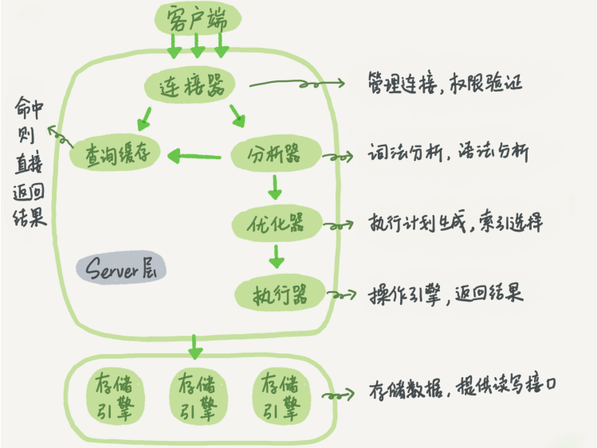
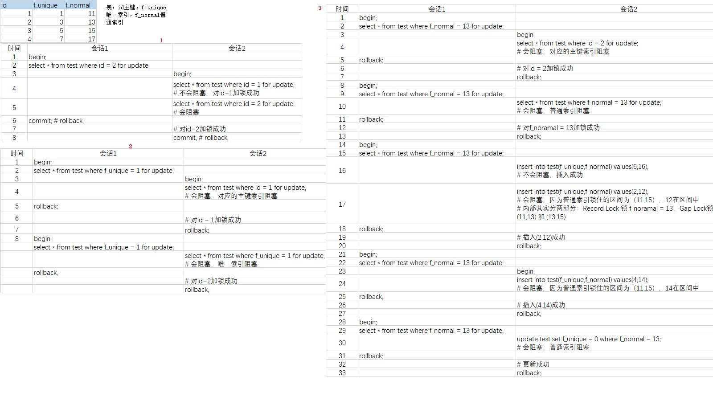

## 数据类型

### 1）选择原则
（1）尽量选择小的
（2）选择简单的；整型 > 字符串
（3）避免可为null

### 2）整数类型
（singed存储范围 -2^(n-1) ~ 2^(n-1)，unsingned存储范围0 ~ 2^n）
* tinyint 1个字节
* smallint 2个字节
* mediumint 3个字节
* int 4个字节
* bigint 8个字节

### 3）实数类型
* float 单精度浮点型，存在数据精度丢失
* double 双精度浮点型，存在数据精度丢失
* decimal(a,b) 小数类型优先使用此类型，a代表总位数，包括整数位+小数点1位+小数位b

### 4）字符串类型
* varchar 可变字符串
* char 定长字符串

``` bash
#存储字节数
#varchr(10)变长字段且允许NULL    =  10 * ( character set：utf8=3,gbk=2,latin1=1)+1(NULL)+2(变长字段)
#varchr(10)变长字段且不允许NULL =  10 *( character set：utf8=3,gbk=2,latin1=1)+2(变长字段)

#char(10)固定字段且允许NULL        =  10 * ( character set：utf8=3,gbk=2,latin1=1)+1(NULL)
#char(10)固定字段且不允许NULL        =  10 * ( character set：utf8=3,gbk=2,latin1=1)
```
* text与smalltext同义，存储的是普通字符集
    * tinytext
    * smalltext
    * mediumtext
    * longtext
* blob与smallblob同义，存储的是二进制数据
    * tinyblob
    * smallblob
    * mediumblob
    * longblob

### 5）日期和时间类型
* date 日期
* time 时间
* year 年份
* datetime 日期时间精确到秒 1001-9999年，优先使用
* timestamp 日期时间精确到秒 1970/1/1格林尼治时间开始后-2038年，范围小

### 6）位数据类型
* bit 存储0/1 true/false
* set 

### 7）特殊类型数据
* 钱相关可以使用bigint等整数存储，单位为分
* ip可以使用32位无符号整数存储
* SELECT INET_NTOA('2886736938'),INET_ATON('172.16.28.42')

<br/>
<hr/>

## mysql的sql执行流程



<br/>
<hr/>

## mysql应用文件

### 1）错误日志
``` sql
# 查看路径
show variables like 'log_error';
```

### 2）慢查询日志
``` sql
# 记录慢查询日志开关
show variables like 'log_show_queries';

# 默认是10s
show variables like 'long_query_time';

# 记录没有使用索引的查询日志开关（也是记录到慢查询日志）
show variables like 'log_queries_not_using_indexes';

# 慢查询日志记录方式，默认FILE、可修改为TABLE
# 转成TABLE默认引擎为CSV，修改为MyISAM提高查询效率，增加start_time列索引
show variables like 'log_output';
SET GLOBAL slow_query_log=off;
ALTER TABLE mysql.slow_log ENGINE=MyISAM;
```

### 3）查询日志

general_log，和慢查询日志设置非常相似
记录查询日志、请求拒绝的日志、未正确执行的sql等

### 4）二进制日志（binlog）

binlog，二进制日志文件，记录所有对mysql数据库执行更改的所有操作（不是结果），不包括select和show等查询操作，默认不开启

**主要作用：**
>（1）恢复：恢复数据
>（2）复制：主从复制
>（3）审计：查看更改数据操作的sql是否有风险

#### （1）日志格式
（1）STATEMENT：记录的是逻辑sql语句，如果使用了uuid()等函数，可能会导致主从数据不一致
（2）ROW：记录行更改的情况，开启后日志文件会变得很大
（3）MIX：混合记录

#### （2）InnoDB引擎的binlog

>事务开始时，所有未提交的二进制日志会被记录到 buffer 缓存中
>事务即将提交前，再将buffer写入到磁盘
>
>binlog_cache_size设置buffer的大小，默认32k
>每次开始一个事务时，都会新开一个buffer
>如果buffer放不下，会开一个临时文件
>所以设置合适的值
>
>sync_binlog=1，代表每写一次buffer，就写入磁盘
>但即使这样，也有可能丢失数据
>极端情况下：
>事务即将提交前，buffer写入磁盘后，事务还没提交，宕机


<br/>
<hr/>


## InnoDB引擎文件

**InnoDB引擎的逻辑存储结构：**
表空间（tablespace）->段（segment）->区（extent）->页（page）->行（row）

默认情况下只有一个默认表空间，所有的数据都存在这里边
若启用了 innodb_file_per_table ，则每张表都会有一张单独的表空间
但是这些表单独的表空间只存放该表的数据、索引等

（1）段：数据段、索引段、回滚段
（2）区：连续的页组成的空间，每个区的大小为1MB
（3）页：默认16kb，可设置，InnoDB最小的磁盘管理单位
（4）行：每页存储的最多行数 16kb/2-200=7992

### 1）行溢出
InnoDB可以将一条记录中的某些数据存放在真正的数据页外面
>varchar、text、blob类型
>原则：
>当一页（默认16k）存放不了2行数据时
>就会只在真正的数据页存放前面一部分数据
>其他数据存放在行溢出页UnCompressed BLOB page

### 2）页的分裂与合并
指的是增加或删除数据时，索引树上结点（16k）的变化

<br/>
<hr/>

## InnoDB引擎索引

### 1）B+树索引

二叉搜索树->平衡二叉树->（2-3树：3阶b树）b树->b+树 ，依次演变而成

#### （1）选择B+树的理由

**不选择二叉树的理由：**
>查找时树的每一层就相当于一次相对io操作
>
>理论上，二叉树的查找速度和比较次数都是最小的
>但是相较B+树来说二叉树高度的高度较高
>所以相对io次数就会更多，影响性能

**不选择B树的理由：**
>B树的数据可以存在非叶子节点上
>数据占用一定大小的空间
>所以B树的高度相对B+树要高
>对于范围查找来说，B树需要重复的中序遍历进行查找
>而B+树不需要，只要在遍历叶子节点的链表即可


#### （2）聚集索引
（生成唯一一颗叶子结点存储所有数据的B+树）
>（1）如果有主键，则聚集索引为主键字段
>（2）如果没有主键，但表中的字段有"唯一非空"索引(多个的话取定义时的第一个)，则以这个字段为聚集索引
>（3）如果没有主键，也没有"唯一非空"索引字段，则内部隐式生成一个聚集索引

#### （3）非聚集索引
（每个索引会生成一颗B+树，叶子结点只存储对应的聚集索引key，不存储数据）
>（1）普通索引
>（2）唯一索引（和普通索引一样，只起到新增数据时保证数据唯一的功能）
>（3）多列索引（最左前缀原则）

#### （4）联合索引

满足最左前缀原则

联合索引多字段排序：
https://zhuanlan.zhihu.com/p/63451584	

>a,b索引
1）order by a asc,b asc; 不用filesort，索引可以直接排序
2）order by a desc,b desc; 不用filesort，索引可以直接排序，
从索引圈定的叶子节点范围，
从右往左，根据每个叶子上的主键值去主键索引上找到数据放到结果集里边
依次执行
3）order by a asc,b desc; 需要filesort，索引不能直接排序，不符合单向链表

#### （5）索引结点的大小
InnoDB的磁盘管理最小单位是页，所以索引的结点只能是16k的倍数
索引结点的大小是16k


### 2）哈希索引

### 3）全文索引

### 4）空间索引

<br/>
<hr/>


## InnoDB的事务与锁

``` sql
begin;

sql语句

commit;
rollback;
```

事务具有的ACID特性：

```
Atomicity（原子性）：一个事务中的所有操作，要么全部完成，要么全部不完成，不会结束在中间某个环节
Consistency（一致性）：在事务开始之前和事务结束以后，数据库的完整性没有被破坏
Isolation（隔离性）：多个并发事务不会互相影响
Durability（持久性）：事务处理结束后，对数据的修改就是永久的，即便系统故障也不会丢失
```

### 1）隔离性Isolation 详解

#### （1）隔离性的4个问题

>**（1）脏读：**
>一个事务中，select到另一个事务**没有提交**的数据
>**（2）不可重复读：**
>一个事务中，2次select读取同一条数据得到不同的结果（原因：别的事务对这条数据做了update且已提交，且别的事务已经提交）
>**（3）幻读：**
>一个事务中，2次select读取相同条件的数据得到的条数不同（原因：别的事务在这个范围内做了insert或delete）
>**（4）丢失更新**
>一个事务的更新操作被另一个事务的更新操作覆盖

#### （2）隔离级别的实现原理

**表锁：**
>mysql层的锁，有好多种
>（1）sql命令
>LOCK TABLE table READ|WRITE
>UNLOCK TABLES;
>
>（2）用于ddl操作
>dml操作会加上Metadata Lock
>当执行ddl时，需要等待dml释放掉元数据锁
>ddl才能执行

**两个行锁：**
>InnoDB层的锁
>（1）共享锁（S Lock）
>select ... lock in share mode;操作
>
>（2）排他锁（X Lock）
>select ... for update;操作
>update/delete操作

**两个意向锁，表锁：**
>InnoDB层的锁，Intention Lock
>（1）意向共享锁（IS）：每次在加共享锁时，会先加一个IS锁
>（2）意向排他锁（IX）：每次在加排他锁时，会先加一个IX锁
>
>作用：
>当需要加表锁时
>先根据意向锁判断表中是否已经有了行锁
>这样就可以提前判断是否互斥
>不用遍历所有的数据结点去判断

**mvcc：**
>mvcc（multi version concurrency control）多版本并发控制
>
>原理：
>当select时
>如果读取的行上有X锁（update/delete）
>不会等待释放X锁
>而是直接读取行的快照数据
>（都是事务已经提交的数据）
>
>**通过undo日志实现的**

**行锁算法：**
>（1）Record Lock：
>单个行记录上的锁
>
>（2）Gap Lock：
>间隙锁，锁定范围但不包括记录本身
>
>（3）Next-Key Lock：
>临键锁，Record Lock + Gap Lock
>锁定包含记录本身和记录相邻两侧的范围的数据 

#### （3）4种隔离级别

ddl：表的结构等操作
dml：insert/update/delete

##### 读未提交（Read Uncommitted）
>解决：丢失更新
>
>默认update/delete会加X锁
>所以所有隔离级别都没有这个问题

##### 读已提交（Read Committed）
>解决：丢失更新，脏读
>
>（脏读）
>通过mvcc每次都读取数据行的最新的一次快照
>这样也不会读到别的事务未提交的数据

##### 可重复读（Repeatable Read）
>Mysql默认隔离级别
>解决：丢失更新，脏读、不可重复读、幻读
>
>（脏读）
>通过mvcc每次都读取数据行事务开始后的第一次快照
>这样就不会读到别的事务未提交的数据

>（不可重复读）
>因为是读的mvcc的事务开始后的第一次快照
>所以每次读到的都是相同的数据
>
>（幻读）
>此隔离级别下，行锁采用Next-Key Lock
>注意：这里指的是可以解决幻读
>即必须显示的使用排他锁select for update才能解决幻读，大部分场景是不需要解决的
>
>a）使用的是主键索引：
>将只锁住主键树的对应的实际数据行
>
>b）使用的是唯一索引：
>将锁住唯一索引树对应的索引记录行 和 唯一索引对应的主键索引实际数据行
>
>c）使用的是普通索引
>将锁住 1普通索引的索引记录行 和 2普通索引对应的主键索引实际数据行 和 3普通引相邻索数据的闭区间

 

##### 串行化（Serializable）
>解决：4个问题

#### （4）死锁

死锁：两个事务在争夺资源而造成的互相等待的现象

**解决死锁：**
>（1）超时机制
>innodb_lock_wait_timeout 等待锁释放的时间，默认50秒
>innodb_rollback_on_timeout 等待超时的事务是否回滚，默认OFF不回滚
>
>（2）主动检测死锁
>wait-for-graph，主动回滚某条事务解决死锁


### 2）原子性Atomicity/一致性Consistency/持久性Durability详解


#### （1）redolog（重做日志）
每个InnoDB引擎至少有1个重做日志文件组，每个重做日志文件组至少有2个重做日志文件

**binlog 和 redolog 的区别：**
>（1）binlog：
>*记录所有存储引擎的数据变动日志，包括InnoDB、MyISAM等
>*记录的是逻辑日志
>*在事务即将提交前只记录一次
>
>（2）redolog：
>*只记录InnoDB本身的事务日志
>*记录的是每个页更改的物理情况
>*在事务进行过程中不断写入每个页改变的情况到重做日志文件

**redolog 写入时机：**
>redolog也不是一次写入磁盘，而是先写 redolog buffer
>写入磁盘的时机：
>（1）主线程每秒都会写
>（2）innodb_flush_log_at_trx_commit值控制，一般设置为1
>0：不做操作，等着主线程每秒写
>1：执行commit时写
>2：异步写

#### （2）undolog

逻辑日志，以便可以回滚事务
>例如：
>事务执行insert，记录delete
>事务执行delete，设置行记录数据delete flag=1，undo记录可以回滚的记录
>事务执行update非主键字段，记录相反的update
>事务执行update主键字段，设置原行记录数据delete flag=1，新增一个新的记录行，undo记录可以回滚的记录

**作用：**
>（1）事务回滚
>（2）mvcc

**undolog 写入时机：**
>每次操作聚集索引的数据前

#### （3）purge
**purge线程的作用：**
>（1）执行真正的删除，delete flag=1的行记录数据
>（2）由于支持mvcc，purge用来删除没有使用到的undolog