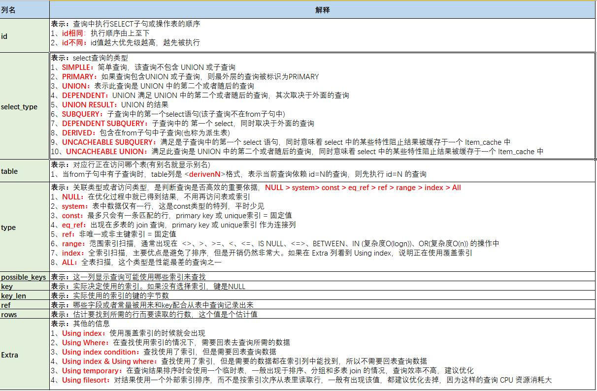

## explain

explain sql语句

 

## mysql提供的优化机制

### （1）索引选择的字段是否合适
字段存储的数据区分度是否高，即建立索引后是否高效

show index from table 中的 cardinality 基数近似值，越大说明索引字段越高效

### （2）覆盖索引
>如果在非聚集索引中可以得到查询的记录
>不需要回表（根据非聚集索引的叶子节点上的key去聚集索引查找）
>即查询需要返回的列都在（索引字段+主键字段）中
>称之为覆盖索引

explain sql 列中的 Extra 有 using index，表示覆盖索引

### （3）不使用非聚集索引的情况

explain sql 发现 possible keys 一列中有非聚集索引，但是没有使用，用了聚集索引（全表扫描）

>非聚集索引的索引树叶子结点key是有序的
>但是如果需要回表查询时
>非聚集索引的叶子结点key对应到聚集索引上是无序的
>所以会造成大量的磁盘随机访问
>顺序读磁盘很快，但是随机读磁盘会很慢
>
>所以当需要回表的数据超过表数据的20%时
>优化器认为随机读磁盘太慢
>则会使用聚集索引提高效率

如果确信使用非聚集索引高效，可以使用 force index(索引名)强制使用索引，例如存储用的是随机访问很快的固态硬盘

### （4）MRR优化
multil-range read

MRR优化适用于 range、ref、eq_ref 类型的查询

**原理：**
>需要回表的索引
>先在非聚集索引叶子结点找到key后
>**对key进行排序**
>然后按照顺序去聚集索引查找数据
>能有效减少随机访问

当没有开启MRR，extra 只有 using index condition，开启后还会出现 using MRR

### （5）ICP优化
index condition pushdown

**原理：**
>需要回表的索引
>没有ICP时，会在聚集索引中找到所有数据后在where过滤
>有ICP时，特定情况下会在取出非聚集索引叶子结点时过滤一部分数据
>
>例如：
>主键是联合索引：a、b，普通索引c
>select * from t where c>1 and b>2
>
>首先只会使用索引c
>索引c中包含：c、a、b
>所以在取叶子结点key时就可以过滤一部分b的数据

 

## 索引失效的场景

（1）索引列上有函数计算
（2）不满足最左匹配
（3）like百分比写在左边
（4）使用 != 或 or
（5）varchar引号丢失
（6）查询的数据超过20%有可能会使用全表

 

## 优化经验

>1）优化数据访问：
>确定只返回需要的数据：包括列和行
>使用limit限制行数据
>查询列尽量不要使用*，只取需要的列，优化器可能使用覆盖索引优化
>
>2）COUNT()：
>如果统计的是行数优先使用count(*)，count(1)也一样，但是count(列)就只会统计不为null的记录数
>
>3）关联查询：on或using子句中的列上一定要有索引，优化器explain后是先A表后B表，则B表上的on中的列一定要建索引，group by和order by中的列最好只有一个表中的列
>
>4）使用覆盖索引
>
>5）前缀索引：字符串类型的列作索引时只取前面的部分，能有效减小索引文件的大小，提高索引的速度
>坏处：不能在 ORDER BY 或 GROUP BY 中使用前缀索引，也不能把它们用作覆盖索引
>
>6）排序尽量使用索引排序
>
>7）尽可能重用索引，使用多列索引，避免建立多个索引
>
>8）union：除非需要distinct，否则使用union all
>
>9）分页优化：分页查询后面的数据会比较耗时，可以利用覆盖索引和关联来优化
>优化前
>SELECT * FROM `tbl_works` WHERE `status`=1 LIMIT 100000, 10
>优化后
>SELECT * FROM tbl_works t1
>inner join (SELECT id from tbl_works WHERE status=1 limit 100000, 10) t2
>ON t1.id = t2.id
>这条SQL的含义是，通过自连接与join定位到目标 ids，然后再将数据取出。
>在定位目标 ids时，由于SELECT的元素只有主键ID，且status存在索引，
>因此MySQL只需在索引中，就能得到ids，不用回表查询。因而，查询效率非常高
> 

## mybatis查看sql
org.apache.ibatis.executor.SimpleExecutor # doQuery 