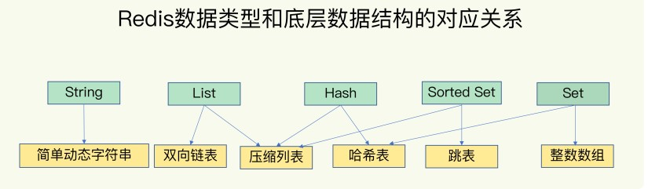

## redis介绍

redis是使用c语言开发的一个高性能键值（Key-Value）内存数据库，单进程单线程模型，不存在并发问题

### 1）简单安装
``` shell
#docker安装
docker run -di --name=db-redis -p 56379:6379 redis
docker run -di --name=db-redis -p 56379:6379 redis --requirepass "password"

#测试redis
#登录容器
docker exec -it db-redis /bin/bash
#进入redis命令界面
redis-cli
#如果配置了密码
auth 密码
#测试：选择第一个数据库
select 1

#界面客户端使用 RedisDesktopManager
```

### 2）常用命令

http://redisdoc.com/string/index.html


<br/>
<hr/>


## redis数据结构（待补充）



内容摘录自 http://zhangtielei.com/posts/server.html

### 1）底层数据结构

#### （1）dict（哈希表）

redis全局的key和value使用了此结构，value的Hash结构也使用了此结构

``` c
typedef struct dict {
    //类型指针，通过自定义方式，使得dict可以存储任何类型的数据
    dictType *type;
    //私有数据指针，调用者传进来，需要时传回给调用者
    void *privdata;
    //两个哈希表
    //只有在重哈希的时候，ht[0]和ht[1]才都有效，平常只有ht[0]有效
    dictht ht[2];
    //当前重哈希索引
    //rehashidx = -1，表示当前没有在重哈希过程中
    //否则，表示当前正在进行重哈希，值记录了重哈希到 ht[0] 的数组索引
    long rehashidx;
    //重哈希时当前正在遍历的entry链表结点个数
    int iterators;
} dict;

typedef struct dictType {
    //key进行哈希值计算的哈希算法
    unsigned int (*hashFunction)(const void *key);
    //分别定义key和value的拷贝函数
    //用于在需要的时候对key和value进行深拷贝，而不仅仅是传递对象指针
    void *(*keyDup)(void *privdata, const void *key);
    void *(*valDup)(void *privdata, const void *obj);
    //定义两个key的比较操作，在根据key进行查找时会用到
    int (*keyCompare)(void *privdata, const void *key1, const void *key2);
    //分别定义对key和value的析构函数（和构造函数相反，生命周期结束时调用）
    void (*keyDestructor)(void *privdata, void *key);
    void (*valDestructor)(void *privdata, void *obj);
} dictType;


typedef struct dictht {
    //dictEntry指针数组
    //如果哈希冲突，则构造链表
    dictEntry **table;
    //数组长度，2的倍数
    unsigned long size;
    //用于根据key计算数组索引，size-1，二进制全是1
    unsigned long sizemask;
    //元素个数，计算 负载因子=元素个数/数组长度
    unsigned long used;
} dictht;

typedef struct dictEntry {
    void *key;
    union {
        void *val;
        uint64_t u64;
        int64_t s64;
        double d;
    } v;
    struct dictEntry *next;
} dictEntry;
```

##### （1.1）rehash 渐进式重哈希

redis全局的key和value使用时，由于redis的主操作是单线程的，为了尽量避免重哈希导致一次操作非常慢， 所以redis使用了渐进式重哈希

>**（1）发生的时机：**
>redis进程有没有在执行 BGSAVE（开启子进程生成快照）、BGREWRITEAOF（开启子进程重写日志）
>若没有执行，临界负载因子 = 1
>若正在执行，临界负载因子 = 5
>
>**（2）重哈希过程：**
>简单来讲就是将一次重哈希分散到多次请求中
>包含查找、插入和删除
>从ht[0]的第一个索引开始顺序遍历
>迁移这个索引上的所有的链表结点到ht[1]
>每次请求迁移的索引个数不定，由参数传入
>
>**（3）重哈希过程中的新操作：**
>计算得到的索引，和 rehashidx 比较
>如果已经被迁移到ht[1]，在ht[1]上操作 
>如果还没有迁移到ht[1]，在ht[0]上操作

#### （2）sds（简单动态字符串）

大部分语言中的字符串分为2种：可变mutable 和 不可变immutable ，这里的是可变mutable
为了能够尽可能的节省内存

#### （3）ziplist（压缩列表）


#### （4）quicklist（双向链表）


#### （5）skiplist（跳表）


### 2）外层数据结构

对于外层的数据结构，都是使用dict来存储的
>**key=sds类型，value=robj类型**
>
>robj类型就是用上面的底层结构来表达下面的外层结构的通用结构

``` c
//OBJ_ENCODING_RAW: 最原生的表示方式。其实只有string类型才会用这个encoding值（表示成sds）。
//OBJ_ENCODING_INT: 表示成数字。实际用long表示。
//OBJ_ENCODING_HT: 表示成dict。
//OBJ_ENCODING_ZIPMAP: 是个旧的表示方式，已不再用。在小于Redis 2.6的版本中才有。
//OBJ_ENCODING_LINKEDLIST: 也是个旧的表示方式，已不再用。
//OBJ_ENCODING_ZIPLIST: 表示成ziplist。
//OBJ_ENCODING_INTSET: 表示成intset。用于set数据结构。
//OBJ_ENCODING_SKIPLIST: 表示成skiplist。用于sorted set数据结构。
//OBJ_ENCODING_EMBSTR: 表示成一种特殊的嵌入式的sds。
//OBJ_ENCODING_QUICKLIST: 表示成quicklist。用于list数据结构

typedef struct redisObject {
	//对象的数据类型（外层的数据结构），占4个bit
	//5种：OBJ_STRING, OBJ_LIST, OBJ_SET, OBJ_ZSET, OBJ_HASH
    unsigned type:4;
    //对象的底层结构类型
    unsigned encoding:4;
    //用于lru淘汰算法
    unsigned lru:LRU_BITS;
    //引用计数
    int refcount;
    //数据指针，指向真正的数据
    void *ptr;
} robj;
```

#### （1）string（字符串）

底层：简单动态字符串

#### （2）list（列表）

底层：双向链表 / 压缩列表

#### （3）hash（哈希表）

底层：哈希表 / 压缩列表

#### （4）set（集合）

底层：跳表 / 压缩列表

#### （5）sorted set（有序集合）

底层：哈希表 / 整数数组


<br/>
<hr/>

## redis多路复用IO模型

linux IO多路复用中的 epoll

<br/>
<hr/>

## redis持久化

### 1）AOF日志

Append Only File，写后日志，记录的是redis执行的命令


#### （1）AOF主线程写日志

主线程写日志，会阻塞客户端的操作

**redis命令写后日志：**
>第一步：在内存执行redis命令
>第二步：在磁盘保存redis命令
>
>写后日志：
>（1）只记录执行成功的命令
>（2）不阻塞当前的写操作

**触发条件：**
>1）配置项
> appendfsync
> 
>（1）Always 同步写回：
> 每个写命令执行完，立马同步地将日志写回磁盘
>（2）Everysec 每秒写回：
> 每个写命令执行完，只是先把日志写到 AOF 文件的内存缓冲区，每隔一秒把缓冲区中的内容写入磁盘
>（3）No 操作系统控制的写回：
> 每个写命令执行完，只是先把日志写到 AOF 文件的内存缓冲区，由操作系统决定何时将缓冲区内容写回磁盘

#### （2）AOF子线程重写日志

主线程fork出的子线程 bgrewriteaof 重写日志，新写一个aof日志文件，不会阻塞客户端操作

>主线程的写的AOF日志是每条命令都要记录
>可能同一个key，执行了多次操作
>所以日志文件很大
>
>而子线程bgrewriteaof重写日志机制
>根据redis进程现状
>读取所有的键值信息
>每个键值只写一条 set 命令
>有效的减少了日志文件大小

**触发条件：**
>1）手动执行命令 bgrewriteaof
>2）配置项
>auto-aof-rewrite-percentage 100
>auto-aof-rewrite-min-size 64mb
>在aof文件超过64mb，且比上次重写后的体量增加了100%时自动触发重写

**当开始执行AOF日志重写时：**
>在子线程执行AOF重写期间
>主线程会把新的写操作记录到 旧AOF文件 和 AOF重写缓冲区
>子线程执行完AOF重写后
>再将AOF重写缓冲区的数据写入新的AOF文件
>之后用新的AOF文件替换旧的AOF文件


### 2）RDB快照
如果宕机，用AOF文件恢复时比较慢，因为需要执行每条命令，所以有了RDB内存快照，恢复速度很快

>（1）save指令：主线程执行，会导致阻塞
>（2）bgsave指令：创建子线程执行，不会阻塞，默认配置

执行快照操作时，如果主线程需要执行写操作
那么利用操作系统的 "写时复制技术" 
主线程对这部分内存区域进行复制
主线程依旧写数据
子线程对复制出来的区域做快照

### 3）混合使用 AOF日志 & RDB快照

redis 4.0开始，aof-use-rdb-preamble 默认关闭，开启 true

>**（1）基本原理：**
>在两次快照之间，记录AOF日志
> 
>**（2）数据恢复：**
>aof文件开头是rdb的格式, 先加载rdb内容再加载aof
>aof文件开头不是rdb的格式，直接以aof格式加载整个文件


### 4）过期数据淘汰策略

#### （1）被动删除

当读/写一个已经过期的key时，会发生一个惰性删除，直接删掉这个过期的key

#### （2）定时删除

由于惰性删除的策略无法保证过期数据被及时删掉，所以redis会定期主动淘汰一批已经过期的key

#### （3）主动清理

当前已用的内存超过配置的 maxmemory 限定时触发
>（1）volatile-lru：从已设置过期时间的内存数据集中挑选最近最少使用的数据 淘汰
>（2）volatile-ttl：从已设置过期时间的内存数据集中挑选即将过期的数据 淘汰
>（3）volatile-random：从已设置过期时间的内存数据集中任意挑选数据 淘汰
>（4）allkeys-lru：从内存数据集中挑选最近最少使用的数据 淘汰
>（5）allkeys-random：从数据集中任意挑选数据 淘汰
>（6）no-enviction(驱逐)：禁止驱逐数据（默认淘汰策略，当redis内存数据达到maxmemory，在该策略下，直接返回OOM错误）

<br/>
<hr/>

## redis集群

### 1）主从集群

redis的主从模式，采用的是读写分离：
>（1）读操作：主库、从库都可以接收
>（2）写操作：首先到主库执行，然后，主库将写操作同步给从库

#### （1）主从同步

**基本原理：**
>**（1）建立连接阶段：**
>（1.1）从库执行 slaveof/replicaof 命令
>发送 psync ? -1 到主库（? 第一次同步不知道主库的runId，-1 表示第一次同步）
>（1.2）主库收到 psync 命令后
>发送 FULLRESYNC 主库runID 复制进度offset 到从库（FULLRESYNC表示第一次采用全量复制）
>（1.3）从库保存主库信息，主库保存从库信息
> 
>**（2）数据复制阶段：**
>（2.1）主库执行 bgsave 命令生成 RDB 快照文件，将快照发给从库
>（2.2）从库清空数据库，根据快照文件恢复数据
>（2.3）主库向从库发送 replication buffer 数据（从库执行快照期间新的写命令）
> 
>**（3）命令传播阶段：**
>第一次同步完成后，进入命令传播阶段
>（3.1）主节点执行的写命令发送给从节点
>（3.2）从节点执行写命令保持数据的最终一致性
>

**从库过多：**
分担主库压力，可以使用 主-从-从 这种级联模式

**网络断了：**
主从复制采用部分复制，主库 repl_backlog_buffer 环形缓冲区
主库会记录自己写到的位置，从库记录自己已经读到的位置
网络恢复后从库从读的位置继续重新读取

#### （2）哨兵集群

哨兵机制是实现 **主从库自动切换** 的关键机制，解决 **主从集群的故障转移**，raft协议

哨兵进程就是一个运行在特定模式下的redis进程

主要负责3个任务：监控、选主、通知

##### （2.1）监控

>哨兵节点会使用 ping 命令检测主从的所有节点是否正常
>若发现某个数据节点异常，通知其他哨兵节点一起判断
>大于一半的节点认为这个数据节点异常下线，则认为下线
>大于一半的节点认为这个数据节点正常，则认为正常

##### （2.2）选主
若哨兵集群发现主库下线，需要选择新的主库

**选主打分机制：**
>（1）slave-priority 配置项优先级高得分高
>（2）和旧主库同步程度最接近的从库得分高
>（3）redis进程的 runID 号小的从库得分高

##### （2.3）通知
通知其他从库和新的主库重新开始复制


##### （2.4）原理

1）哨兵集群通过发布订阅来相互发现
**主库的 "__sentinel__:hello" 频道**

2）哨兵通过向主节点发送命令获得数据节点的信息

3）每个哨兵实例也提供 pub/sub 机制，客户端可以从哨兵订阅消息

4）发起投票的哨兵实例执行主从切换

### 2）分片集群

#### （1）服务端分片

redis 3.0 之后提供的分片集群方案
>一个切片集群共有 16384 个哈希槽
>每个节点分配一部分哈希槽
>所有的节点必须分配完所有的槽

具体过程：
>key 按照 CRC16 算法计算一个 16 bit 的值
>然后值对 16384 取模
>得到 0~16383 范围内的值
>根据值找到对应的节点
>
>集群客户端连接集群中任一Redis Instance即可发送命令
>当Redis Instance收到自己不负责的Slot的请求时
>会将负责请求Key所在Slot的Redis Instance地址返回给客户端
>客户端收到后自动将原请求重新发往这个地址


#### （2）客户端分片

ShardedJedis 用 一致性hash 算法实现的数据分片


<br/>
<hr/>

## 其他

### 1）redis发布订阅

#### （1）原理
pubsub_channels 是一个 dict 字典类型
key=订阅的频道，value=链表（保存订阅消息客户端的信息）

#### （2）缺点
（1）消息无法持久化
（2）没有类似ACK的机制
（3）广播机制，下游消费能力取决于消费方本身


### 2）redis事务
MULTI 去开启事务，EXEC 去执行事务，不支持回滚，不建议使用事务

