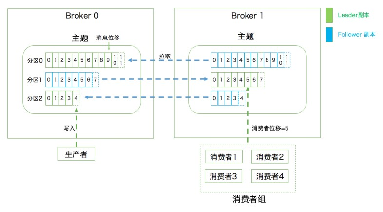

## kafka架构

>broker：服务进程节点
>producer：生产者客户端
>consumer：消费者客户端
>
>topic：消息主题
>partition：分区，将一个主题下的消息数据切片
>replica：副本，每个分区下只能有1个领导者副本（负责读写），多个追随者副本（冗余）

kafka应用的三层架构
>1）主题层：每个主题可以配置M个分区，每个分区又可以配置N个副本
>2）分区层：每个分区的N个副本只有一个是领导者角色，对外提供服务；其它的都是追随者副本，冗余
>3）消息层：分区包含若干条消息，每条消息的分区位移从0开始，依次递增，客户端只能与分区的领导者副本交互

kafka消息的持久化
>消息日志log来保存数据
>一个日志就是磁盘上一个只能追加写的物理文件
>因为只能追加写（顺序io），避免随机io耗时，提升吞吐量
>底层实现分为多个日志段（log segment）
>写满一个日志段会新建一个日志段继续写
>后台有定时任务检查可以删除的日志段

kafka消息模型
>1）点对点：
>消费者组（consumer group）
>每个主题的每个分区只能被一个消费者实例消费
>
> 
>2）发布订阅： 

kafka吞吐量高
>1）写消息时，采用顺序写，避免随机io
>2）多个分区、每个分区的数据被消费者组下不同的消费者实例同时消费

kafka重平衡
>同一消费组的消费者实例可以彼此感知，发送心跳
>组内某个实例挂掉，将挂掉的实例负责消费的分区转移到其它消费者
> 
>问题：？

kafka使用zookeeper
>zookeeper用来协调管理并保存kafka集群的元数据信息
>

kafka分区策略
>1）消息hash%分区数量
>1）轮询策略
>2）随机策略

kafka消息压缩
>生产者压缩，消息中包含压缩算法
>broker一般不解压缩
>除非生产者的压缩算法和broker指定的不一样，或者版本问题的兼容才需要
>消费者解压缩 

kafka消息丢失
>1）生产者消息丢失
>等待分区中所有副本都同步完成，再返回ack给生产者
>等待分区中领导副本写完，就直接返回ack给生产者
>2）消费者消息丢失
> 

https://segmentfault.com/a/1190000039010754

##

